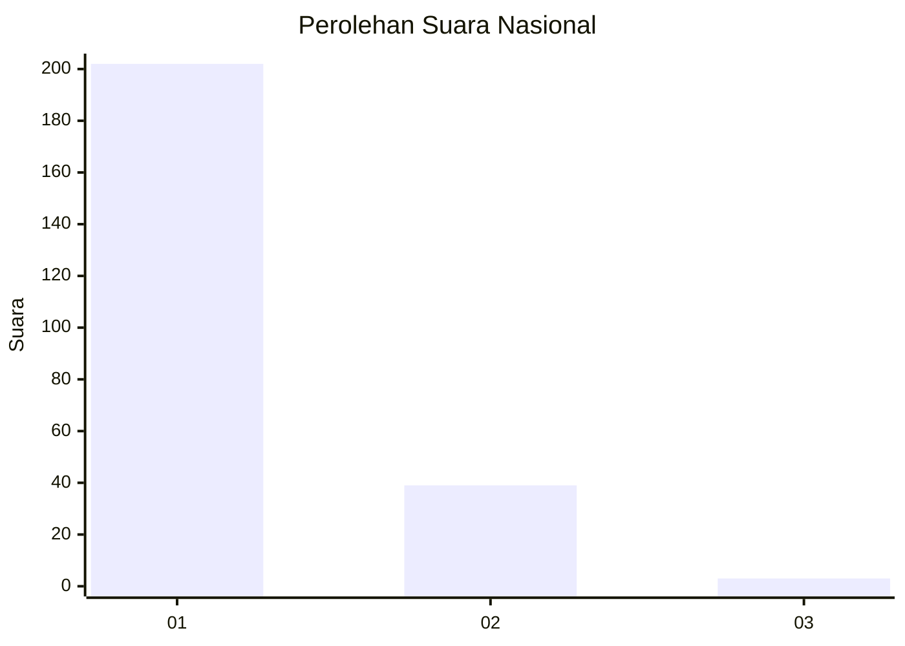
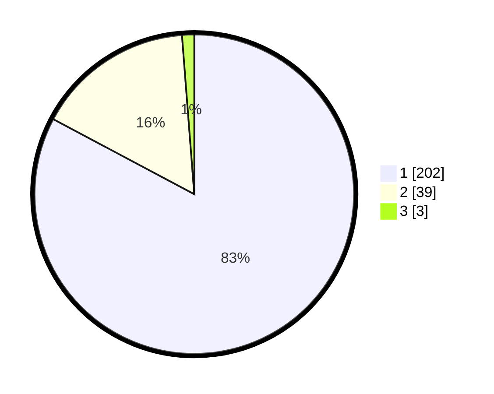

# Hasil

## Grafik

## Tabel

| No. | Nama Paslon    | Suara | Suara (raw) | Persentase |
|:--- |:-------------- | -----:| -----------:| ----------:|
| 1   | ANIES MUHAIMIN | 202   | [202][p-1]  | 82,79      |
| 2   | PRABOWO GIBRAN | 39    | [39][p-2]   | 15,98      |
| 3   | GANJAR MAHFUD  | 3     | [3][p-3]    | 1,23       |

[p-1]: https://github.com/gigit-pemilu/pemilu-2024/blob/main/pilpres/hitung-suara/sub/11-aceh/sub/06-aceh-besar/sub/10-ingin-jaya/sub/2032-meunasah-manyet/sub/002-tps/sub/paslon-1.txt
[p-2]: https://github.com/gigit-pemilu/pemilu-2024/blob/main/pilpres/hitung-suara/sub/11-aceh/sub/06-aceh-besar/sub/10-ingin-jaya/sub/2032-meunasah-manyet/sub/002-tps/sub/paslon-2.txt
[p-3]: https://github.com/gigit-pemilu/pemilu-2024/blob/main/pilpres/hitung-suara/sub/11-aceh/sub/06-aceh-besar/sub/10-ingin-jaya/sub/2032-meunasah-manyet/sub/002-tps/sub/paslon-3.txt

## Foto C Plano

https://sirekap-obj-formc.kpu.go.id/6897/pemilu/ppwp/11/06/10/20/32/1106102032002-20240215-070351--762fd6af-d65b-40b2-a870-665723a98a88.jpg

https://sirekap-obj-formc.kpu.go.id/6897/pemilu/ppwp/11/06/10/20/32/1106102032002-20240216-163908--9d560d9e-8e50-47fa-b721-e54a1ca0ff59.jpg

https://sirekap-obj-formc.kpu.go.id/6897/pemilu/ppwp/11/06/10/20/32/1106102032002-20240215-070516--bf1b315a-62b7-44f6-82b4-74e3e69f8679.jpg

## Metadata

| Key        | Value               |
| ---------- | ------------------- |
| Time Stamp | 2024-02-19 22:00:00 |

