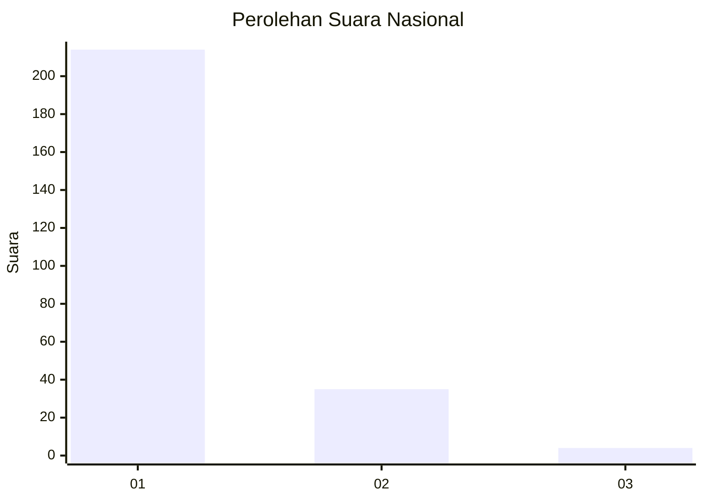
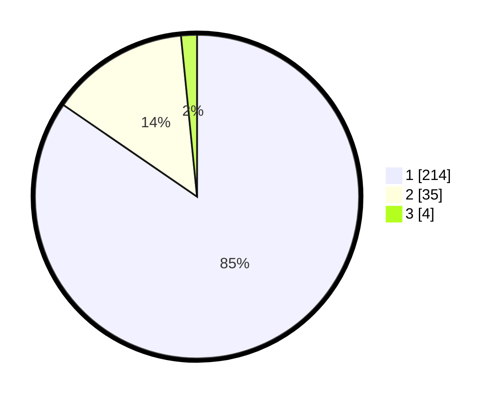

# Hasil

## Grafik

## Tabel

| No. | Nama Paslon    | Suara | Suara (raw) | Persentase |
|:--- |:-------------- | -----:| -----------:| ----------:|
| 1   | ANIES MUHAIMIN | 214   | [214][p-1]  | 84,58      |
| 2   | PRABOWO GIBRAN | 35    | [35][p-2]   | 13,83      |
| 3   | GANJAR MAHFUD  | 4     | [4][p-3]    | 1,58       |

[p-1]: https://github.com/gigit-pemilu/pemilu-2024/blob/main/pilpres/hitung-suara/sub/11-aceh/sub/06-aceh-besar/sub/10-ingin-jaya/sub/2033-santan/sub/002-tps/sub/paslon-1.txt
[p-2]: https://github.com/gigit-pemilu/pemilu-2024/blob/main/pilpres/hitung-suara/sub/11-aceh/sub/06-aceh-besar/sub/10-ingin-jaya/sub/2033-santan/sub/002-tps/sub/paslon-2.txt
[p-3]: https://github.com/gigit-pemilu/pemilu-2024/blob/main/pilpres/hitung-suara/sub/11-aceh/sub/06-aceh-besar/sub/10-ingin-jaya/sub/2033-santan/sub/002-tps/sub/paslon-3.txt

## Foto C Plano

https://sirekap-obj-formc.kpu.go.id/4759/pemilu/ppwp/11/06/10/20/33/1106102033002-20240214-230755--fc6d97fe-e78c-42a3-9a70-35f3149f7550.jpg

https://sirekap-obj-formc.kpu.go.id/4759/pemilu/ppwp/11/06/10/20/33/1106102033002-20240214-232040--06272b24-5d9f-4a65-a19c-3115e071484d.jpg

https://sirekap-obj-formc.kpu.go.id/4759/pemilu/ppwp/11/06/10/20/33/1106102033002-20240214-204653--df86799f-e2cb-4646-8f4a-d27a88daac00.jpg

## Metadata

| Key        | Value               |
| ---------- | ------------------- |
| Time Stamp | 2024-02-15 23:29:50 |

