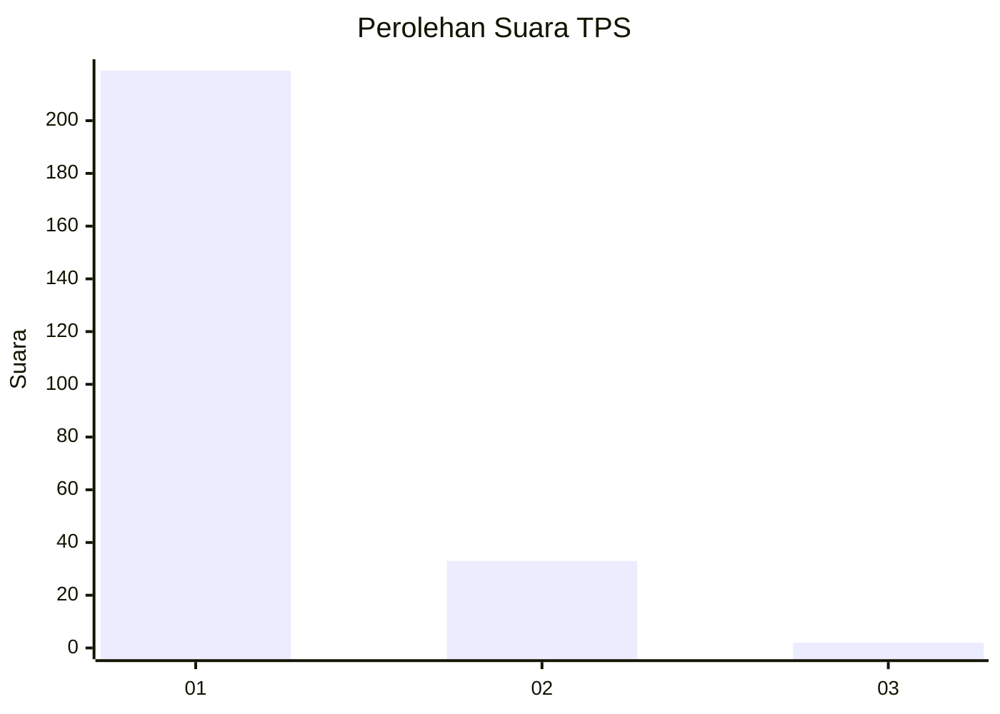
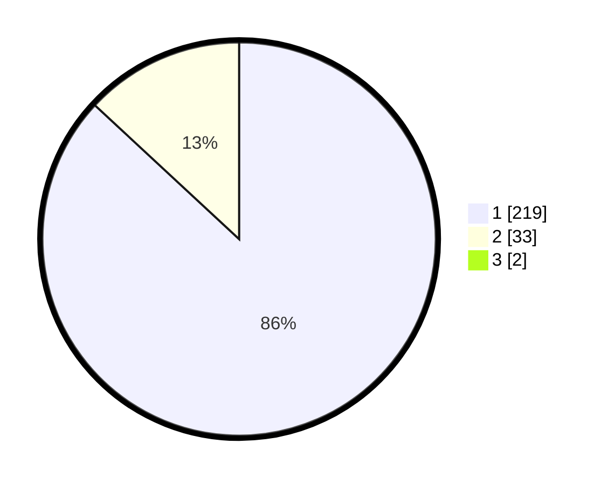

# Hasil

## Grafik

## Tabel

| No. | Nama Paslon    | Suara | Suara (raw) | Persentase |
|:--- |:-------------- | -----:| -----------:| ----------:|
| 1   | ANIES MUHAIMIN | 219   | [219][p-1]  | 86,22      |
| 2   | PRABOWO GIBRAN | 33    | [33][p-2]   | 12,99      |
| 3   | GANJAR MAHFUD  | 2     | [2][p-3]    | 0,79       |

[p-1]: https://github.com/gigit-pemilu/pemilu-2024-11-aceh/blob/main/pilpres/hitung-suara/sub/11-aceh/sub/06-aceh-besar/sub/10-ingin-jaya/sub/2034-tanjong/sub/001-tps/sub/paslon-1.txt
[p-2]: https://github.com/gigit-pemilu/pemilu-2024-11-aceh/blob/main/pilpres/hitung-suara/sub/11-aceh/sub/06-aceh-besar/sub/10-ingin-jaya/sub/2034-tanjong/sub/001-tps/sub/paslon-2.txt
[p-3]: https://github.com/gigit-pemilu/pemilu-2024-11-aceh/blob/main/pilpres/hitung-suara/sub/11-aceh/sub/06-aceh-besar/sub/10-ingin-jaya/sub/2034-tanjong/sub/001-tps/sub/paslon-3.txt

## Foto C Plano

https://sirekap-obj-formc.kpu.go.id/1863/pemilu/ppwp/11/06/10/20/34/1106102034001-20240214-232710--96449a81-904a-462e-aab9-0d33d0fb3f04.jpg

https://sirekap-obj-formc.kpu.go.id/1863/pemilu/ppwp/11/06/10/20/34/1106102034001-20240214-222110--73289caa-0740-4137-85be-4eccf5bd639c.jpg

https://sirekap-obj-formc.kpu.go.id/1863/pemilu/ppwp/11/06/10/20/34/1106102034001-20240214-222250--c1796d9b-bb78-4904-b941-7f4906e6021f.jpg

## Metadata

| Key        | Value               |
| ---------- | ------------------- |
| Time Stamp | 2024-02-15 17:00:25 |

