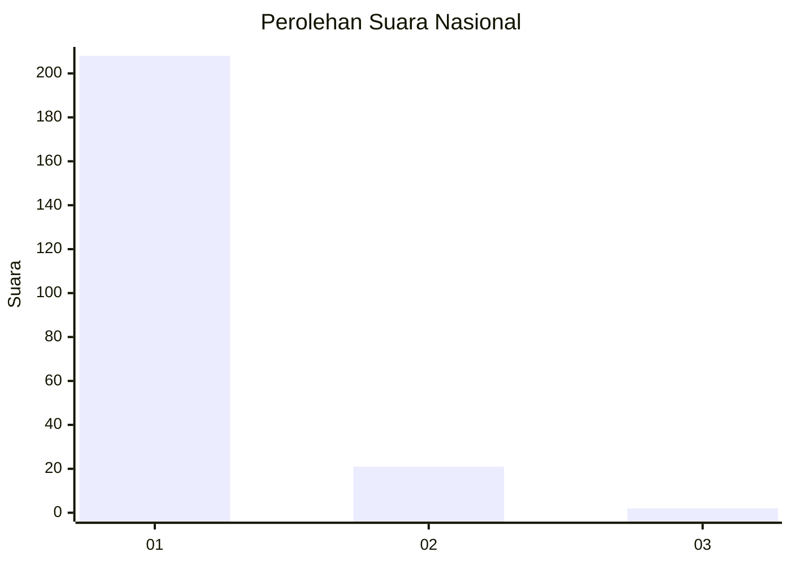
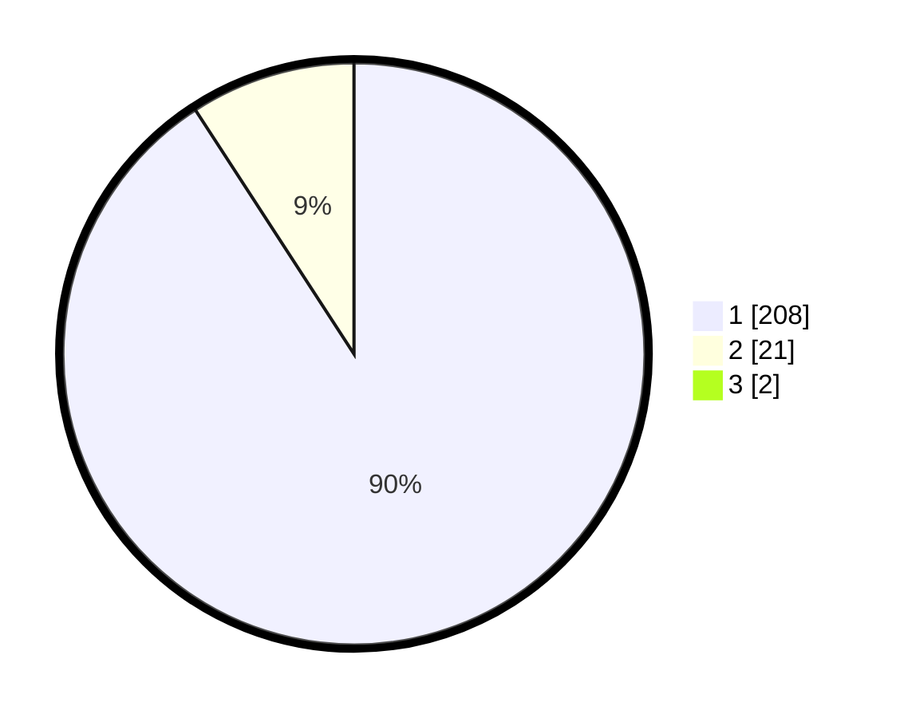

# Hasil

## Grafik

## Tabel

| No. | Nama Paslon    | Suara | Suara (raw) | Persentase |
|:--- |:-------------- | -----:| -----------:| ----------:|
| 1   | ANIES MUHAIMIN | 208   | [208][p-1]  | 90,04      |
| 2   | PRABOWO GIBRAN | 21    | [21][p-2]   | 9,09       |
| 3   | GANJAR MAHFUD  | 2     | [2][p-3]    | 0,87       |

[p-1]: https://github.com/gigit-pemilu/pemilu-2024/blob/main/pilpres/hitung-suara/sub/11-aceh/sub/06-aceh-besar/sub/10-ingin-jaya/sub/2034-tanjong/sub/003-tps/sub/paslon-1.txt
[p-2]: https://github.com/gigit-pemilu/pemilu-2024/blob/main/pilpres/hitung-suara/sub/11-aceh/sub/06-aceh-besar/sub/10-ingin-jaya/sub/2034-tanjong/sub/003-tps/sub/paslon-2.txt
[p-3]: https://github.com/gigit-pemilu/pemilu-2024/blob/main/pilpres/hitung-suara/sub/11-aceh/sub/06-aceh-besar/sub/10-ingin-jaya/sub/2034-tanjong/sub/003-tps/sub/paslon-3.txt

## Foto C Plano

https://sirekap-obj-formc.kpu.go.id/6c32/pemilu/ppwp/11/06/10/20/34/1106102034003-20240214-224243--06d63fce-86a7-4f3f-b249-b343c854f0cd.jpg

https://sirekap-obj-formc.kpu.go.id/6c32/pemilu/ppwp/11/06/10/20/34/1106102034003-20240214-230359--637432bd-5a07-4e83-8993-a87af6d3b47a.jpg

https://sirekap-obj-formc.kpu.go.id/6c32/pemilu/ppwp/11/06/10/20/34/1106102034003-20240214-224500--9ca1331f-3f2c-46ca-83cc-08903460d710.jpg

## Metadata

| Key        | Value               |
| ---------- | ------------------- |
| Time Stamp | 2024-02-15 17:30:25 |

