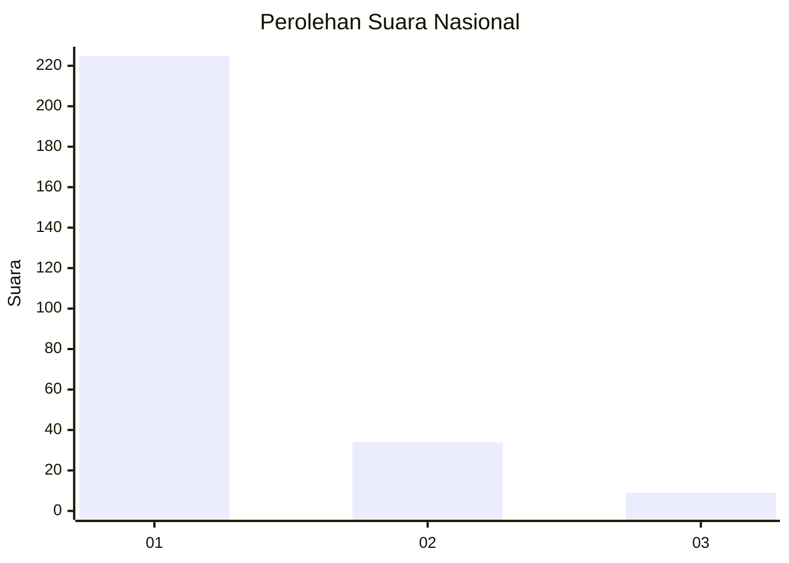
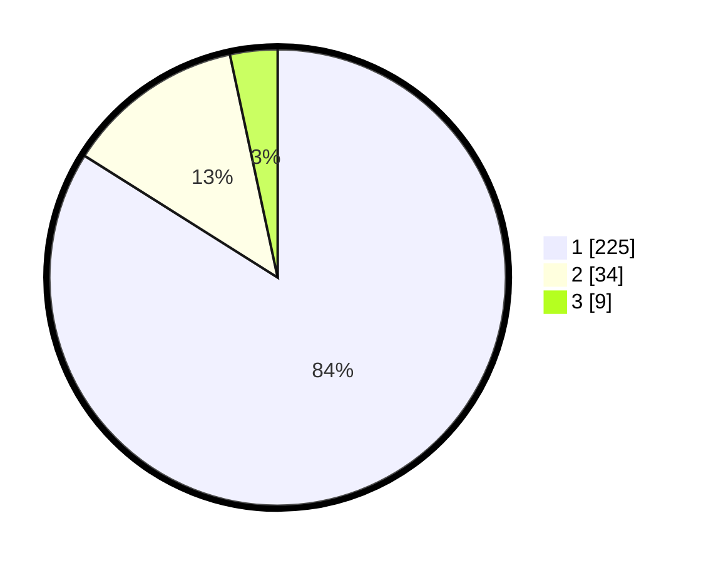

# Hasil

## Grafik

## Tabel

| No. | Nama Paslon    | Suara | Suara (raw) | Persentase |
|:--- |:-------------- | -----:| -----------:| ----------:|
| 1   | ANIES MUHAIMIN | 225   | [225][p-1]  | 83,96      |
| 2   | PRABOWO GIBRAN | 34    | [34][p-2]   | 12,69      |
| 3   | GANJAR MAHFUD  | 9     | [9][p-3]    | 3,36       |

[p-1]: https://github.com/gigit-pemilu/pemilu-2024/blob/main/pilpres/hitung-suara/sub/11-aceh/sub/06-aceh-besar/sub/10-ingin-jaya/sub/2035-reuloh/sub/002-tps/sub/paslon-1.txt
[p-2]: https://github.com/gigit-pemilu/pemilu-2024/blob/main/pilpres/hitung-suara/sub/11-aceh/sub/06-aceh-besar/sub/10-ingin-jaya/sub/2035-reuloh/sub/002-tps/sub/paslon-2.txt
[p-3]: https://github.com/gigit-pemilu/pemilu-2024/blob/main/pilpres/hitung-suara/sub/11-aceh/sub/06-aceh-besar/sub/10-ingin-jaya/sub/2035-reuloh/sub/002-tps/sub/paslon-3.txt

## Foto C Plano

https://sirekap-obj-formc.kpu.go.id/333a/pemilu/ppwp/11/06/10/20/35/1106102035002-20240214-233807--1267e05e-0593-4dc6-b55f-3534b5d78c18.jpg

https://sirekap-obj-formc.kpu.go.id/333a/pemilu/ppwp/11/06/10/20/35/1106102035002-20240214-233824--adcf3e9b-2042-4fa1-9cfc-b2c58ecd302f.jpg

https://sirekap-obj-formc.kpu.go.id/333a/pemilu/ppwp/11/06/10/20/35/1106102035002-20240214-233834--06308c3f-a476-4a40-b48b-1bc591330189.jpg

## Metadata

| Key        | Value               |
| ---------- | ------------------- |
| Time Stamp | 2024-02-15 23:29:50 |

