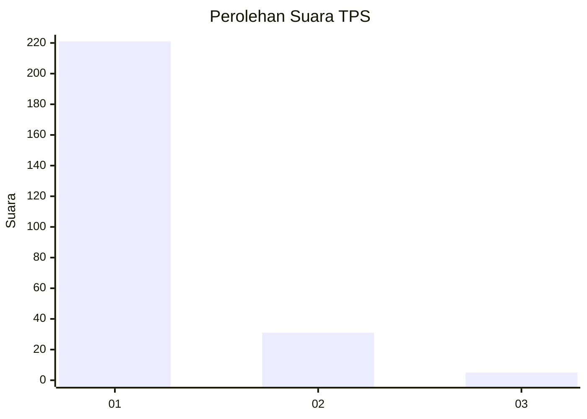
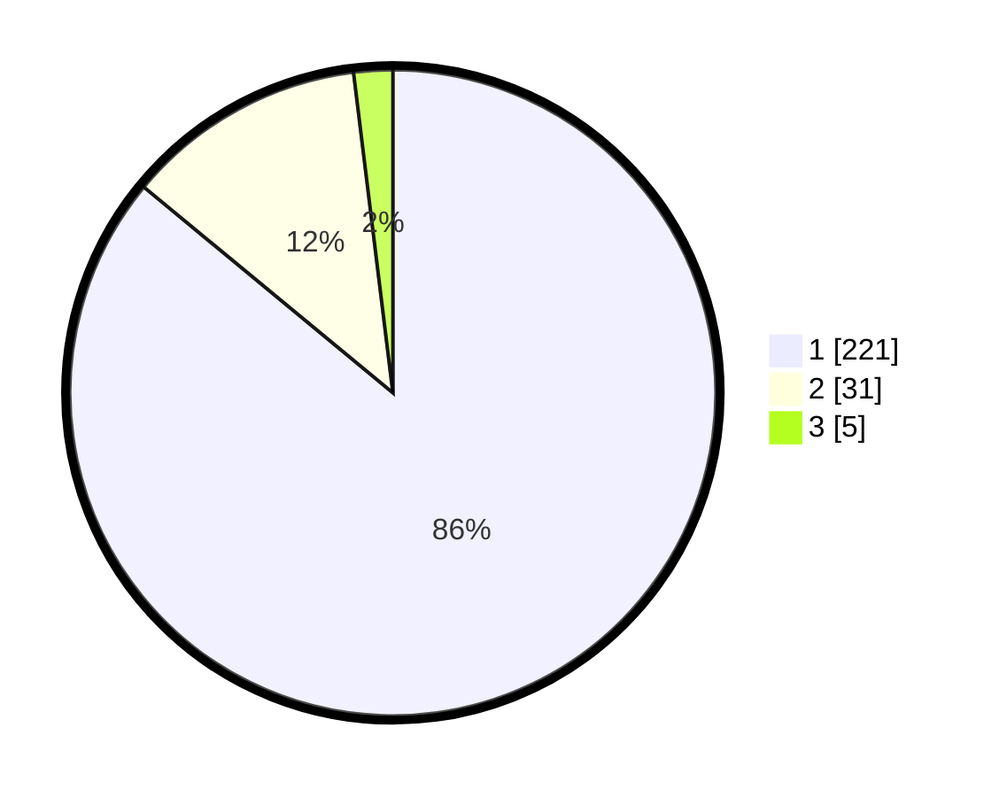

# Hasil

## Grafik

## Tabel

| No. | Nama Paslon    | Suara | Suara (raw) | Persentase |
|:--- |:-------------- | -----:| -----------:| ----------:|
| 1   | ANIES MUHAIMIN | 221   | [221][p-1]  | 85,99      |
| 2   | PRABOWO GIBRAN | 31    | [31][p-2]   | 12,06      |
| 3   | GANJAR MAHFUD  | 5     | [5][p-3]    | 1,95       |

[p-1]: https://github.com/gigit-pemilu/pemilu-2024-11-aceh/blob/main/pilpres/hitung-suara/sub/11-aceh/sub/06-aceh-besar/sub/10-ingin-jaya/sub/2035-reuloh/sub/003-tps/sub/paslon-1.txt
[p-2]: https://github.com/gigit-pemilu/pemilu-2024-11-aceh/blob/main/pilpres/hitung-suara/sub/11-aceh/sub/06-aceh-besar/sub/10-ingin-jaya/sub/2035-reuloh/sub/003-tps/sub/paslon-2.txt
[p-3]: https://github.com/gigit-pemilu/pemilu-2024-11-aceh/blob/main/pilpres/hitung-suara/sub/11-aceh/sub/06-aceh-besar/sub/10-ingin-jaya/sub/2035-reuloh/sub/003-tps/sub/paslon-3.txt

## Foto C Plano

https://sirekap-obj-formc.kpu.go.id/c701/pemilu/ppwp/11/06/10/20/35/1106102035003-20240215-025824--b9dacd7b-744b-4864-bdc7-7f18e1582cbc.jpg

https://sirekap-obj-formc.kpu.go.id/c701/pemilu/ppwp/11/06/10/20/35/1106102035003-20240215-025848--60bf2585-2067-4146-a65b-608d8f6c7597.jpg

https://sirekap-obj-formc.kpu.go.id/c701/pemilu/ppwp/11/06/10/20/35/1106102035003-20240215-025900--5d630113-2732-4b91-90c9-ca771dd55950.jpg

## Metadata

| Key        | Value               |
| ---------- | ------------------- |
| Time Stamp | 2024-02-15 17:30:25 |

