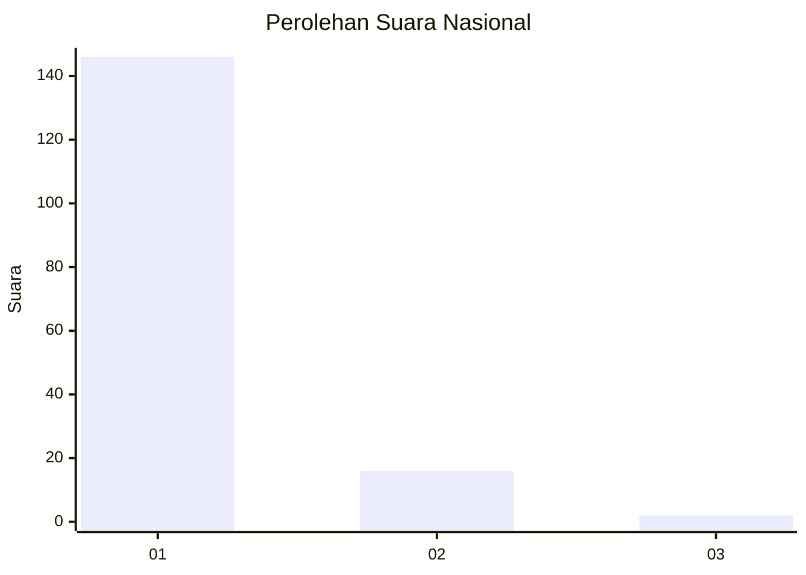
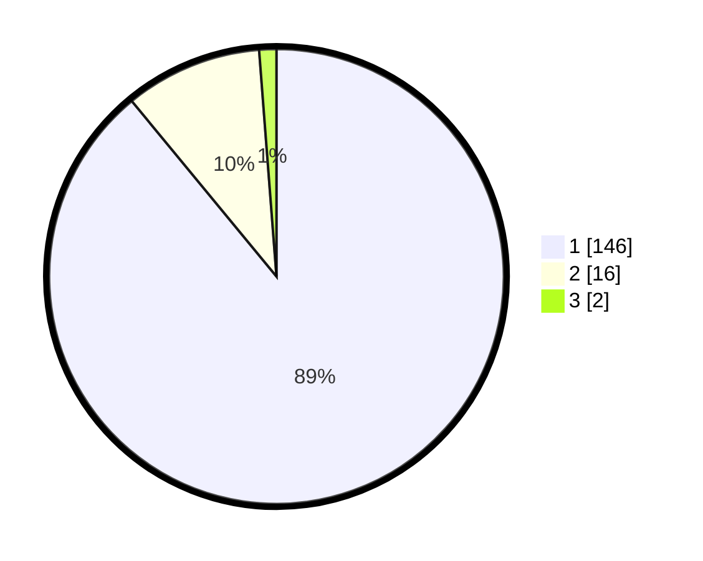

# Hasil

## Grafik

## Tabel

| No. | Nama Paslon    | Suara | Suara (raw) | Persentase |
|:--- |:-------------- | -----:| -----------:| ----------:|
| 1   | ANIES MUHAIMIN | 146   | [146][p-1]  | 89,02      |
| 2   | PRABOWO GIBRAN | 16    | [16][p-2]   | 9,76       |
| 3   | GANJAR MAHFUD  | 2     | [2][p-3]    | 1,22       |

[p-1]: https://github.com/gigit-pemilu/pemilu-2024/blob/main/pilpres/hitung-suara/sub/11-aceh/sub/06-aceh-besar/sub/10-ingin-jaya/sub/2044-paleuh-pulo/sub/002-tps/sub/paslon-1.txt
[p-2]: https://github.com/gigit-pemilu/pemilu-2024/blob/main/pilpres/hitung-suara/sub/11-aceh/sub/06-aceh-besar/sub/10-ingin-jaya/sub/2044-paleuh-pulo/sub/002-tps/sub/paslon-2.txt
[p-3]: https://github.com/gigit-pemilu/pemilu-2024/blob/main/pilpres/hitung-suara/sub/11-aceh/sub/06-aceh-besar/sub/10-ingin-jaya/sub/2044-paleuh-pulo/sub/002-tps/sub/paslon-3.txt

## Foto C Plano

https://sirekap-obj-formc.kpu.go.id/6a9d/pemilu/ppwp/11/06/10/20/44/1106102044002-20240214-155848--990e7570-5639-4d21-af3a-4365a090a8a1.jpg

https://sirekap-obj-formc.kpu.go.id/6a9d/pemilu/ppwp/11/06/10/20/44/1106102044002-20240214-160114--6f40cadd-9b93-4f2c-b39f-74ecb179d046.jpg

https://sirekap-obj-formc.kpu.go.id/6a9d/pemilu/ppwp/11/06/10/20/44/1106102044002-20240214-160104--3badabcc-83d8-4caf-8d9d-49ce933783c3.jpg

## Metadata

| Key        | Value               |
| ---------- | ------------------- |
| Time Stamp | 2024-02-15 17:30:25 |

