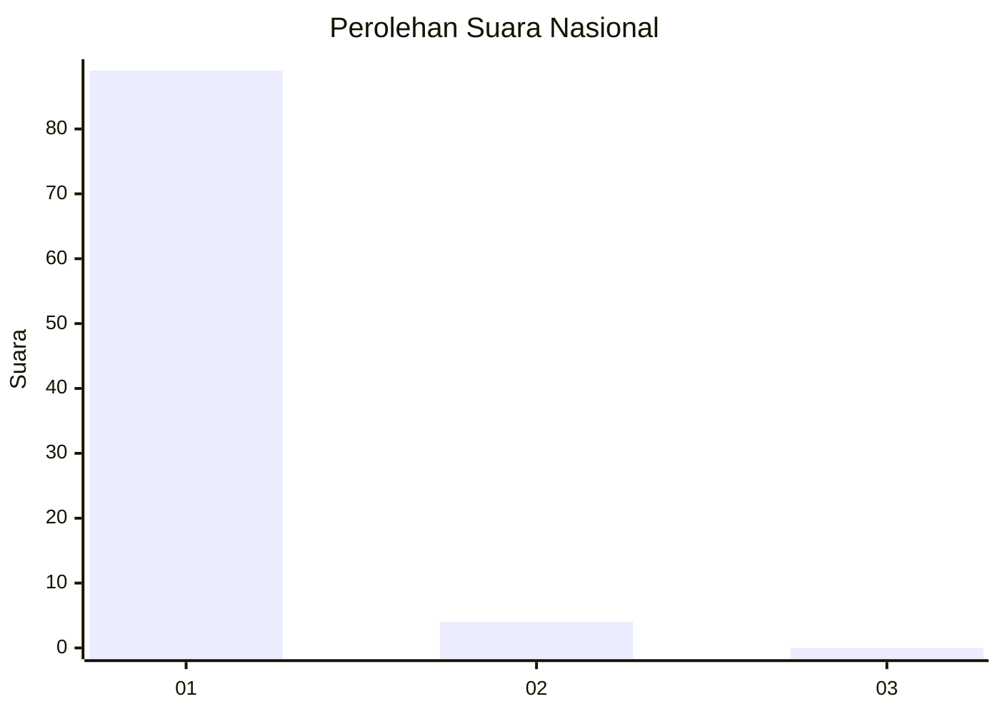
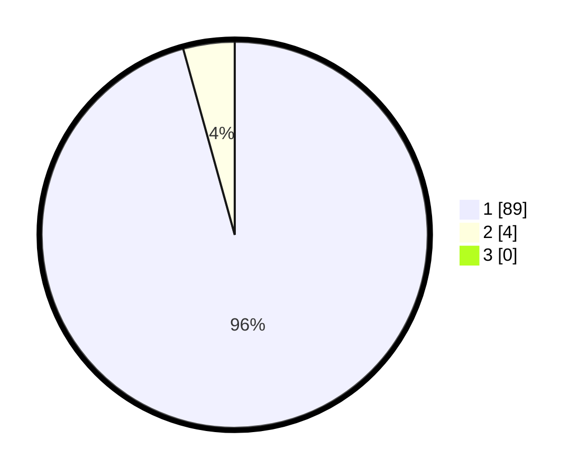

# Hasil

## Grafik

## Tabel

| No. | Nama Paslon    | Suara | Suara (raw) | Persentase |
|:--- |:-------------- | -----:| -----------:| ----------:|
| 1   | ANIES MUHAIMIN | 89    | [89][p-1]   | 95,70      |
| 2   | PRABOWO GIBRAN | 4     | [4][p-2]    | 4,30       |
| 3   | GANJAR MAHFUD  | 0     | [0][p-3]    | 0,00       |

[p-1]: https://github.com/gigit-pemilu/pemilu-2024/blob/main/pilpres/hitung-suara/sub/11-aceh/sub/06-aceh-besar/sub/10-ingin-jaya/sub/2046-lamsinyeu/sub/001-tps/sub/paslon-1.txt
[p-2]: https://github.com/gigit-pemilu/pemilu-2024/blob/main/pilpres/hitung-suara/sub/11-aceh/sub/06-aceh-besar/sub/10-ingin-jaya/sub/2046-lamsinyeu/sub/001-tps/sub/paslon-2.txt
[p-3]: https://github.com/gigit-pemilu/pemilu-2024/blob/main/pilpres/hitung-suara/sub/11-aceh/sub/06-aceh-besar/sub/10-ingin-jaya/sub/2046-lamsinyeu/sub/001-tps/sub/paslon-3.txt

## Foto C Plano

https://sirekap-obj-formc.kpu.go.id/fcf9/pemilu/ppwp/11/06/10/20/46/1106102046001-20240214-204214--ead1b281-1344-4435-8b82-8d5ee3f15a92.jpg

https://sirekap-obj-formc.kpu.go.id/fcf9/pemilu/ppwp/11/06/10/20/46/1106102046001-20240214-200205--11149ca9-14c0-4e12-9ad0-f5f434def650.jpg

https://sirekap-obj-formc.kpu.go.id/fcf9/pemilu/ppwp/11/06/10/20/46/1106102046001-20240214-200522--119677ed-8293-405c-a6eb-8e321f4250ec.jpg

## Metadata

| Key        | Value               |
| ---------- | ------------------- |
| Time Stamp | 2024-02-15 23:29:50 |

