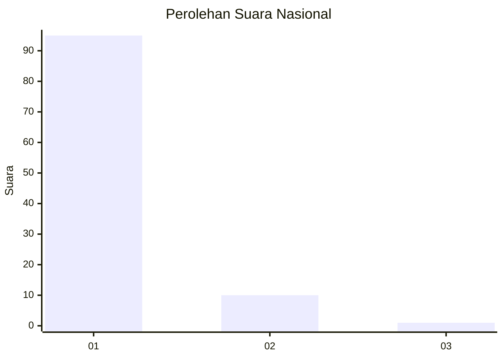
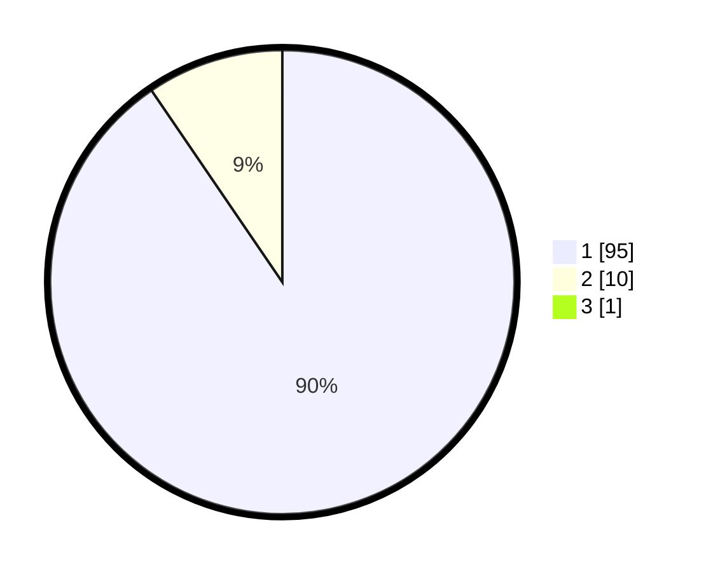

# Hasil

## Grafik

## Tabel

| No. | Nama Paslon    | Suara | Suara (raw) | Persentase |
|:--- |:-------------- | -----:| -----------:| ----------:|
| 1   | ANIES MUHAIMIN | 95    | [95][p-1]   | 89,62      |
| 2   | PRABOWO GIBRAN | 10    | [10][p-2]   | 9,43       |
| 3   | GANJAR MAHFUD  | 1     | [1][p-3]    | 0,94       |

[p-1]: https://github.com/gigit-pemilu/pemilu-2024/blob/main/pilpres/hitung-suara/sub/11-aceh/sub/06-aceh-besar/sub/10-ingin-jaya/sub/2048-cot-gud/sub/001-tps/sub/paslon-1.txt
[p-2]: https://github.com/gigit-pemilu/pemilu-2024/blob/main/pilpres/hitung-suara/sub/11-aceh/sub/06-aceh-besar/sub/10-ingin-jaya/sub/2048-cot-gud/sub/001-tps/sub/paslon-2.txt
[p-3]: https://github.com/gigit-pemilu/pemilu-2024/blob/main/pilpres/hitung-suara/sub/11-aceh/sub/06-aceh-besar/sub/10-ingin-jaya/sub/2048-cot-gud/sub/001-tps/sub/paslon-3.txt

## Foto C Plano

https://sirekap-obj-formc.kpu.go.id/258d/pemilu/ppwp/11/06/10/20/48/1106102048001-20240217-212348--ccd26460-93d6-40d8-82a0-113f190ee38b.jpg

https://sirekap-obj-formc.kpu.go.id/258d/pemilu/ppwp/11/06/10/20/48/1106102048001-20240217-212310--ec22073e-7925-41a8-9117-0b535c6314f9.jpg

https://sirekap-obj-formc.kpu.go.id/258d/pemilu/ppwp/11/06/10/20/48/1106102048001-20240217-212434--f27ad3e3-47e8-4387-9741-1b984ccb0d5f.jpg

## Metadata

| Key        | Value               |
| ---------- | ------------------- |
| Time Stamp | 2024-02-19 21:00:00 |

