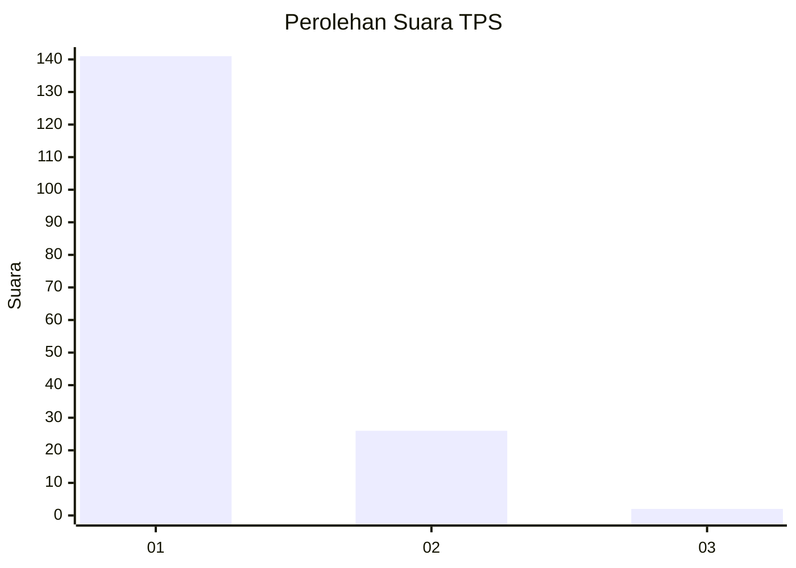
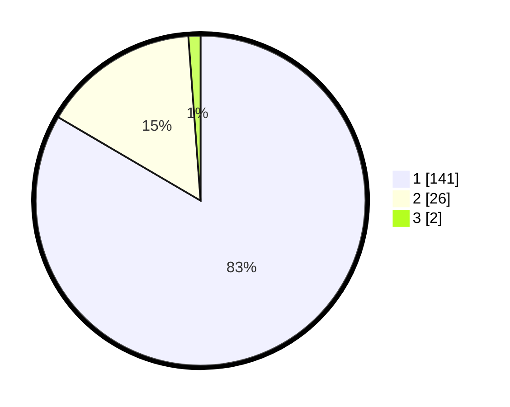

# Hasil

## Grafik

## Tabel

| No. | Nama Paslon    | Suara | Suara (raw) | Persentase |
|:--- |:-------------- | -----:| -----------:| ----------:|
| 1   | ANIES MUHAIMIN | 141   | [141][p-1]  | 83,43      |
| 2   | PRABOWO GIBRAN | 26    | [26][p-2]   | 15,38      |
| 3   | GANJAR MAHFUD  | 2     | [2][p-3]    | 1,18       |

[p-1]: https://github.com/gigit-pemilu/pemilu-2024-11-aceh/blob/main/pilpres/hitung-suara/sub/11-aceh/sub/06-aceh-besar/sub/10-ingin-jaya/sub/2050-lambada/sub/002-tps/sub/paslon-1.txt
[p-2]: https://github.com/gigit-pemilu/pemilu-2024-11-aceh/blob/main/pilpres/hitung-suara/sub/11-aceh/sub/06-aceh-besar/sub/10-ingin-jaya/sub/2050-lambada/sub/002-tps/sub/paslon-2.txt
[p-3]: https://github.com/gigit-pemilu/pemilu-2024-11-aceh/blob/main/pilpres/hitung-suara/sub/11-aceh/sub/06-aceh-besar/sub/10-ingin-jaya/sub/2050-lambada/sub/002-tps/sub/paslon-3.txt

## Foto C Plano

https://sirekap-obj-formc.kpu.go.id/6802/pemilu/ppwp/11/06/10/20/50/1106102050002-20240214-202427--f92b7e1b-abe8-4f6a-8380-019e916bfd9d.jpg

https://sirekap-obj-formc.kpu.go.id/6802/pemilu/ppwp/11/06/10/20/50/1106102050002-20240214-211030--60a35381-0cbe-4bdc-b879-1446041c90fc.jpg

https://sirekap-obj-formc.kpu.go.id/6802/pemilu/ppwp/11/06/10/20/50/1106102050002-20240214-202530--3c1672d9-7577-419b-b167-ed316c934ed2.jpg

## Metadata

| Key        | Value               |
| ---------- | ------------------- |
| Time Stamp | 2024-02-15 23:29:50 |

