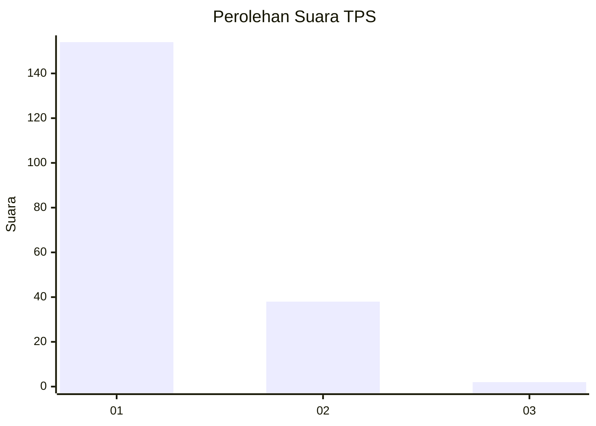
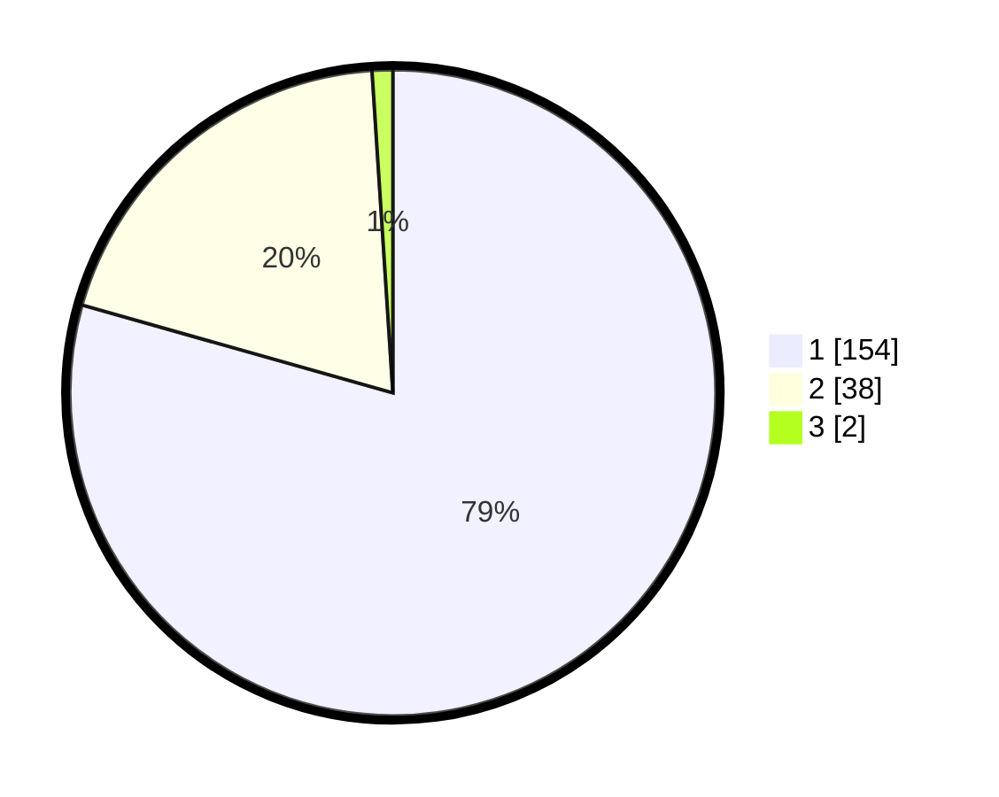

# Hasil

## Grafik

## Tabel

| No. | Nama Paslon    | Suara | Suara (raw) | Persentase |
|:--- |:-------------- | -----:| -----------:| ----------:|
| 1   | ANIES MUHAIMIN | 154   | [154][p-1]  | 79,38      |
| 2   | PRABOWO GIBRAN | 38    | [38][p-2]   | 19,59      |
| 3   | GANJAR MAHFUD  | 2     | [2][p-3]    | 1,03       |

[p-1]: https://github.com/gigit-pemilu/pemilu-2024-11-aceh/blob/main/pilpres/hitung-suara/sub/11-aceh/sub/06-aceh-besar/sub/11-kuta-baro/sub/2001-krueng-anoi/sub/001-tps/sub/paslon-1.txt
[p-2]: https://github.com/gigit-pemilu/pemilu-2024-11-aceh/blob/main/pilpres/hitung-suara/sub/11-aceh/sub/06-aceh-besar/sub/11-kuta-baro/sub/2001-krueng-anoi/sub/001-tps/sub/paslon-2.txt
[p-3]: https://github.com/gigit-pemilu/pemilu-2024-11-aceh/blob/main/pilpres/hitung-suara/sub/11-aceh/sub/06-aceh-besar/sub/11-kuta-baro/sub/2001-krueng-anoi/sub/001-tps/sub/paslon-3.txt

## Foto C Plano

https://sirekap-obj-formc.kpu.go.id/5269/pemilu/ppwp/11/06/11/20/01/1106112001001-20240217-102410--7fdbbb87-bb2c-4a48-982b-02f5913b43a2.jpg

https://sirekap-obj-formc.kpu.go.id/5269/pemilu/ppwp/11/06/11/20/01/1106112001001-20240217-101945--aaf9196a-1eea-4908-86d4-2a828bf56f24.jpg

https://sirekap-obj-formc.kpu.go.id/5269/pemilu/ppwp/11/06/11/20/01/1106112001001-20240217-102224--3401e7c5-10e2-4e05-828a-a9a41737c683.jpg

## Metadata

| Key        | Value               |
| ---------- | ------------------- |
| Time Stamp | 2024-02-19 22:00:00 |

