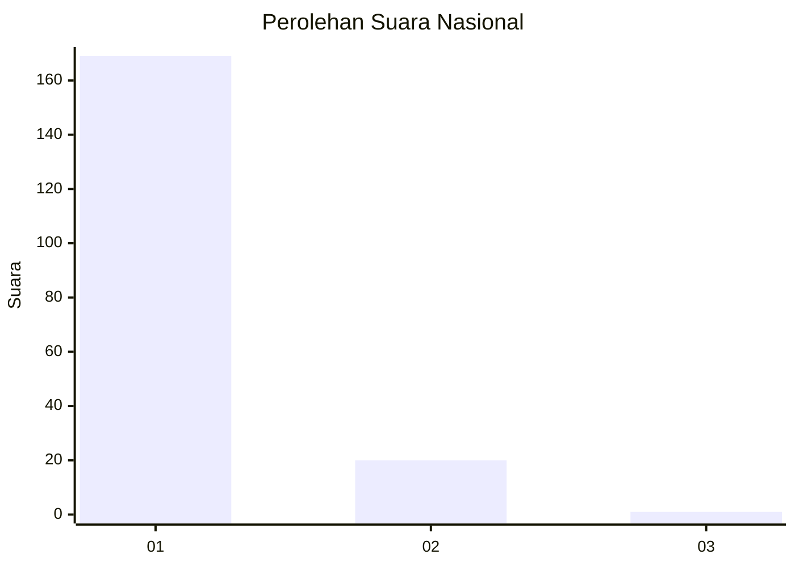
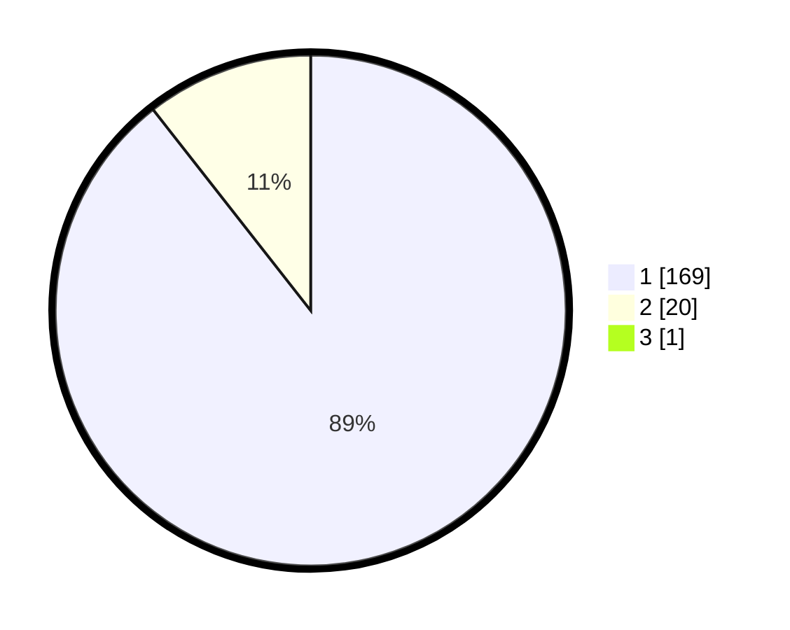

# Hasil

## Grafik

## Tabel

| No. | Nama Paslon    | Suara | Suara (raw) | Persentase |
|:--- |:-------------- | -----:| -----------:| ----------:|
| 1   | ANIES MUHAIMIN | 169   | [169][p-1]  | 88,95      |
| 2   | PRABOWO GIBRAN | 20    | [20][p-2]   | 10,53      |
| 3   | GANJAR MAHFUD  | 1     | [1][p-3]    | 0,53       |

[p-1]: https://github.com/gigit-pemilu/pemilu-2024/blob/main/pilpres/hitung-suara/sub/11-aceh/sub/06-aceh-besar/sub/11-kuta-baro/sub/2007-cot-mancang/sub/002-tps/sub/paslon-1.txt
[p-2]: https://github.com/gigit-pemilu/pemilu-2024/blob/main/pilpres/hitung-suara/sub/11-aceh/sub/06-aceh-besar/sub/11-kuta-baro/sub/2007-cot-mancang/sub/002-tps/sub/paslon-2.txt
[p-3]: https://github.com/gigit-pemilu/pemilu-2024/blob/main/pilpres/hitung-suara/sub/11-aceh/sub/06-aceh-besar/sub/11-kuta-baro/sub/2007-cot-mancang/sub/002-tps/sub/paslon-3.txt

## Foto C Plano

https://sirekap-obj-formc.kpu.go.id/ea0e/pemilu/ppwp/11/06/11/20/07/1106112007002-20240214-232917--b4ec4bd0-b49e-4ec6-a3f3-c7f1cf9094c8.jpg

https://sirekap-obj-formc.kpu.go.id/ea0e/pemilu/ppwp/11/06/11/20/07/1106112007002-20240215-053140--65c037a1-8ec4-41d2-a4d6-319bba0ae38b.jpg

https://sirekap-obj-formc.kpu.go.id/ea0e/pemilu/ppwp/11/06/11/20/07/1106112007002-20240215-053216--c15da25c-c25a-46e4-b801-995c755d7368.jpg

## Metadata

| Key        | Value               |
| ---------- | ------------------- |
| Time Stamp | 2024-02-15 21:30:27 |

