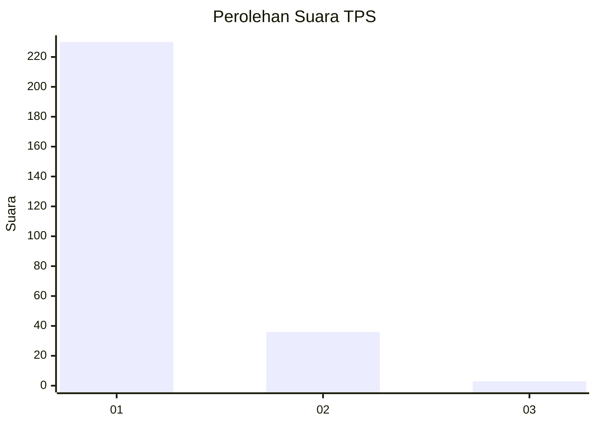
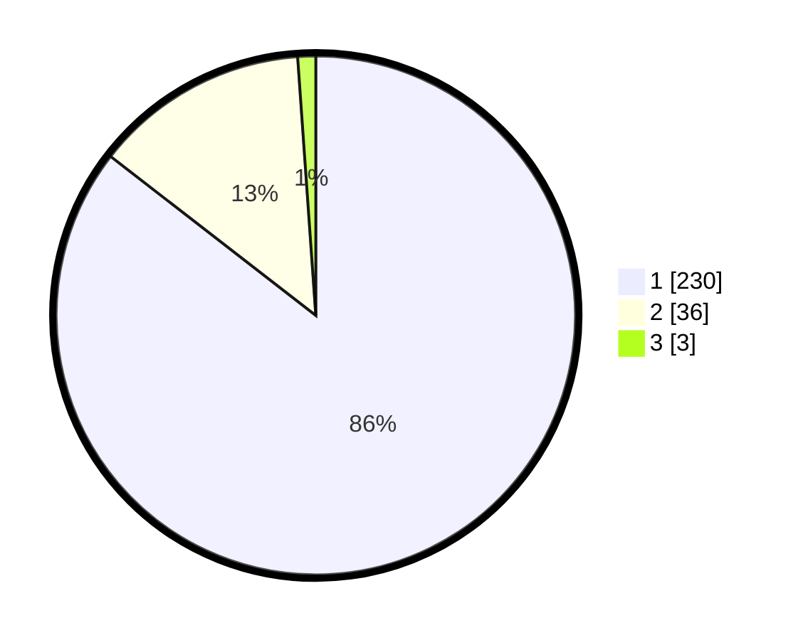

# Hasil

## Grafik

## Tabel

| No. | Nama Paslon    | Suara | Suara (raw) | Persentase |
|:--- |:-------------- | -----:| -----------:| ----------:|
| 1   | ANIES MUHAIMIN | 230   | [230][p-1]  | 85,50      |
| 2   | PRABOWO GIBRAN | 36    | [36][p-2]   | 13,38      |
| 3   | GANJAR MAHFUD  | 3     | [3][p-3]    | 1,12       |

[p-1]: https://github.com/gigit-pemilu/pemilu-2024-11-aceh/blob/main/pilpres/hitung-suara/sub/11-aceh/sub/06-aceh-besar/sub/11-kuta-baro/sub/2009-cot-masam/sub/001-tps/sub/paslon-1.txt
[p-2]: https://github.com/gigit-pemilu/pemilu-2024-11-aceh/blob/main/pilpres/hitung-suara/sub/11-aceh/sub/06-aceh-besar/sub/11-kuta-baro/sub/2009-cot-masam/sub/001-tps/sub/paslon-2.txt
[p-3]: https://github.com/gigit-pemilu/pemilu-2024-11-aceh/blob/main/pilpres/hitung-suara/sub/11-aceh/sub/06-aceh-besar/sub/11-kuta-baro/sub/2009-cot-masam/sub/001-tps/sub/paslon-3.txt

## Foto C Plano

https://sirekap-obj-formc.kpu.go.id/fbf6/pemilu/ppwp/11/06/11/20/09/1106112009001-20240214-212104--7125f6ca-521f-4571-ba77-6716e5c533c3.jpg

https://sirekap-obj-formc.kpu.go.id/fbf6/pemilu/ppwp/11/06/11/20/09/1106112009001-20240214-192341--6993b3a2-75d2-4a87-a244-2a26efd2e547.jpg

https://sirekap-obj-formc.kpu.go.id/fbf6/pemilu/ppwp/11/06/11/20/09/1106112009001-20240214-192347--9ea326f2-4aa8-4a5d-8a3c-1e6eeff014be.jpg

## Metadata

| Key        | Value               |
| ---------- | ------------------- |
| Time Stamp | 2024-02-15 04:00:24 |

