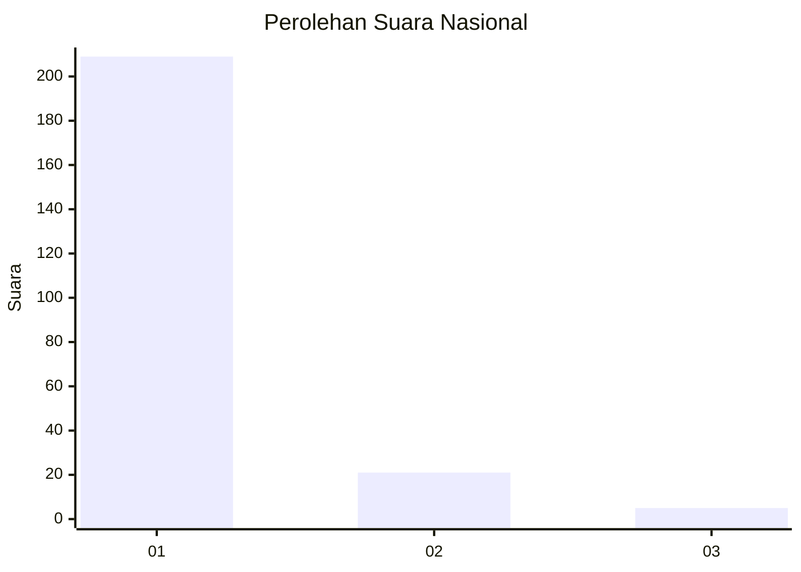
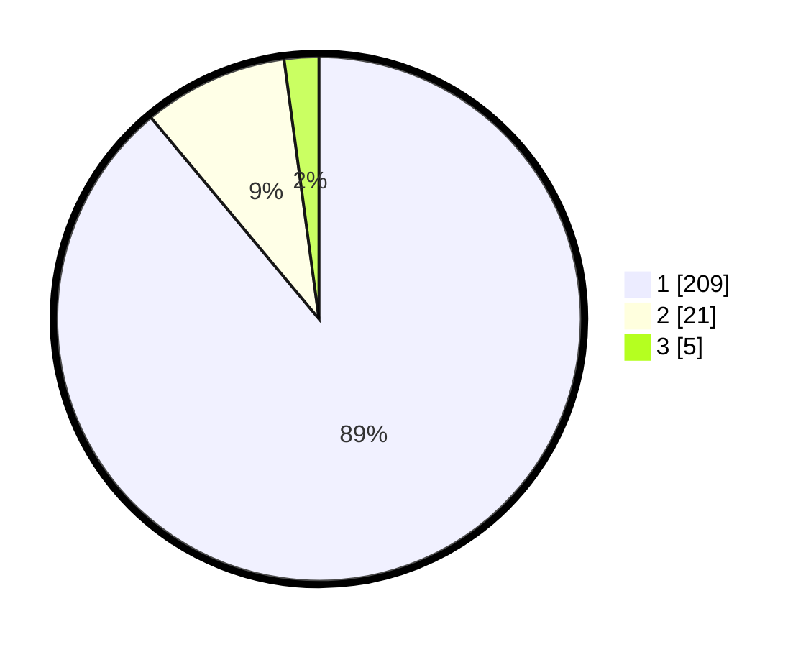

# Hasil

## Grafik

## Tabel

| No. | Nama Paslon    | Suara | Suara (raw) | Persentase |
|:--- |:-------------- | -----:| -----------:| ----------:|
| 1   | ANIES MUHAIMIN | 209   | [209][p-1]  | 88,94      |
| 2   | PRABOWO GIBRAN | 21    | [21][p-2]   | 8,94       |
| 3   | GANJAR MAHFUD  | 5     | [5][p-3]    | 2,13       |

[p-1]: https://github.com/gigit-pemilu/pemilu-2024/blob/main/pilpres/hitung-suara/sub/11-aceh/sub/06-aceh-besar/sub/11-kuta-baro/sub/2016-gue/sub/002-tps/sub/paslon-1.txt
[p-2]: https://github.com/gigit-pemilu/pemilu-2024/blob/main/pilpres/hitung-suara/sub/11-aceh/sub/06-aceh-besar/sub/11-kuta-baro/sub/2016-gue/sub/002-tps/sub/paslon-2.txt
[p-3]: https://github.com/gigit-pemilu/pemilu-2024/blob/main/pilpres/hitung-suara/sub/11-aceh/sub/06-aceh-besar/sub/11-kuta-baro/sub/2016-gue/sub/002-tps/sub/paslon-3.txt

## Foto C Plano

https://sirekap-obj-formc.kpu.go.id/3865/pemilu/ppwp/11/06/11/20/16/1106112016002-20240215-014118--010fdc72-ef94-44eb-95c5-1294eaeda867.jpg

https://sirekap-obj-formc.kpu.go.id/3865/pemilu/ppwp/11/06/11/20/16/1106112016002-20240215-013859--b618edf1-9acc-4b55-83a8-6be874598535.jpg

https://sirekap-obj-formc.kpu.go.id/3865/pemilu/ppwp/11/06/11/20/16/1106112016002-20240215-013411--8f275103-39af-4ea6-a0a5-ab4acced395a.jpg

## Metadata

| Key        | Value               |
| ---------- | ------------------- |
| Time Stamp | 2024-02-15 23:29:50 |

