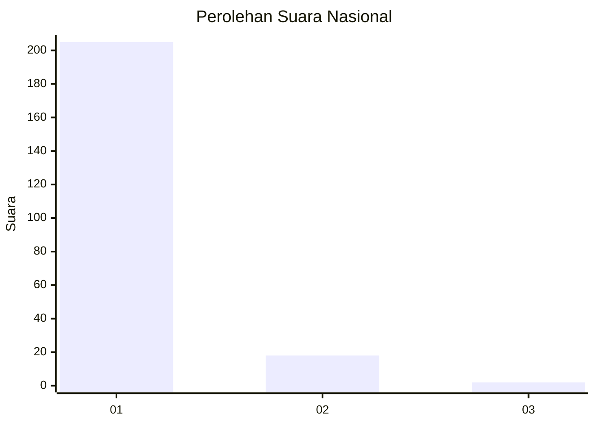
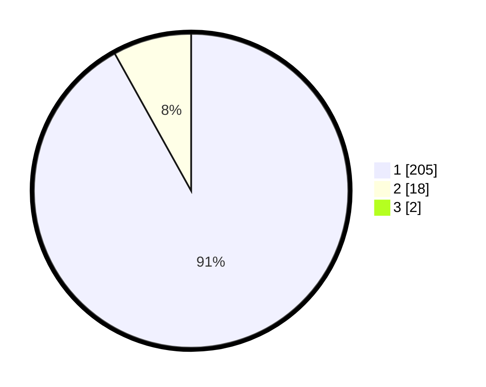

# Hasil

## Grafik

## Tabel

| No. | Nama Paslon    | Suara | Suara (raw) | Persentase |
|:--- |:-------------- | -----:| -----------:| ----------:|
| 1   | ANIES MUHAIMIN | 205   | [205][p-1]  | 91,11      |
| 2   | PRABOWO GIBRAN | 18    | [18][p-2]   | 8,00       |
| 3   | GANJAR MAHFUD  | 2     | [2][p-3]    | 0,89       |

[p-1]: https://github.com/gigit-pemilu/pemilu-2024/blob/main/pilpres/hitung-suara/sub/11-aceh/sub/06-aceh-besar/sub/11-kuta-baro/sub/2018-lam-sabang/sub/001-tps/sub/paslon-1.txt
[p-2]: https://github.com/gigit-pemilu/pemilu-2024/blob/main/pilpres/hitung-suara/sub/11-aceh/sub/06-aceh-besar/sub/11-kuta-baro/sub/2018-lam-sabang/sub/001-tps/sub/paslon-2.txt
[p-3]: https://github.com/gigit-pemilu/pemilu-2024/blob/main/pilpres/hitung-suara/sub/11-aceh/sub/06-aceh-besar/sub/11-kuta-baro/sub/2018-lam-sabang/sub/001-tps/sub/paslon-3.txt

## Foto C Plano

https://sirekap-obj-formc.kpu.go.id/a695/pemilu/ppwp/11/06/11/20/18/1106112018001-20240215-064502--10c7dea0-9eb9-4f77-b3fb-24786783fed7.jpg

https://sirekap-obj-formc.kpu.go.id/a695/pemilu/ppwp/11/06/11/20/18/1106112018001-20240215-064746--b1996142-bc9c-4b55-959d-47d01fb5add6.jpg

https://sirekap-obj-formc.kpu.go.id/a695/pemilu/ppwp/11/06/11/20/18/1106112018001-20240215-065010--d3ba6042-05f1-4bc2-bd9a-097e6538a3f0.jpg

## Metadata

| Key        | Value               |
| ---------- | ------------------- |
| Time Stamp | 2024-02-15 23:29:50 |

