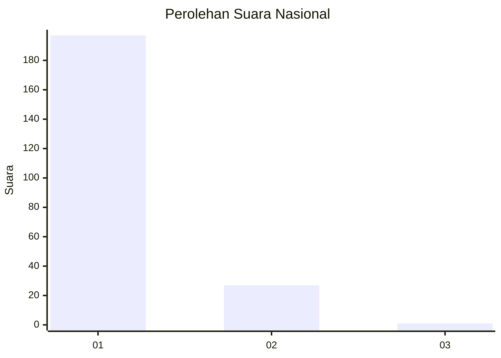
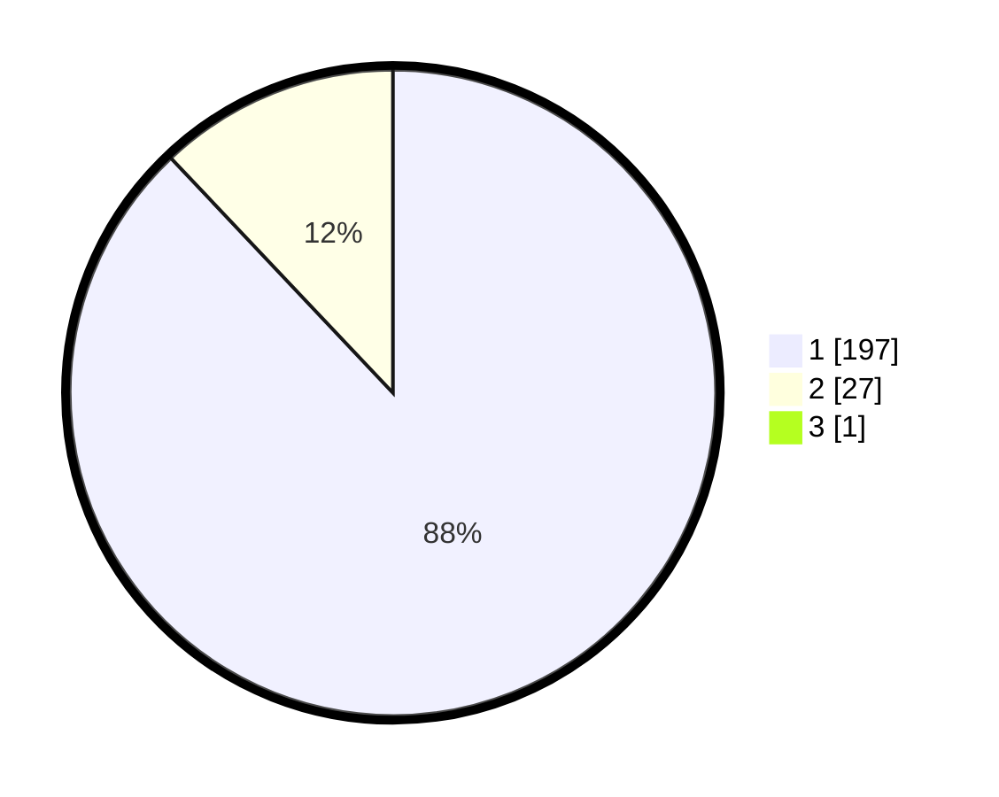

# Hasil

## Grafik

## Tabel

| No. | Nama Paslon    | Suara | Suara (raw) | Persentase |
|:--- |:-------------- | -----:| -----------:| ----------:|
| 1   | ANIES MUHAIMIN | 197   | [197][p-1]  | 87,56      |
| 2   | PRABOWO GIBRAN | 27    | [27][p-2]   | 12,00      |
| 3   | GANJAR MAHFUD  | 1     | [1][p-3]    | 0,44       |

[p-1]: https://github.com/gigit-pemilu/pemilu-2024/blob/main/pilpres/hitung-suara/sub/11-aceh/sub/06-aceh-besar/sub/11-kuta-baro/sub/2018-lam-sabang/sub/002-tps/sub/paslon-1.txt
[p-2]: https://github.com/gigit-pemilu/pemilu-2024/blob/main/pilpres/hitung-suara/sub/11-aceh/sub/06-aceh-besar/sub/11-kuta-baro/sub/2018-lam-sabang/sub/002-tps/sub/paslon-2.txt
[p-3]: https://github.com/gigit-pemilu/pemilu-2024/blob/main/pilpres/hitung-suara/sub/11-aceh/sub/06-aceh-besar/sub/11-kuta-baro/sub/2018-lam-sabang/sub/002-tps/sub/paslon-3.txt

## Foto C Plano

https://sirekap-obj-formc.kpu.go.id/fad3/pemilu/ppwp/11/06/11/20/18/1106112018002-20240215-064716--2d6f192f-c065-4155-ae37-009cdf2f51cb.jpg

https://sirekap-obj-formc.kpu.go.id/fad3/pemilu/ppwp/11/06/11/20/18/1106112018002-20240215-064907--1522be2b-1704-44ea-8cdc-7de7aacc93e8.jpg

https://sirekap-obj-formc.kpu.go.id/fad3/pemilu/ppwp/11/06/11/20/18/1106112018002-20240215-065015--f344b9ea-f9b3-4523-9d25-105595a32e61.jpg

## Metadata

| Key        | Value               |
| ---------- | ------------------- |
| Time Stamp | 2024-02-15 22:30:27 |

