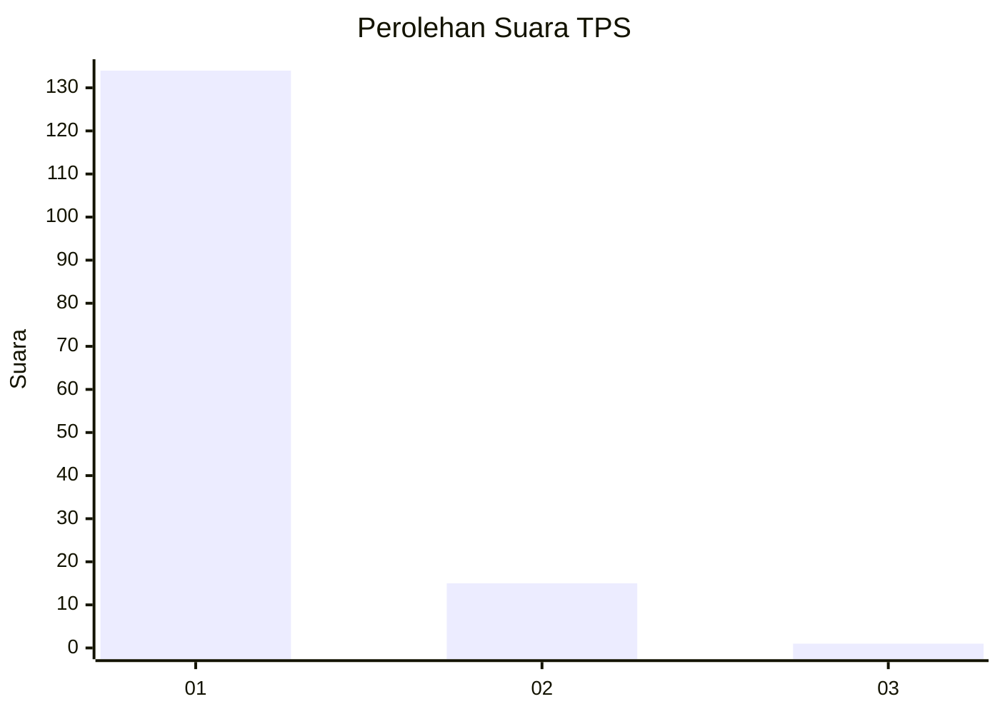
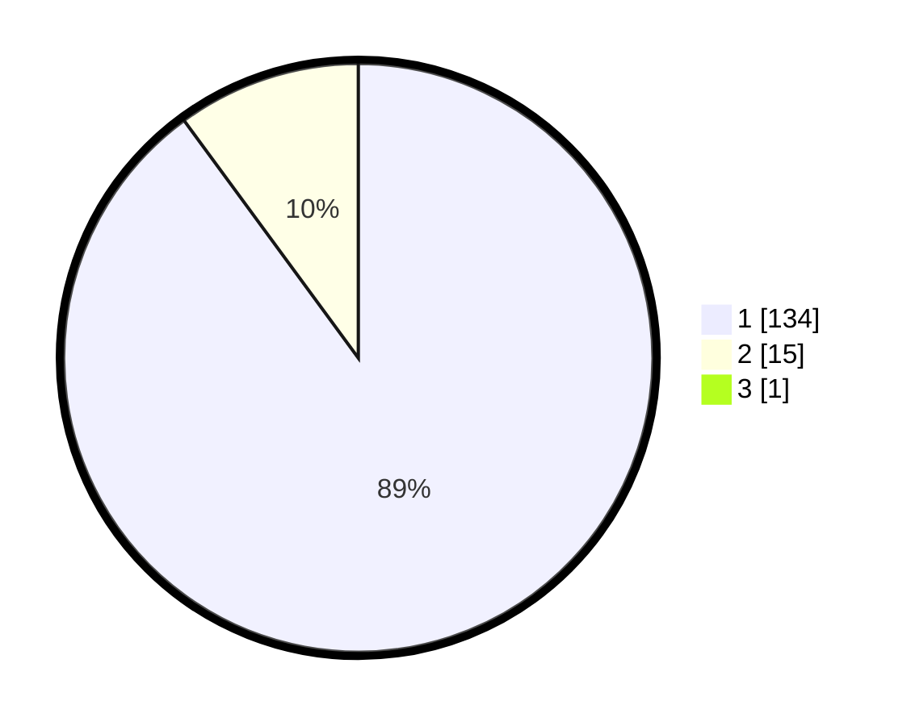

# Hasil

## Grafik

## Tabel

| No. | Nama Paslon    | Suara | Suara (raw) | Persentase |
|:--- |:-------------- | -----:| -----------:| ----------:|
| 1   | ANIES MUHAIMIN | 134   | [134][p-1]  | 89,33      |
| 2   | PRABOWO GIBRAN | 15    | [15][p-2]   | 10,00      |
| 3   | GANJAR MAHFUD  | 1     | [1][p-3]    | 0,67       |

[p-1]: https://github.com/gigit-pemilu/pemilu-2024-11-aceh/blob/main/pilpres/hitung-suara/sub/11-aceh/sub/06-aceh-besar/sub/11-kuta-baro/sub/2019-lam-alue-raya/sub/002-tps/sub/paslon-1.txt
[p-2]: https://github.com/gigit-pemilu/pemilu-2024-11-aceh/blob/main/pilpres/hitung-suara/sub/11-aceh/sub/06-aceh-besar/sub/11-kuta-baro/sub/2019-lam-alue-raya/sub/002-tps/sub/paslon-2.txt
[p-3]: https://github.com/gigit-pemilu/pemilu-2024-11-aceh/blob/main/pilpres/hitung-suara/sub/11-aceh/sub/06-aceh-besar/sub/11-kuta-baro/sub/2019-lam-alue-raya/sub/002-tps/sub/paslon-3.txt

## Foto C Plano

https://sirekap-obj-formc.kpu.go.id/6d13/pemilu/ppwp/11/06/11/20/19/1106112019002-20240214-222122--76307f33-ccee-494b-a687-9737e7de917f.jpg

https://sirekap-obj-formc.kpu.go.id/6d13/pemilu/ppwp/11/06/11/20/19/1106112019002-20240214-222304--6e860165-1a21-4791-bc7f-f109000514ce.jpg

https://sirekap-obj-formc.kpu.go.id/6d13/pemilu/ppwp/11/06/11/20/19/1106112019002-20240214-222533--9a291b7b-f3ca-436f-9220-a7500ccc2e3c.jpg

## Metadata

| Key        | Value               |
| ---------- | ------------------- |
| Time Stamp | 2024-02-15 23:29:50 |

