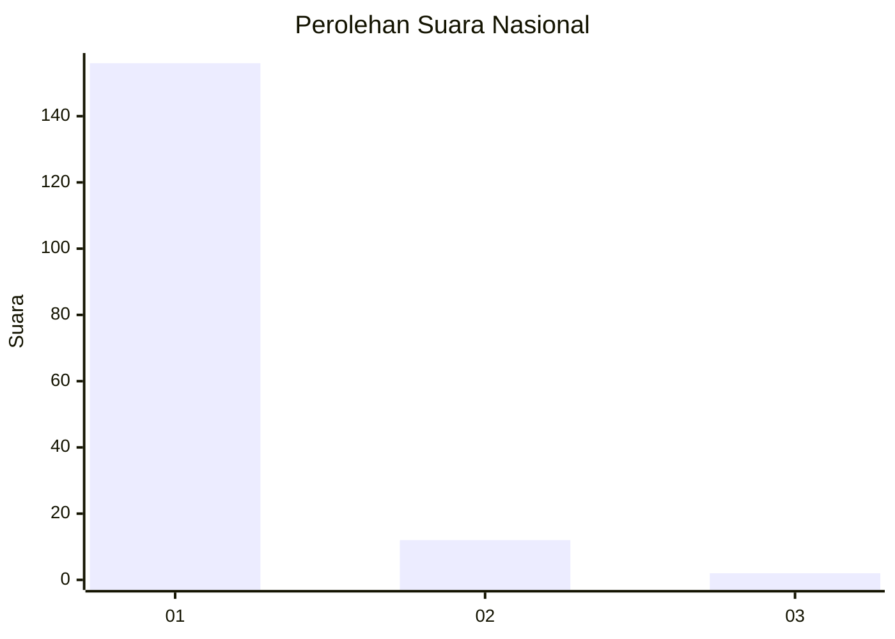
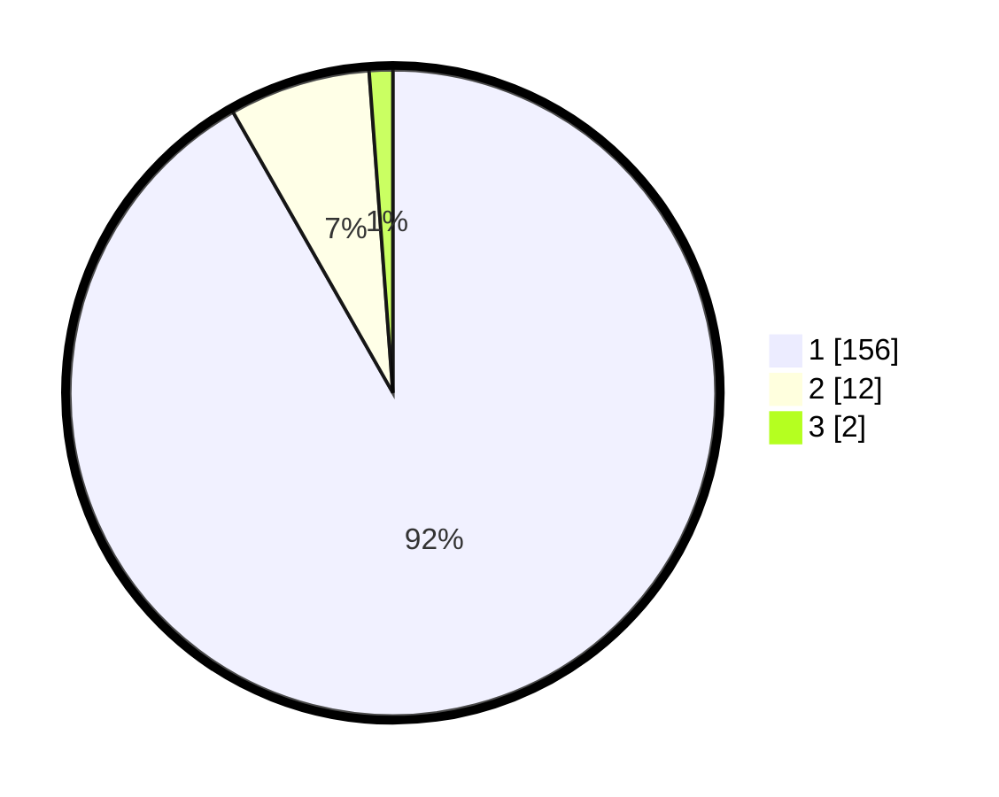

# Hasil

## Grafik

## Tabel

| No. | Nama Paslon    | Suara | Suara (raw) | Persentase |
|:--- |:-------------- | -----:| -----------:| ----------:|
| 1   | ANIES MUHAIMIN | 156   | [156][p-1]  | 91,76      |
| 2   | PRABOWO GIBRAN | 12    | [12][p-2]   | 7,06       |
| 3   | GANJAR MAHFUD  | 2     | [2][p-3]    | 1,18       |

[p-1]: https://github.com/gigit-pemilu/pemilu-2024/blob/main/pilpres/hitung-suara/sub/11-aceh/sub/06-aceh-besar/sub/11-kuta-baro/sub/2020-lam-alue-cut/sub/001-tps/sub/paslon-1.txt
[p-2]: https://github.com/gigit-pemilu/pemilu-2024/blob/main/pilpres/hitung-suara/sub/11-aceh/sub/06-aceh-besar/sub/11-kuta-baro/sub/2020-lam-alue-cut/sub/001-tps/sub/paslon-2.txt
[p-3]: https://github.com/gigit-pemilu/pemilu-2024/blob/main/pilpres/hitung-suara/sub/11-aceh/sub/06-aceh-besar/sub/11-kuta-baro/sub/2020-lam-alue-cut/sub/001-tps/sub/paslon-3.txt

## Foto C Plano

https://sirekap-obj-formc.kpu.go.id/487c/pemilu/ppwp/11/06/11/20/20/1106112020001-20240214-231000--f7774c55-42f8-40b2-96fb-feb22bfab1be.jpg

https://sirekap-obj-formc.kpu.go.id/487c/pemilu/ppwp/11/06/11/20/20/1106112020001-20240214-231202--9e62cd12-cffc-4467-b0f7-4753e127374c.jpg

https://sirekap-obj-formc.kpu.go.id/487c/pemilu/ppwp/11/06/11/20/20/1106112020001-20240214-231504--9f091c00-cb23-4601-bab0-fb174b57986d.jpg

## Metadata

| Key        | Value               |
| ---------- | ------------------- |
| Time Stamp | 2024-02-15 17:30:25 |

