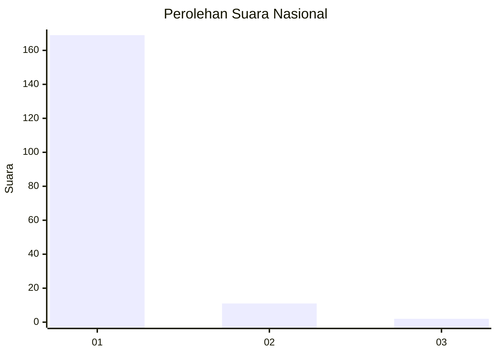
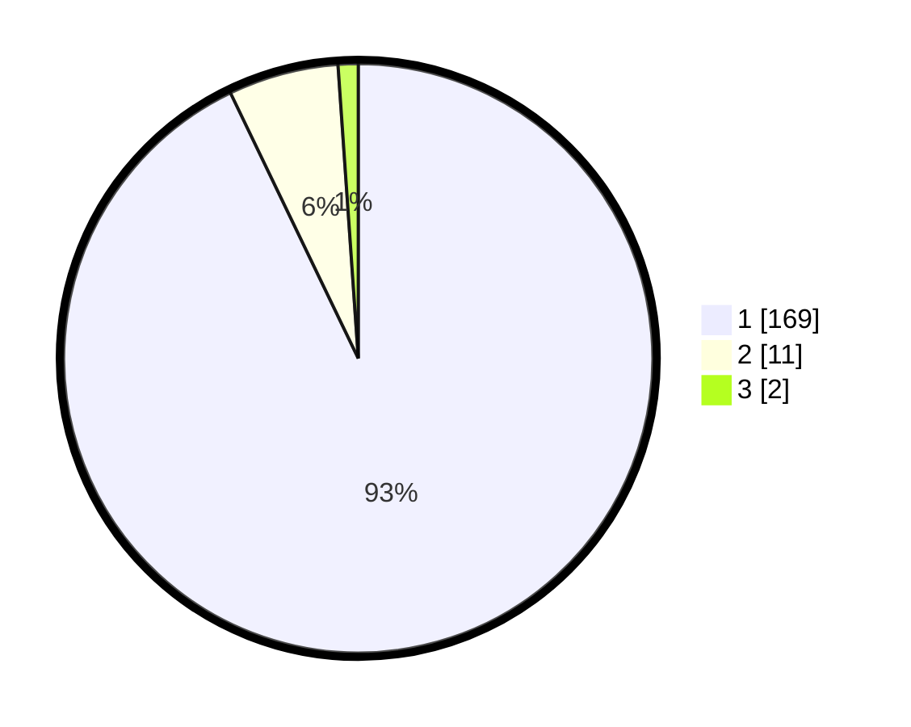

# Hasil

## Grafik

## Tabel

| No. | Nama Paslon    | Suara | Suara (raw) | Persentase |
|:--- |:-------------- | -----:| -----------:| ----------:|
| 1   | ANIES MUHAIMIN | 169   | [169][p-1]  | 92,86      |
| 2   | PRABOWO GIBRAN | 11    | [11][p-2]   | 6,04       |
| 3   | GANJAR MAHFUD  | 2     | [2][p-3]    | 1,10       |

[p-1]: https://github.com/gigit-pemilu/pemilu-2024/blob/main/pilpres/hitung-suara/sub/11-aceh/sub/06-aceh-besar/sub/11-kuta-baro/sub/2020-lam-alue-cut/sub/002-tps/sub/paslon-1.txt
[p-2]: https://github.com/gigit-pemilu/pemilu-2024/blob/main/pilpres/hitung-suara/sub/11-aceh/sub/06-aceh-besar/sub/11-kuta-baro/sub/2020-lam-alue-cut/sub/002-tps/sub/paslon-2.txt
[p-3]: https://github.com/gigit-pemilu/pemilu-2024/blob/main/pilpres/hitung-suara/sub/11-aceh/sub/06-aceh-besar/sub/11-kuta-baro/sub/2020-lam-alue-cut/sub/002-tps/sub/paslon-3.txt

## Foto C Plano

https://sirekap-obj-formc.kpu.go.id/1760/pemilu/ppwp/11/06/11/20/20/1106112020002-20240214-232413--2008d062-f2b2-4c7d-934c-b9f31365f59a.jpg

https://sirekap-obj-formc.kpu.go.id/1760/pemilu/ppwp/11/06/11/20/20/1106112020002-20240214-232603--dbe8b9b3-2a34-406f-b38f-3e0e23d80bfc.jpg

https://sirekap-obj-formc.kpu.go.id/1760/pemilu/ppwp/11/06/11/20/20/1106112020002-20240214-232735--ab162aec-2cb5-425c-bffc-1a273b6b6e46.jpg

## Metadata

| Key        | Value               |
| ---------- | ------------------- |
| Time Stamp | 2024-02-15 23:29:50 |

