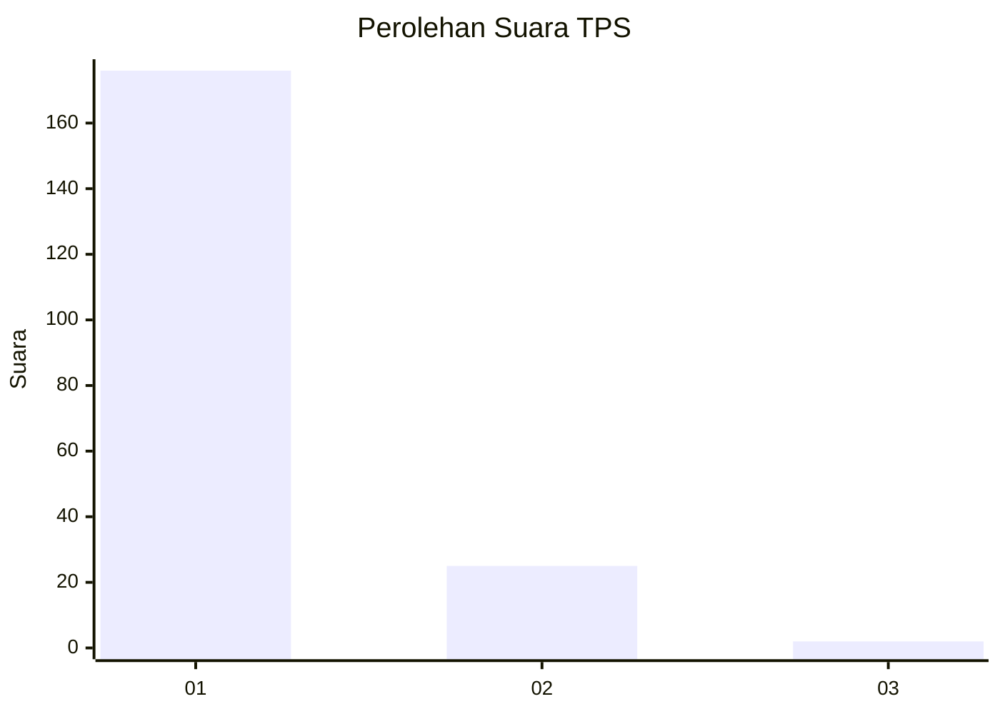
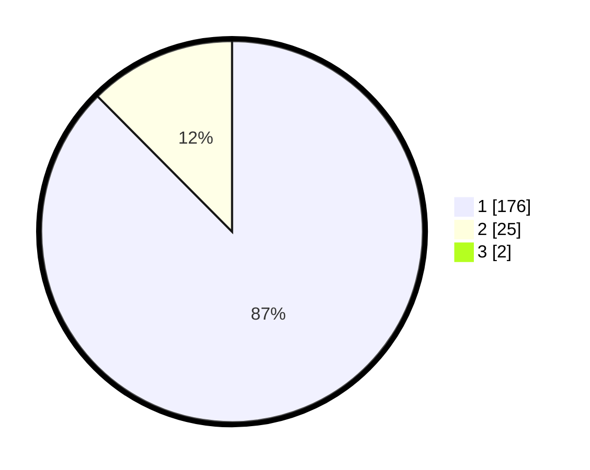

# Hasil

## Grafik

## Tabel

| No. | Nama Paslon    | Suara | Suara (raw) | Persentase |
|:--- |:-------------- | -----:| -----------:| ----------:|
| 1   | ANIES MUHAIMIN | 176   | [176][p-1]  | 86,70      |
| 2   | PRABOWO GIBRAN | 25    | [25][p-2]   | 12,32      |
| 3   | GANJAR MAHFUD  | 2     | [2][p-3]    | 0,99       |

[p-1]: https://github.com/gigit-pemilu/pemilu-2024-11-aceh/blob/main/pilpres/hitung-suara/sub/11-aceh/sub/06-aceh-besar/sub/11-kuta-baro/sub/2021-leupung-mesjid/sub/001-tps/sub/paslon-1.txt
[p-2]: https://github.com/gigit-pemilu/pemilu-2024-11-aceh/blob/main/pilpres/hitung-suara/sub/11-aceh/sub/06-aceh-besar/sub/11-kuta-baro/sub/2021-leupung-mesjid/sub/001-tps/sub/paslon-2.txt
[p-3]: https://github.com/gigit-pemilu/pemilu-2024-11-aceh/blob/main/pilpres/hitung-suara/sub/11-aceh/sub/06-aceh-besar/sub/11-kuta-baro/sub/2021-leupung-mesjid/sub/001-tps/sub/paslon-3.txt

## Foto C Plano

https://sirekap-obj-formc.kpu.go.id/f1dc/pemilu/ppwp/11/06/11/20/21/1106112021001-20240215-035314--0f17577c-1bb4-4ba6-8330-35364c37cdaa.jpg

https://sirekap-obj-formc.kpu.go.id/f1dc/pemilu/ppwp/11/06/11/20/21/1106112021001-20240215-035425--f87c8787-df3c-4128-a52e-5a975957f2c6.jpg

https://sirekap-obj-formc.kpu.go.id/f1dc/pemilu/ppwp/11/06/11/20/21/1106112021001-20240215-035536--b399c08c-727d-4955-81f1-6438700abf47.jpg

## Metadata

| Key        | Value               |
| ---------- | ------------------- |
| Time Stamp | 2024-02-15 05:00:24 |

