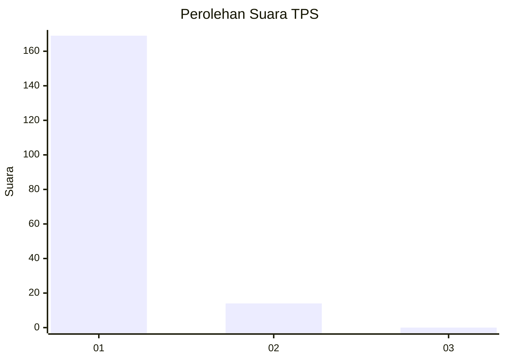
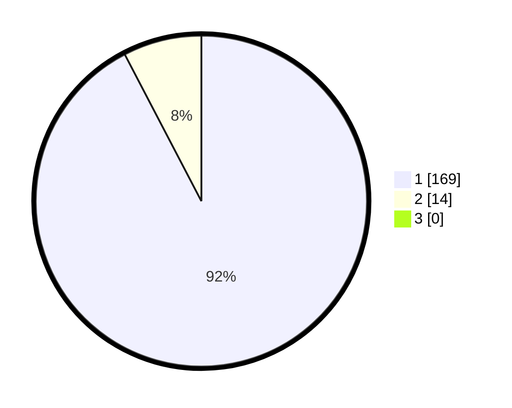

# Hasil

## Grafik

## Tabel

| No. | Nama Paslon    | Suara | Suara (raw) | Persentase |
|:--- |:-------------- | -----:| -----------:| ----------:|
| 1   | ANIES MUHAIMIN | 169   | [169][p-1]  | 92,35      |
| 2   | PRABOWO GIBRAN | 14    | [14][p-2]   | 7,65       |
| 3   | GANJAR MAHFUD  | 0     | [0][p-3]    | 0,00       |

[p-1]: https://github.com/gigit-pemilu/pemilu-2024-11-aceh/blob/main/pilpres/hitung-suara/sub/11-aceh/sub/06-aceh-besar/sub/11-kuta-baro/sub/2024-lampoh-tarom/sub/001-tps/sub/paslon-1.txt
[p-2]: https://github.com/gigit-pemilu/pemilu-2024-11-aceh/blob/main/pilpres/hitung-suara/sub/11-aceh/sub/06-aceh-besar/sub/11-kuta-baro/sub/2024-lampoh-tarom/sub/001-tps/sub/paslon-2.txt
[p-3]: https://github.com/gigit-pemilu/pemilu-2024-11-aceh/blob/main/pilpres/hitung-suara/sub/11-aceh/sub/06-aceh-besar/sub/11-kuta-baro/sub/2024-lampoh-tarom/sub/001-tps/sub/paslon-3.txt

## Foto C Plano

https://sirekap-obj-formc.kpu.go.id/23a4/pemilu/ppwp/11/06/11/20/24/1106112024001-20240215-033005--f91e9e18-0480-4b2b-bf3d-0a9803111366.jpg

https://sirekap-obj-formc.kpu.go.id/23a4/pemilu/ppwp/11/06/11/20/24/1106112024001-20240214-211719--e9fb72ea-be78-40c7-b015-f41a9151aa4d.jpg

https://sirekap-obj-formc.kpu.go.id/23a4/pemilu/ppwp/11/06/11/20/24/1106112024001-20240215-033126--bfe84285-db47-419d-813a-b398a013a415.jpg

## Metadata

| Key        | Value               |
| ---------- | ------------------- |
| Time Stamp | 2024-02-15 19:30:26 |

