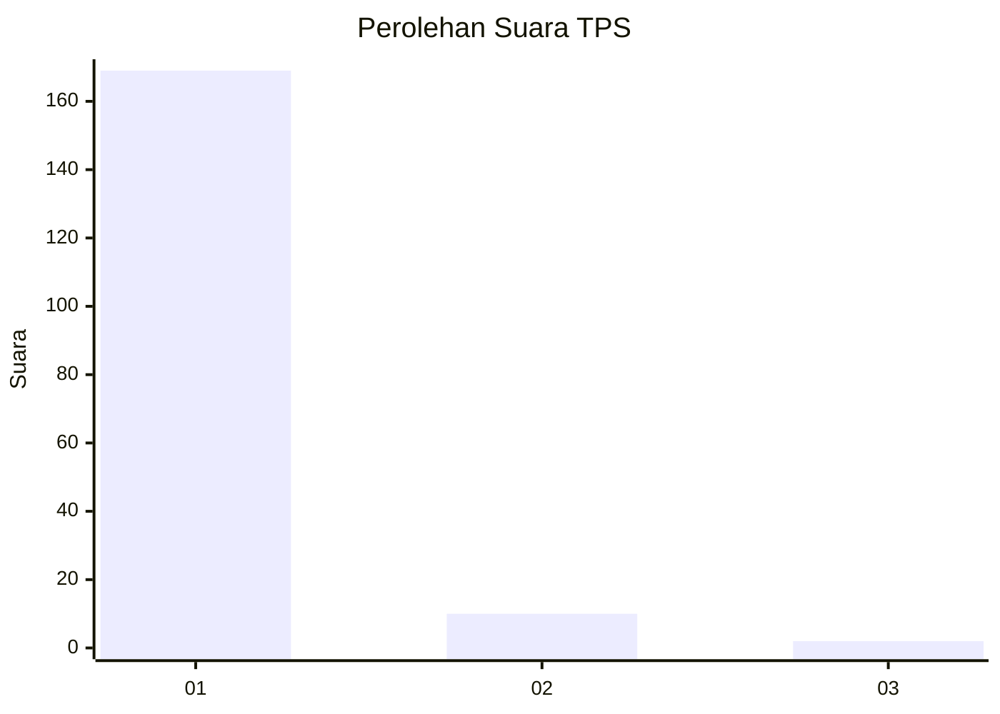
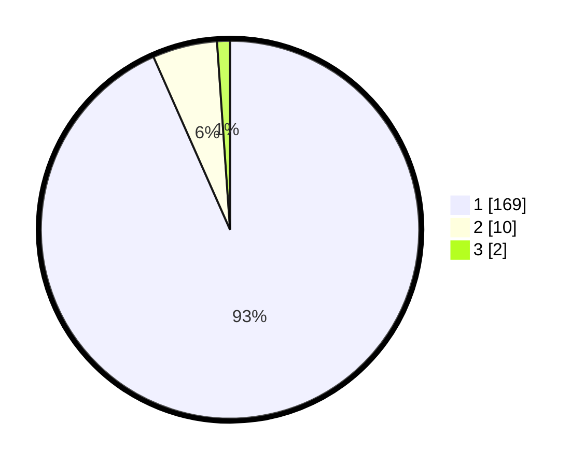

# Hasil

## Grafik

## Tabel

| No. | Nama Paslon    | Suara | Suara (raw) | Persentase |
|:--- |:-------------- | -----:| -----------:| ----------:|
| 1   | ANIES MUHAIMIN | 169   | [169][p-1]  | 93,37      |
| 2   | PRABOWO GIBRAN | 10    | [10][p-2]   | 5,52       |
| 3   | GANJAR MAHFUD  | 2     | [2][p-3]    | 1,10       |

[p-1]: https://github.com/gigit-pemilu/pemilu-2024-11-aceh/blob/main/pilpres/hitung-suara/sub/11-aceh/sub/06-aceh-besar/sub/11-kuta-baro/sub/2024-lampoh-tarom/sub/002-tps/sub/paslon-1.txt
[p-2]: https://github.com/gigit-pemilu/pemilu-2024-11-aceh/blob/main/pilpres/hitung-suara/sub/11-aceh/sub/06-aceh-besar/sub/11-kuta-baro/sub/2024-lampoh-tarom/sub/002-tps/sub/paslon-2.txt
[p-3]: https://github.com/gigit-pemilu/pemilu-2024-11-aceh/blob/main/pilpres/hitung-suara/sub/11-aceh/sub/06-aceh-besar/sub/11-kuta-baro/sub/2024-lampoh-tarom/sub/002-tps/sub/paslon-3.txt

## Foto C Plano

https://sirekap-obj-formc.kpu.go.id/2f37/pemilu/ppwp/11/06/11/20/24/1106112024002-20240214-213042--53bf7911-ad69-4283-85cc-6a455ed1dbcb.jpg

https://sirekap-obj-formc.kpu.go.id/2f37/pemilu/ppwp/11/06/11/20/24/1106112024002-20240215-033513--77f564f9-8cc9-4825-b3b1-3f48702eaa10.jpg

https://sirekap-obj-formc.kpu.go.id/2f37/pemilu/ppwp/11/06/11/20/24/1106112024002-20240215-033712--aae9d088-7f4d-4938-8ee7-1fa4a28f8817.jpg

## Metadata

| Key        | Value               |
| ---------- | ------------------- |
| Time Stamp | 2024-02-15 15:00:29 |

