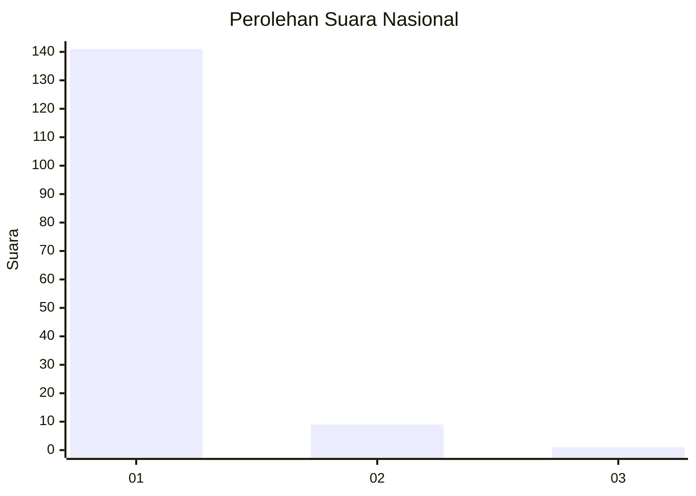
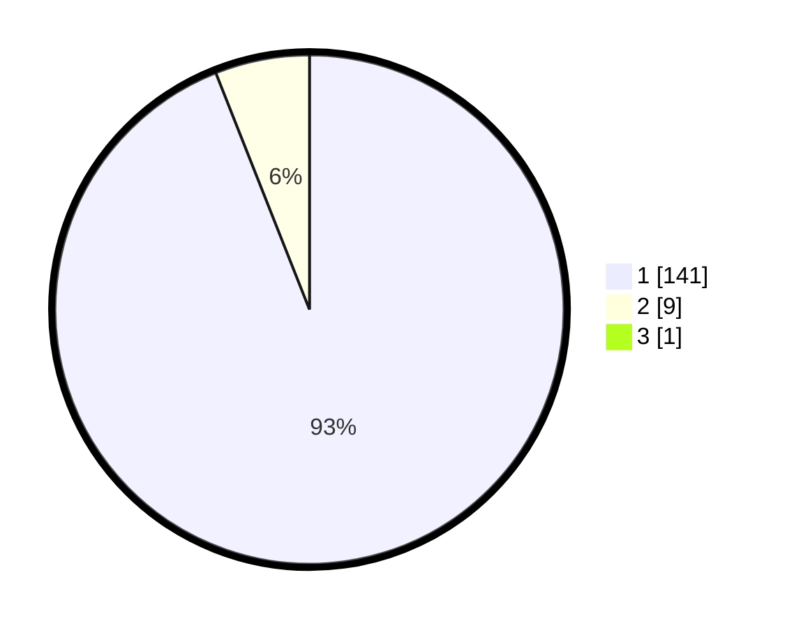

# Hasil

## Grafik

## Tabel

| No. | Nama Paslon    | Suara | Suara (raw) | Persentase |
|:--- |:-------------- | -----:| -----------:| ----------:|
| 1   | ANIES MUHAIMIN | 141   | [141][p-1]  | 93,38      |
| 2   | PRABOWO GIBRAN | 9     | [9][p-2]    | 5,96       |
| 3   | GANJAR MAHFUD  | 1     | [1][p-3]    | 0,66       |

[p-1]: https://github.com/gigit-pemilu/pemilu-2024/blob/main/pilpres/hitung-suara/sub/11-aceh/sub/06-aceh-besar/sub/11-kuta-baro/sub/2028-bak-buloh/sub/001-tps/sub/paslon-1.txt
[p-2]: https://github.com/gigit-pemilu/pemilu-2024/blob/main/pilpres/hitung-suara/sub/11-aceh/sub/06-aceh-besar/sub/11-kuta-baro/sub/2028-bak-buloh/sub/001-tps/sub/paslon-2.txt
[p-3]: https://github.com/gigit-pemilu/pemilu-2024/blob/main/pilpres/hitung-suara/sub/11-aceh/sub/06-aceh-besar/sub/11-kuta-baro/sub/2028-bak-buloh/sub/001-tps/sub/paslon-3.txt

## Foto C Plano

https://sirekap-obj-formc.kpu.go.id/d886/pemilu/ppwp/11/06/11/20/28/1106112028001-20240214-155427--fd5261e6-03b5-482c-b705-410a7879f060.jpg

https://sirekap-obj-formc.kpu.go.id/d886/pemilu/ppwp/11/06/11/20/28/1106112028001-20240214-155733--2e95eaa1-c125-4faf-b558-f788a729778e.jpg

https://sirekap-obj-formc.kpu.go.id/d886/pemilu/ppwp/11/06/11/20/28/1106112028001-20240214-155852--fec5cc9a-811c-42f8-80db-468865c9b6d5.jpg

## Metadata

| Key        | Value               |
| ---------- | ------------------- |
| Time Stamp | 2024-02-15 23:29:50 |

