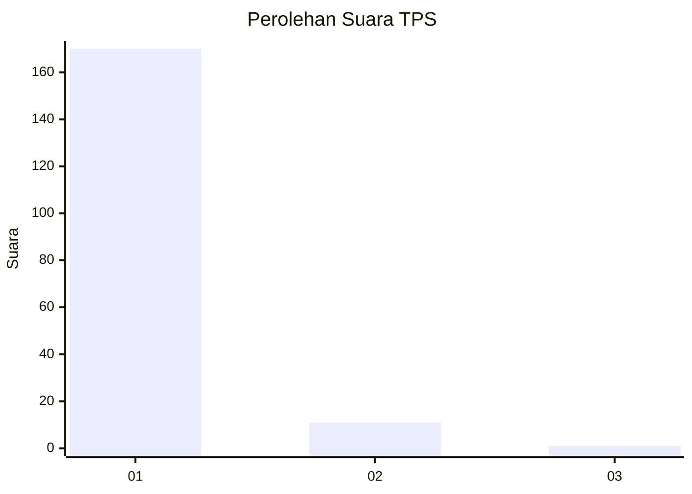
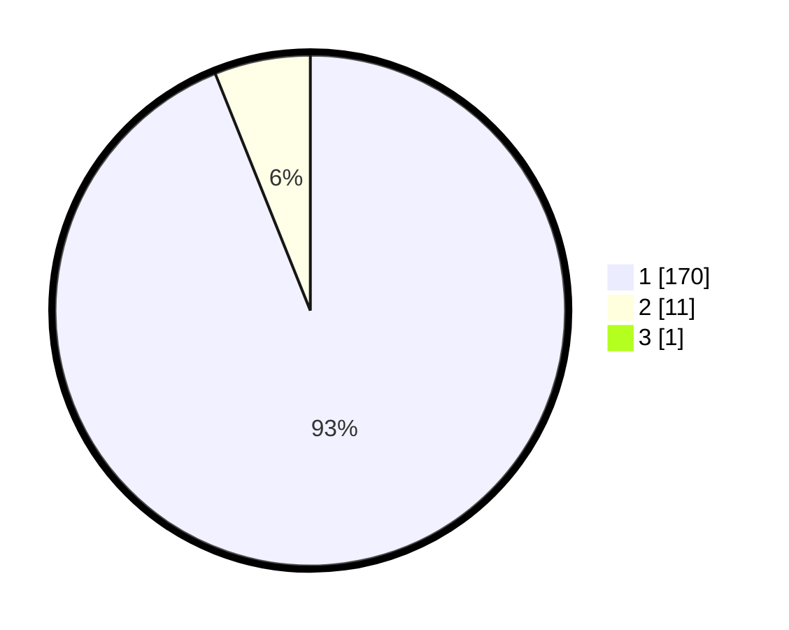

# Hasil

## Grafik

## Tabel

| No. | Nama Paslon    | Suara | Suara (raw) | Persentase |
|:--- |:-------------- | -----:| -----------:| ----------:|
| 1   | ANIES MUHAIMIN | 170   | [170][p-1]  | 93,41      |
| 2   | PRABOWO GIBRAN | 11    | [11][p-2]   | 6,04       |
| 3   | GANJAR MAHFUD  | 1     | [1][p-3]    | 0,55       |

[p-1]: https://github.com/gigit-pemilu/pemilu-2024-11-aceh/blob/main/pilpres/hitung-suara/sub/11-aceh/sub/06-aceh-besar/sub/11-kuta-baro/sub/2029-lam-seunong/sub/001-tps/sub/paslon-1.txt
[p-2]: https://github.com/gigit-pemilu/pemilu-2024-11-aceh/blob/main/pilpres/hitung-suara/sub/11-aceh/sub/06-aceh-besar/sub/11-kuta-baro/sub/2029-lam-seunong/sub/001-tps/sub/paslon-2.txt
[p-3]: https://github.com/gigit-pemilu/pemilu-2024-11-aceh/blob/main/pilpres/hitung-suara/sub/11-aceh/sub/06-aceh-besar/sub/11-kuta-baro/sub/2029-lam-seunong/sub/001-tps/sub/paslon-3.txt

## Foto C Plano

https://sirekap-obj-formc.kpu.go.id/c5f9/pemilu/ppwp/11/06/11/20/29/1106112029001-20240214-203848--e71e4497-fa40-4a6f-93b3-5e91e5123095.jpg

https://sirekap-obj-formc.kpu.go.id/c5f9/pemilu/ppwp/11/06/11/20/29/1106112029001-20240214-200344--d11c3bcd-01e2-47ce-ae5c-290fbfb8eb99.jpg

https://sirekap-obj-formc.kpu.go.id/c5f9/pemilu/ppwp/11/06/11/20/29/1106112029001-20240214-200549--3b45af89-0858-4fca-9e7b-d366f9354165.jpg

## Metadata

| Key        | Value               |
| ---------- | ------------------- |
| Time Stamp | 2024-02-15 23:29:50 |

