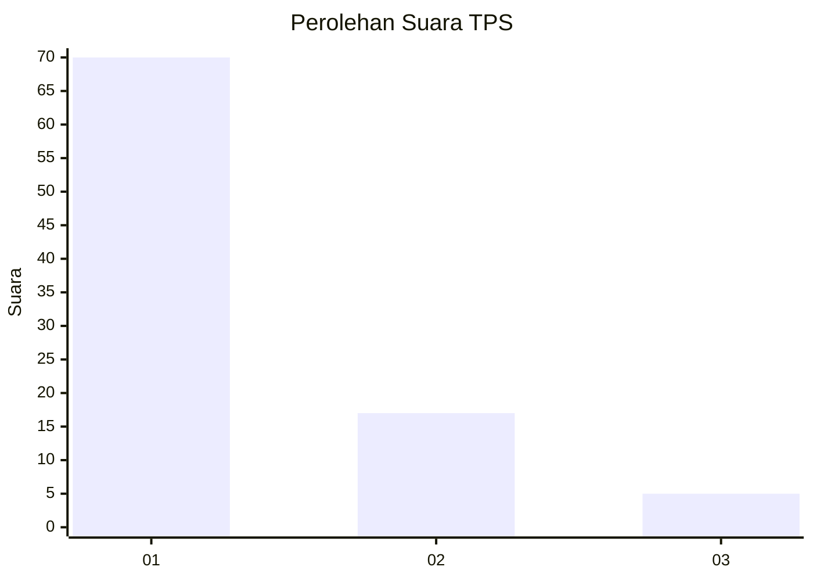
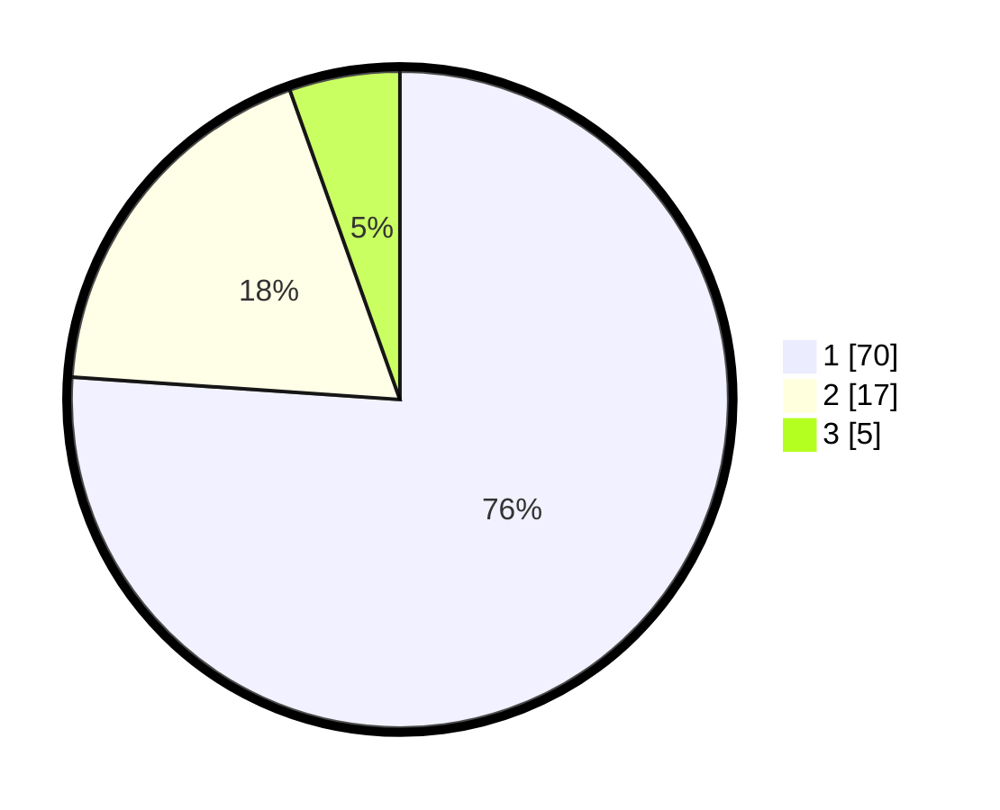

# Hasil

## Grafik

## Tabel

| No. | Nama Paslon    | Suara | Suara (raw) | Persentase |
|:--- |:-------------- | -----:| -----------:| ----------:|
| 1   | ANIES MUHAIMIN | 70    | [70][p-1]   | 76,09      |
| 2   | PRABOWO GIBRAN | 17    | [17][p-2]   | 18,48      |
| 3   | GANJAR MAHFUD  | 5     | [5][p-3]    | 5,43       |

[p-1]: https://github.com/gigit-pemilu/pemilu-2024-11-aceh/blob/main/pilpres/hitung-suara/sub/11-aceh/sub/06-aceh-besar/sub/11-kuta-baro/sub/2031-lam-roh/sub/001-tps/sub/paslon-1.txt
[p-2]: https://github.com/gigit-pemilu/pemilu-2024-11-aceh/blob/main/pilpres/hitung-suara/sub/11-aceh/sub/06-aceh-besar/sub/11-kuta-baro/sub/2031-lam-roh/sub/001-tps/sub/paslon-2.txt
[p-3]: https://github.com/gigit-pemilu/pemilu-2024-11-aceh/blob/main/pilpres/hitung-suara/sub/11-aceh/sub/06-aceh-besar/sub/11-kuta-baro/sub/2031-lam-roh/sub/001-tps/sub/paslon-3.txt

## Foto C Plano

https://sirekap-obj-formc.kpu.go.id/08e0/pemilu/ppwp/11/06/11/20/31/1106112031001-20240216-150202--7489e2e7-949b-46a6-b37f-9d3ae8e796d9.jpg

https://sirekap-obj-formc.kpu.go.id/08e0/pemilu/ppwp/11/06/11/20/31/1106112031001-20240216-095913--3aa8dbed-e269-47e0-ab87-a97775aedb35.jpg

https://sirekap-obj-formc.kpu.go.id/08e0/pemilu/ppwp/11/06/11/20/31/1106112031001-20240216-095909--b58dd4b5-d369-412b-9f15-7dfdbbdd915e.jpg

## Metadata

| Key        | Value               |
| ---------- | ------------------- |
| Time Stamp | 2024-02-16 16:25:10 |

## DATA PEMILIH TETAP

Jumlah pemilih dalam DPT: **93**.
 * L: **45**.
 * P: **48**.

## DATA PENGGUNA HAK PILIH

Jumlah pengguna hak pilih dalam DPT: **92**.
 * L: **45**.
 * P: **47**.

Jumlah pengguna hak pilih dalam DPTb: **0**.
 * L: **0**.
 * P: **0**.

Jumlah pengguna hak pilih dalam DPK: **0**.
 * L: **0**.
 * P: **0**.

Jumlah pengguna hak pilih: **92**.
 * L: **45**.
 * P: **47**.

## JUMLAH SUARA SAH DAN TIDAK SAH

JUMLAH SELURUH SUARA SAH: **92**.

JUMLAH SUARA TIDAK SAH: **0**.

JUMLAH SELURUH SUARA SAH DAN SUARA TIDAK SAH: **92**.

