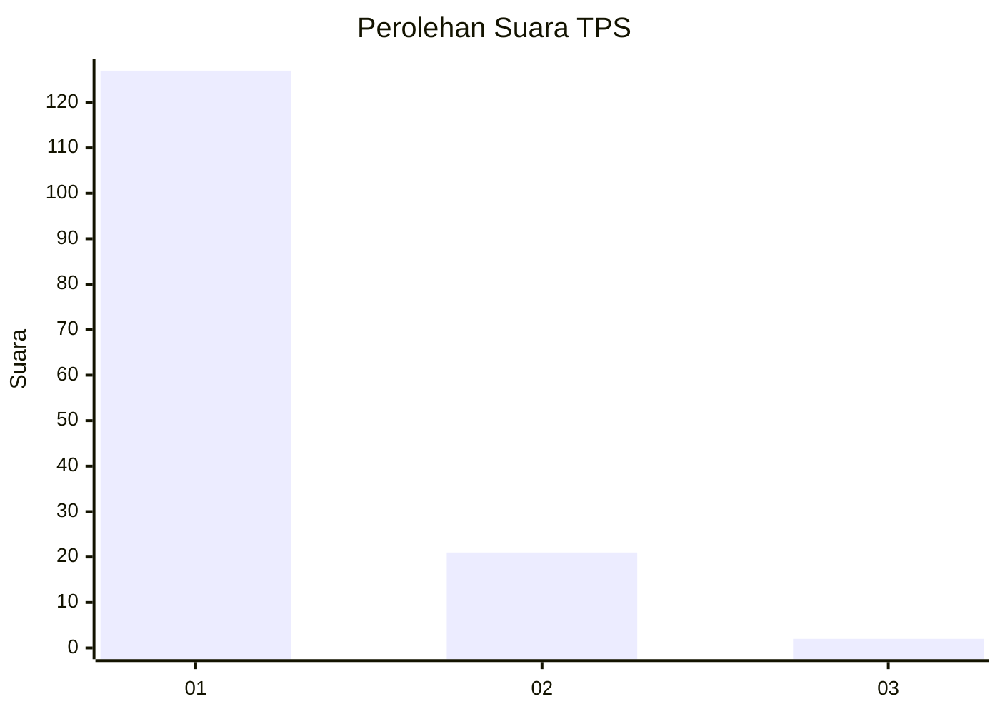
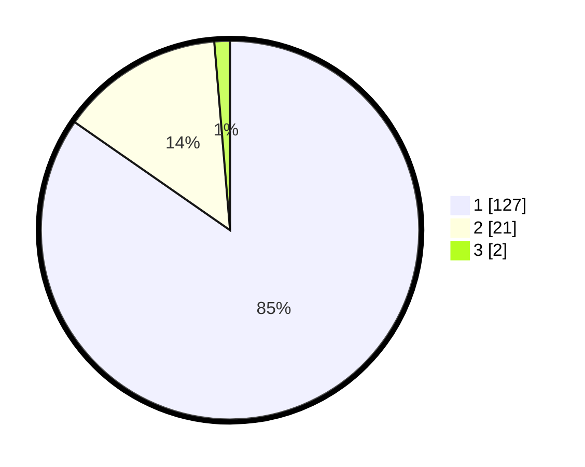

# Hasil

## Grafik

## Tabel

| No. | Nama Paslon    | Suara | Suara (raw) | Persentase |
|:--- |:-------------- | -----:| -----------:| ----------:|
| 1   | ANIES MUHAIMIN | 127   | [127][p-1]  | 84,67      |
| 2   | PRABOWO GIBRAN | 21    | [21][p-2]   | 14,00      |
| 3   | GANJAR MAHFUD  | 2     | [2][p-3]    | 1,33       |

[p-1]: https://github.com/gigit-pemilu/pemilu-2024-11-aceh/blob/main/pilpres/hitung-suara/sub/11-aceh/sub/06-aceh-besar/sub/11-kuta-baro/sub/2038-lambro-deyah/sub/001-tps/sub/paslon-1.txt
[p-2]: https://github.com/gigit-pemilu/pemilu-2024-11-aceh/blob/main/pilpres/hitung-suara/sub/11-aceh/sub/06-aceh-besar/sub/11-kuta-baro/sub/2038-lambro-deyah/sub/001-tps/sub/paslon-2.txt
[p-3]: https://github.com/gigit-pemilu/pemilu-2024-11-aceh/blob/main/pilpres/hitung-suara/sub/11-aceh/sub/06-aceh-besar/sub/11-kuta-baro/sub/2038-lambro-deyah/sub/001-tps/sub/paslon-3.txt

## Foto C Plano

https://sirekap-obj-formc.kpu.go.id/fcbc/pemilu/ppwp/11/06/11/20/38/1106112038001-20240214-204801--e24484bc-f3e0-4b6b-aa60-475c3097bfb8.jpg

https://sirekap-obj-formc.kpu.go.id/fcbc/pemilu/ppwp/11/06/11/20/38/1106112038001-20240214-210421--a0de06b4-0a84-4c52-8884-82ba1f091528.jpg

https://sirekap-obj-formc.kpu.go.id/fcbc/pemilu/ppwp/11/06/11/20/38/1106112038001-20240214-210511--1733dce4-85ea-4a88-aa13-137498084ec9.jpg

## Metadata

| Key        | Value               |
| ---------- | ------------------- |
| Time Stamp | 2024-02-15 23:29:50 |

