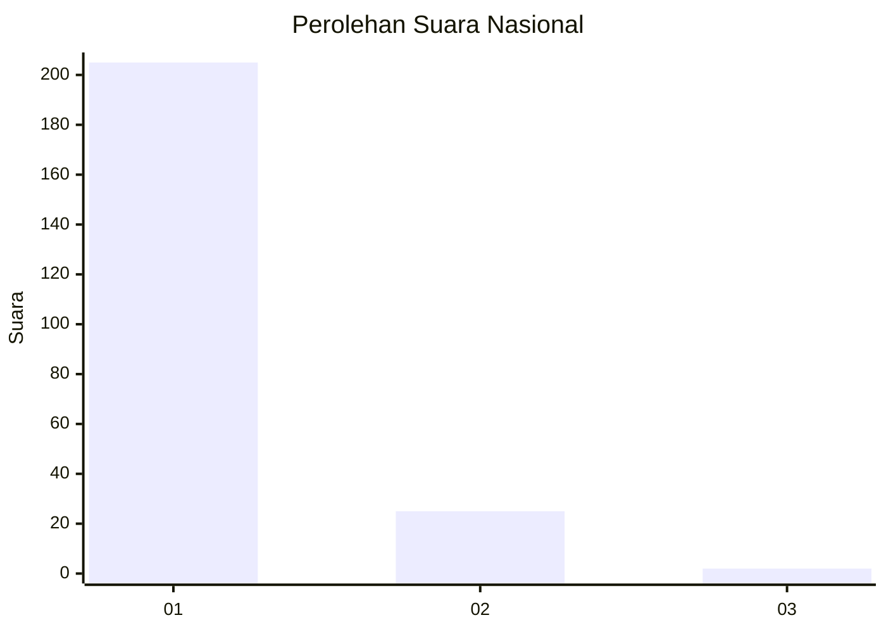
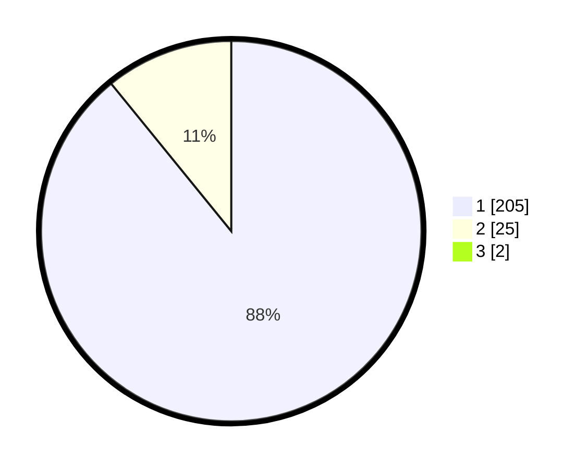

# Hasil

## Grafik

## Tabel

| No. | Nama Paslon    | Suara | Suara (raw) | Persentase |
|:--- |:-------------- | -----:| -----------:| ----------:|
| 1   | ANIES MUHAIMIN | 205   | [205][p-1]  | 88,36      |
| 2   | PRABOWO GIBRAN | 25    | [25][p-2]   | 10,78      |
| 3   | GANJAR MAHFUD  | 2     | [2][p-3]    | 0,86       |

[p-1]: https://github.com/gigit-pemilu/pemilu-2024/blob/main/pilpres/hitung-suara/sub/11-aceh/sub/06-aceh-besar/sub/11-kuta-baro/sub/2041-cot-cut/sub/001-tps/sub/paslon-1.txt
[p-2]: https://github.com/gigit-pemilu/pemilu-2024/blob/main/pilpres/hitung-suara/sub/11-aceh/sub/06-aceh-besar/sub/11-kuta-baro/sub/2041-cot-cut/sub/001-tps/sub/paslon-2.txt
[p-3]: https://github.com/gigit-pemilu/pemilu-2024/blob/main/pilpres/hitung-suara/sub/11-aceh/sub/06-aceh-besar/sub/11-kuta-baro/sub/2041-cot-cut/sub/001-tps/sub/paslon-3.txt

## Foto C Plano

https://sirekap-obj-formc.kpu.go.id/5ef3/pemilu/ppwp/11/06/11/20/41/1106112041001-20240215-114647--439fd81c-c52e-4fd2-a174-40fa3a3a4c44.jpg

https://sirekap-obj-formc.kpu.go.id/5ef3/pemilu/ppwp/11/06/11/20/41/1106112041001-20240215-114750--73e3d7b1-811c-4bc4-9806-fe3f6a046f4e.jpg

https://sirekap-obj-formc.kpu.go.id/5ef3/pemilu/ppwp/11/06/11/20/41/1106112041001-20240215-114837--52c64d2f-7780-4597-a2b4-2231d3c04b32.jpg

## Metadata

| Key        | Value               |
| ---------- | ------------------- |
| Time Stamp | 2024-02-15 23:29:50 |

