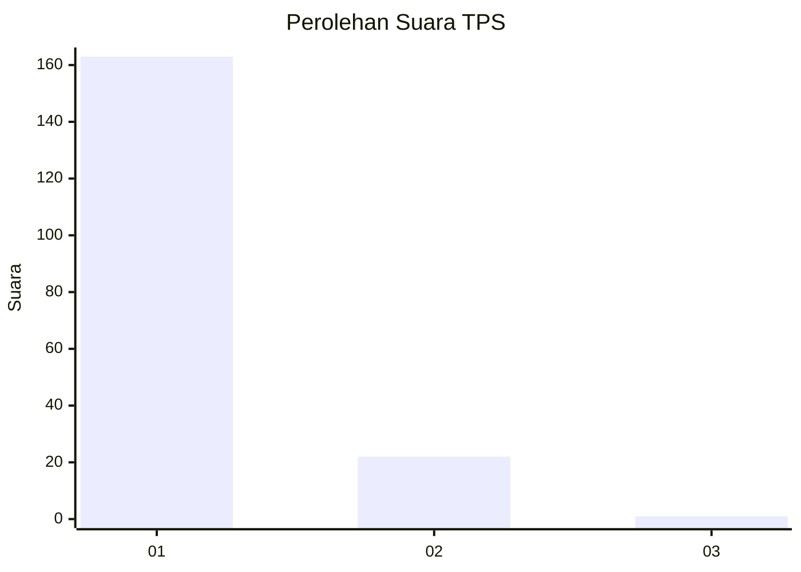
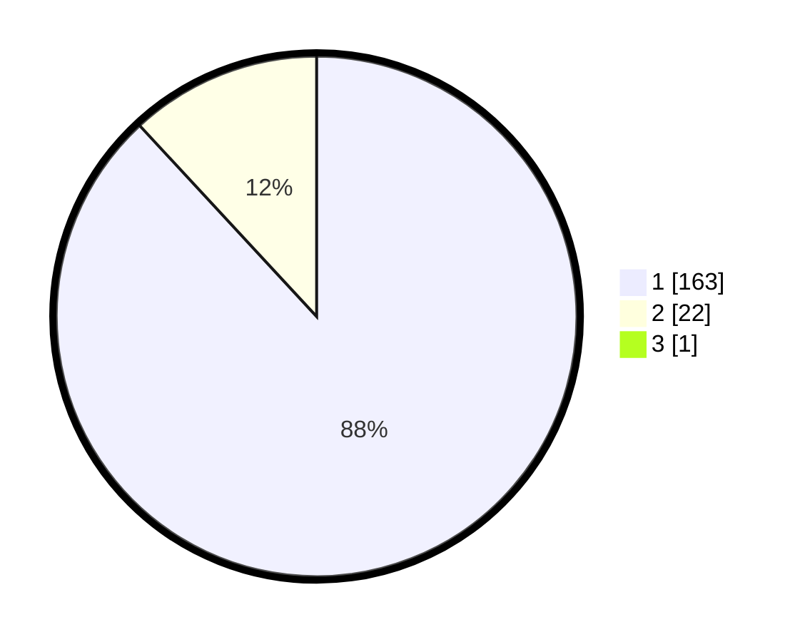

# Hasil

## Grafik

## Tabel

| No. | Nama Paslon    | Suara | Suara (raw) | Persentase |
|:--- |:-------------- | -----:| -----------:| ----------:|
| 1   | ANIES MUHAIMIN | 163   | [163][p-1]  | 87,63      |
| 2   | PRABOWO GIBRAN | 22    | [22][p-2]   | 11,83      |
| 3   | GANJAR MAHFUD  | 1     | [1][p-3]    | 0,54       |

[p-1]: https://github.com/gigit-pemilu/pemilu-2024-11-aceh/blob/main/pilpres/hitung-suara/sub/11-aceh/sub/06-aceh-besar/sub/11-kuta-baro/sub/2046-cucum/sub/002-tps/sub/paslon-1.txt
[p-2]: https://github.com/gigit-pemilu/pemilu-2024-11-aceh/blob/main/pilpres/hitung-suara/sub/11-aceh/sub/06-aceh-besar/sub/11-kuta-baro/sub/2046-cucum/sub/002-tps/sub/paslon-2.txt
[p-3]: https://github.com/gigit-pemilu/pemilu-2024-11-aceh/blob/main/pilpres/hitung-suara/sub/11-aceh/sub/06-aceh-besar/sub/11-kuta-baro/sub/2046-cucum/sub/002-tps/sub/paslon-3.txt

## Foto C Plano

https://sirekap-obj-formc.kpu.go.id/447f/pemilu/ppwp/11/06/11/20/46/1106112046002-20240214-213414--ae51c2be-e23f-4a54-855e-f3183ea3a875.jpg

https://sirekap-obj-formc.kpu.go.id/447f/pemilu/ppwp/11/06/11/20/46/1106112046002-20240214-213121--6ff41295-ca02-4160-a0e8-ba3c33957a41.jpg

https://sirekap-obj-formc.kpu.go.id/447f/pemilu/ppwp/11/06/11/20/46/1106112046002-20240214-213455--00e336f4-2d9c-4ad6-b795-3dda7cbb6481.jpg

## Metadata

| Key        | Value               |
| ---------- | ------------------- |
| Time Stamp | 2024-02-15 23:29:50 |

