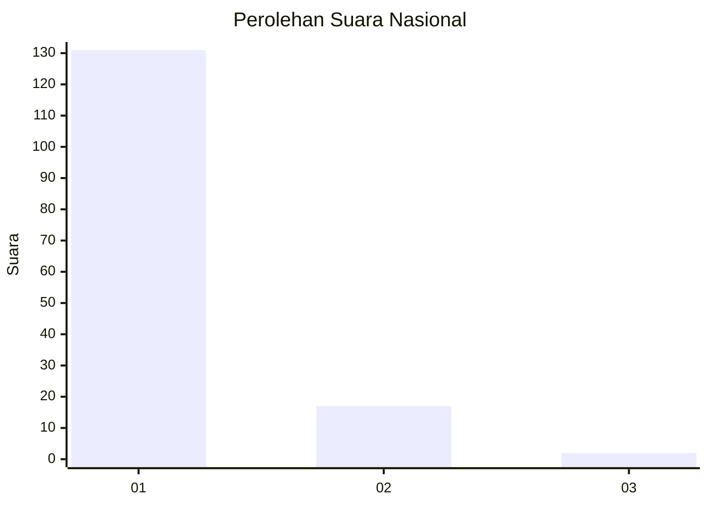
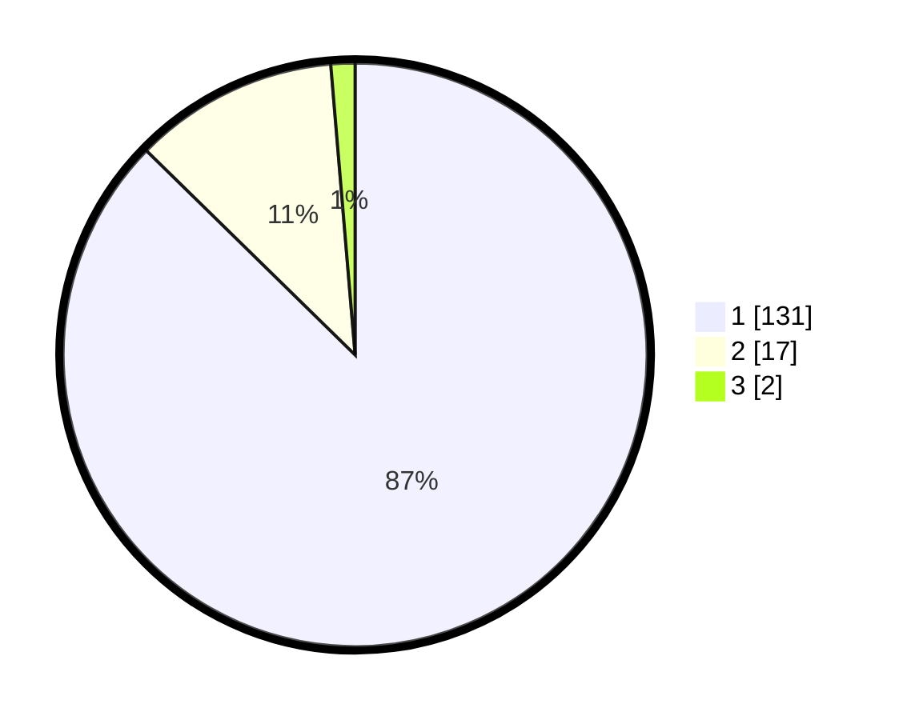

# Hasil

## Grafik

## Tabel

| No. | Nama Paslon    | Suara | Suara (raw) | Persentase |
|:--- |:-------------- | -----:| -----------:| ----------:|
| 1   | ANIES MUHAIMIN | 131   | [131][p-1]  | 87,33      |
| 2   | PRABOWO GIBRAN | 17    | [17][p-2]   | 11,33      |
| 3   | GANJAR MAHFUD  | 2     | [2][p-3]    | 1,33       |

[p-1]: https://github.com/gigit-pemilu/pemilu-2024/blob/main/pilpres/hitung-suara/sub/11-aceh/sub/06-aceh-besar/sub/11-kuta-baro/sub/2049-beurangong/sub/002-tps/sub/paslon-1.txt
[p-2]: https://github.com/gigit-pemilu/pemilu-2024/blob/main/pilpres/hitung-suara/sub/11-aceh/sub/06-aceh-besar/sub/11-kuta-baro/sub/2049-beurangong/sub/002-tps/sub/paslon-2.txt
[p-3]: https://github.com/gigit-pemilu/pemilu-2024/blob/main/pilpres/hitung-suara/sub/11-aceh/sub/06-aceh-besar/sub/11-kuta-baro/sub/2049-beurangong/sub/002-tps/sub/paslon-3.txt

## Foto C Plano

https://sirekap-obj-formc.kpu.go.id/82d0/pemilu/ppwp/11/06/11/20/49/1106112049002-20240214-155052--fbab3578-cedb-4264-855c-3c7a524eeafd.jpg

https://sirekap-obj-formc.kpu.go.id/82d0/pemilu/ppwp/11/06/11/20/49/1106112049002-20240214-155913--114c92ab-b782-4732-90c8-6c7ff6b6d07d.jpg

## Metadata

| Key        | Value               |
| ---------- | ------------------- |
| Time Stamp | 2024-02-24 22:31:28 |

