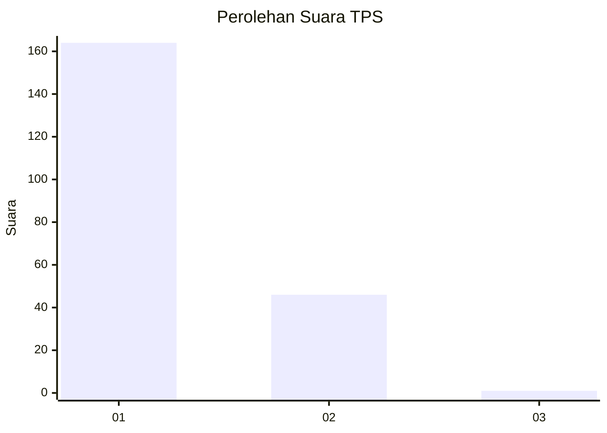
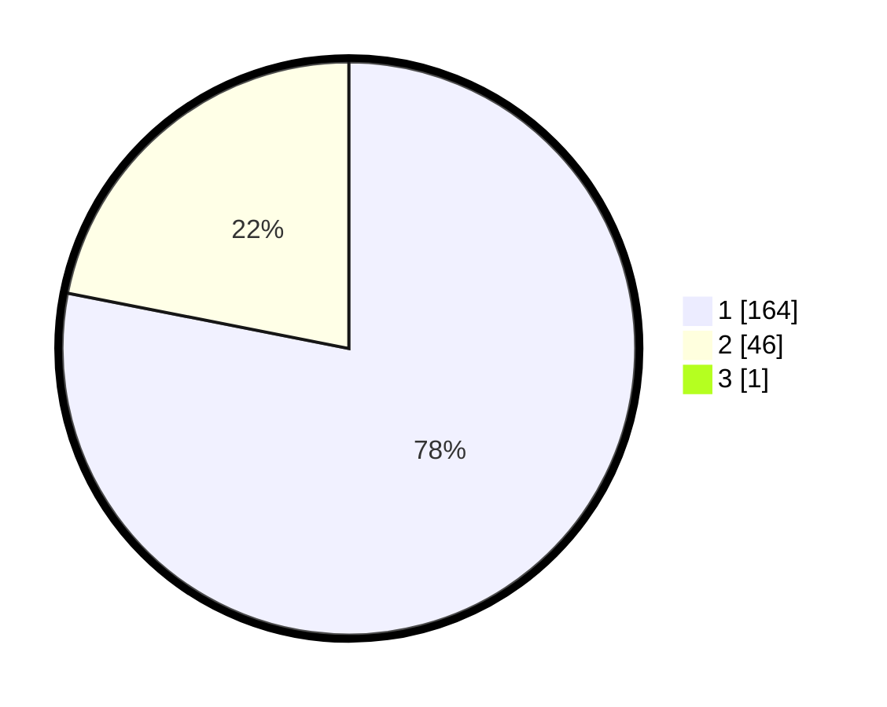

# Hasil

## Grafik

## Tabel

| No. | Nama Paslon    | Suara | Suara (raw) | Persentase |
|:--- |:-------------- | -----:| -----------:| ----------:|
| 1   | ANIES MUHAIMIN | 164   | [164][p-1]  | 77,73      |
| 2   | PRABOWO GIBRAN | 46    | [46][p-2]   | 21,80      |
| 3   | GANJAR MAHFUD  | 1     | [1][p-3]    | 0,47       |

[p-1]: https://github.com/gigit-pemilu/pemilu-2024-11-aceh/blob/main/pilpres/hitung-suara/sub/11-aceh/sub/06-aceh-besar/sub/12-darussalam/sub/2001-angan/sub/001-tps/sub/paslon-1.txt
[p-2]: https://github.com/gigit-pemilu/pemilu-2024-11-aceh/blob/main/pilpres/hitung-suara/sub/11-aceh/sub/06-aceh-besar/sub/12-darussalam/sub/2001-angan/sub/001-tps/sub/paslon-2.txt
[p-3]: https://github.com/gigit-pemilu/pemilu-2024-11-aceh/blob/main/pilpres/hitung-suara/sub/11-aceh/sub/06-aceh-besar/sub/12-darussalam/sub/2001-angan/sub/001-tps/sub/paslon-3.txt

## Foto C Plano

https://sirekap-obj-formc.kpu.go.id/420d/pemilu/ppwp/11/06/12/20/01/1106122001001-20240215-030548--c4163c04-874e-4961-899f-88ec11bc714e.jpg

https://sirekap-obj-formc.kpu.go.id/420d/pemilu/ppwp/11/06/12/20/01/1106122001001-20240215-004823--555dcea4-fccc-4938-ade4-c636a6f17f28.jpg

https://sirekap-obj-formc.kpu.go.id/420d/pemilu/ppwp/11/06/12/20/01/1106122001001-20240215-004920--c33d225a-aaa7-46d9-8148-a46942e7023e.jpg

## Metadata

| Key        | Value               |
| ---------- | ------------------- |
| Time Stamp | 2024-02-15 21:30:27 |

