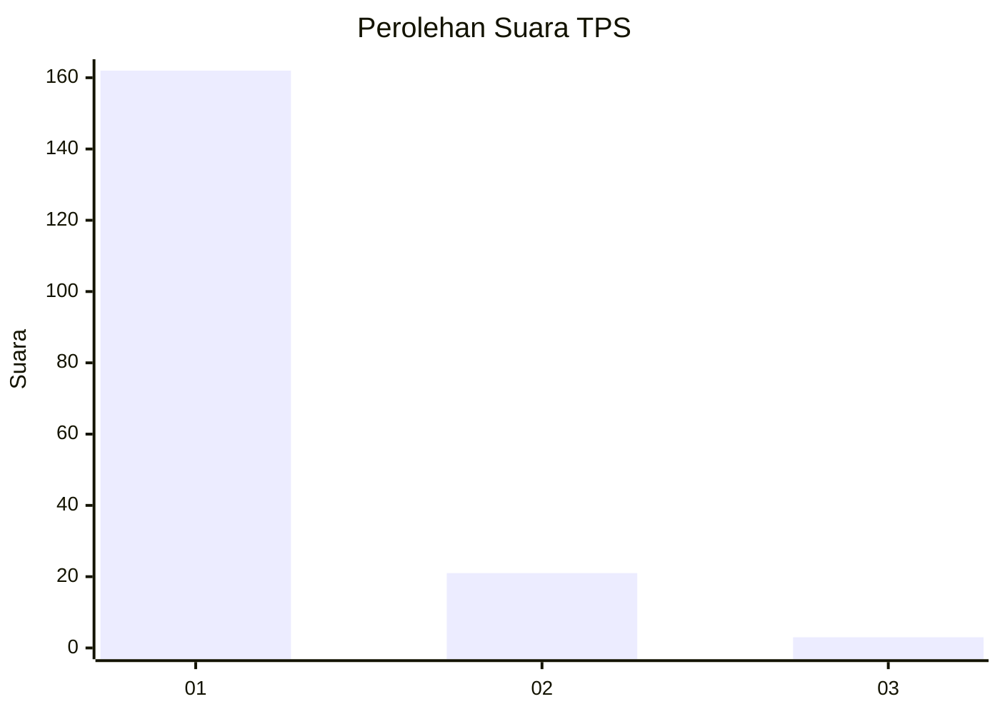
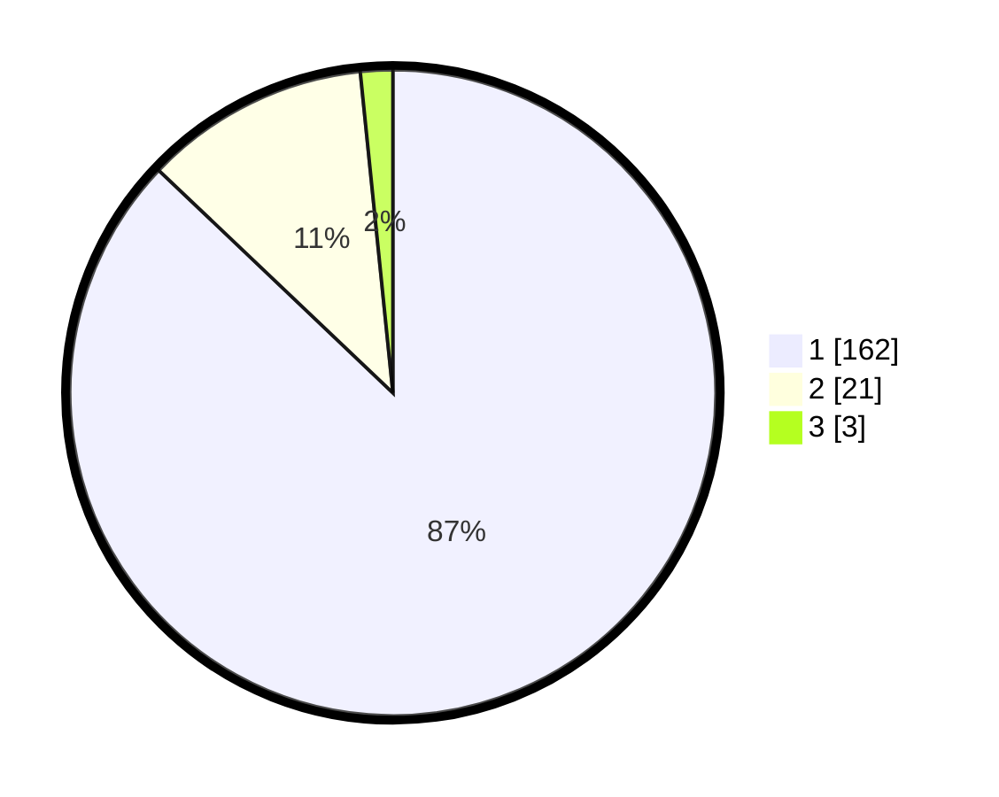

# Hasil

## Grafik

## Tabel

| No. | Nama Paslon    | Suara | Suara (raw) | Persentase |
|:--- |:-------------- | -----:| -----------:| ----------:|
| 1   | ANIES MUHAIMIN | 162   | [162][p-1]  | 87,10      |
| 2   | PRABOWO GIBRAN | 21    | [21][p-2]   | 11,29      |
| 3   | GANJAR MAHFUD  | 3     | [3][p-3]    | 1,61       |

[p-1]: https://github.com/gigit-pemilu/pemilu-2024-11-aceh/blob/main/pilpres/hitung-suara/sub/11-aceh/sub/06-aceh-besar/sub/12-darussalam/sub/2002-lam-peudaya/sub/001-tps/sub/paslon-1.txt
[p-2]: https://github.com/gigit-pemilu/pemilu-2024-11-aceh/blob/main/pilpres/hitung-suara/sub/11-aceh/sub/06-aceh-besar/sub/12-darussalam/sub/2002-lam-peudaya/sub/001-tps/sub/paslon-2.txt
[p-3]: https://github.com/gigit-pemilu/pemilu-2024-11-aceh/blob/main/pilpres/hitung-suara/sub/11-aceh/sub/06-aceh-besar/sub/12-darussalam/sub/2002-lam-peudaya/sub/001-tps/sub/paslon-3.txt

## Foto C Plano

https://sirekap-obj-formc.kpu.go.id/10e3/pemilu/ppwp/11/06/12/20/02/1106122002001-20240219-122006--8272cf6d-49a7-46d1-8bd0-c4c86c19ce9a.jpg

https://sirekap-obj-formc.kpu.go.id/10e3/pemilu/ppwp/11/06/12/20/02/1106122002001-20240219-122101--28f65ec8-03b6-4634-82c8-80fed3e0d707.jpg

https://sirekap-obj-formc.kpu.go.id/10e3/pemilu/ppwp/11/06/12/20/02/1106122002001-20240215-114828--3b56642f-8284-418b-b9d9-921b6975283d.jpg

## Metadata

| Key        | Value               |
| ---------- | ------------------- |
| Time Stamp | 2024-02-19 21:00:00 |

