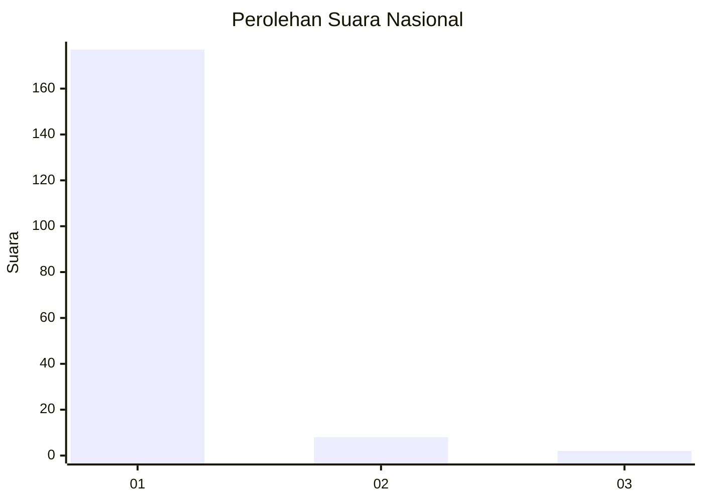
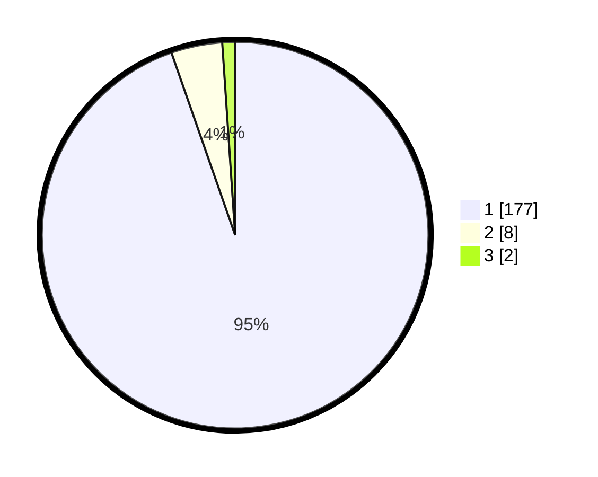

# Hasil

## Grafik

## Tabel

| No. | Nama Paslon    | Suara | Suara (raw) | Persentase |
|:--- |:-------------- | -----:| -----------:| ----------:|
| 1   | ANIES MUHAIMIN | 177   | [177][p-1]  | 94,65      |
| 2   | PRABOWO GIBRAN | 8     | [8][p-2]    | 4,28       |
| 3   | GANJAR MAHFUD  | 2     | [2][p-3]    | 1,07       |

[p-1]: https://github.com/gigit-pemilu/pemilu-2024/blob/main/pilpres/hitung-suara/sub/11-aceh/sub/06-aceh-besar/sub/12-darussalam/sub/2002-lam-peudaya/sub/002-tps/sub/paslon-1.txt
[p-2]: https://github.com/gigit-pemilu/pemilu-2024/blob/main/pilpres/hitung-suara/sub/11-aceh/sub/06-aceh-besar/sub/12-darussalam/sub/2002-lam-peudaya/sub/002-tps/sub/paslon-2.txt
[p-3]: https://github.com/gigit-pemilu/pemilu-2024/blob/main/pilpres/hitung-suara/sub/11-aceh/sub/06-aceh-besar/sub/12-darussalam/sub/2002-lam-peudaya/sub/002-tps/sub/paslon-3.txt

## Foto C Plano

https://sirekap-obj-formc.kpu.go.id/8ddb/pemilu/ppwp/11/06/12/20/02/1106122002002-20240214-200947--fd0ac5c3-14ee-496f-b785-9e4315c5c7d6.jpg

https://sirekap-obj-formc.kpu.go.id/8ddb/pemilu/ppwp/11/06/12/20/02/1106122002002-20240214-202133--f33ffe6f-812c-4ff6-8759-319c88c3d343.jpg

https://sirekap-obj-formc.kpu.go.id/8ddb/pemilu/ppwp/11/06/12/20/02/1106122002002-20240215-005509--9cb8e595-73b3-478a-9fc3-80cec6376901.jpg

## Metadata

| Key        | Value               |
| ---------- | ------------------- |
| Time Stamp | 2024-02-16 00:00:26 |

## DATA PEMILIH TETAP

Jumlah pemilih dalam DPT: **220**.
 * L: **105**.
 * P: **115**.

## DATA PENGGUNA HAK PILIH

Jumlah pengguna hak pilih dalam DPT: **191**.
 * L: **92**.
 * P: **99**.

Jumlah pengguna hak pilih dalam DPTb: **1**.
 * L: **1**.
 * P: **0**.

Jumlah pengguna hak pilih dalam DPK: **0**.
 * L: **0**.
 * P: **0**.

Jumlah pengguna hak pilih: **192**.
 * L: **93**.
 * P: **99**.

## JUMLAH SUARA SAH DAN TIDAK SAH

JUMLAH SELURUH SUARA SAH: **187**.

JUMLAH SUARA TIDAK SAH: **5**.

JUMLAH SELURUH SUARA SAH DAN SUARA TIDAK SAH: **192**.

