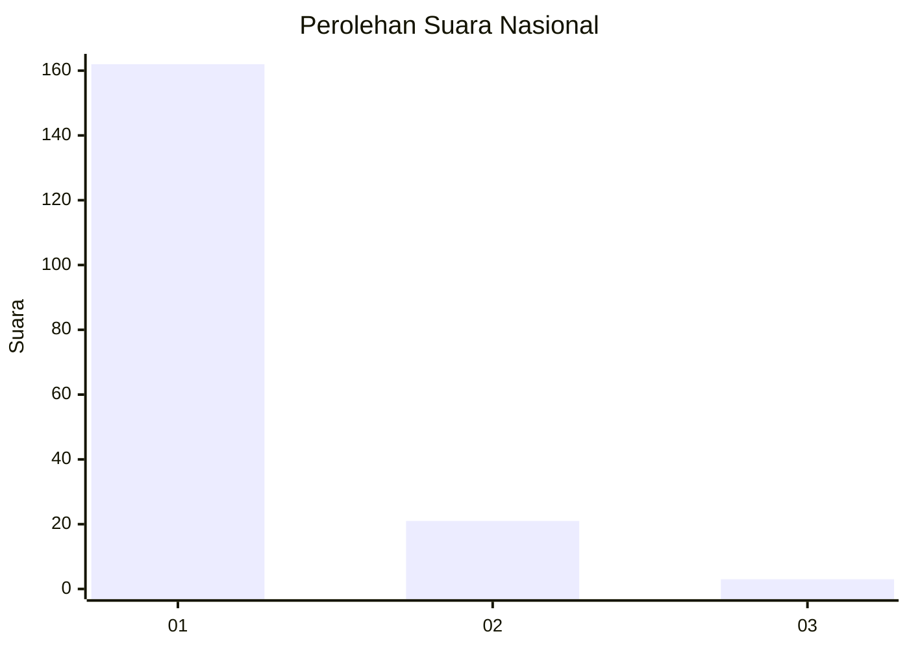
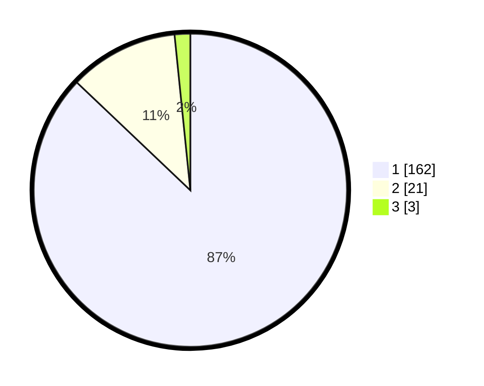

# Hasil

## Grafik

## Tabel

| No. | Nama Paslon    | Suara | Suara (raw) | Persentase |
|:--- |:-------------- | -----:| -----------:| ----------:|
| 1   | ANIES MUHAIMIN | 162   | [162][p-1]  | 87,10      |
| 2   | PRABOWO GIBRAN | 21    | [21][p-2]   | 11,29      |
| 3   | GANJAR MAHFUD  | 3     | [3][p-3]    | 1,61       |

[p-1]: https://github.com/gigit-pemilu/pemilu-2024/blob/main/pilpres/hitung-suara/sub/11-aceh/sub/06-aceh-besar/sub/12-darussalam/sub/2002-lam-peudaya/sub/003-tps/sub/paslon-1.txt
[p-2]: https://github.com/gigit-pemilu/pemilu-2024/blob/main/pilpres/hitung-suara/sub/11-aceh/sub/06-aceh-besar/sub/12-darussalam/sub/2002-lam-peudaya/sub/003-tps/sub/paslon-2.txt
[p-3]: https://github.com/gigit-pemilu/pemilu-2024/blob/main/pilpres/hitung-suara/sub/11-aceh/sub/06-aceh-besar/sub/12-darussalam/sub/2002-lam-peudaya/sub/003-tps/sub/paslon-3.txt

## Foto C Plano

https://sirekap-obj-formc.kpu.go.id/1a39/pemilu/ppwp/11/06/12/20/02/1106122002003-20240219-122251--75b3514f-e550-4ebb-a9dc-fb8c3a8421cf.jpg

https://sirekap-obj-formc.kpu.go.id/1a39/pemilu/ppwp/11/06/12/20/02/1106122002003-20240219-122326--fd980cbc-169c-47cb-9ea7-77283308261a.jpg

https://sirekap-obj-formc.kpu.go.id/1a39/pemilu/ppwp/11/06/12/20/02/1106122002003-20240219-122407--1ac40b78-7752-4d39-b58a-1d10e7abebc4.jpg

## Metadata

| Key        | Value               |
| ---------- | ------------------- |
| Time Stamp | 2024-02-19 22:00:00 |

