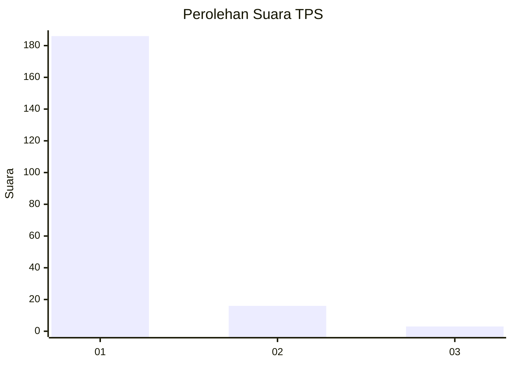
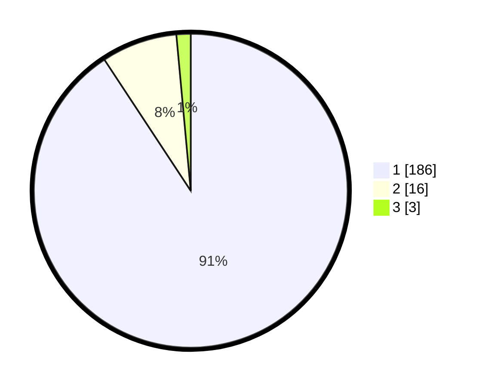

# Hasil

## Grafik

## Tabel

| No. | Nama Paslon    | Suara | Suara (raw) | Persentase |
|:--- |:-------------- | -----:| -----------:| ----------:|
| 1   | ANIES MUHAIMIN | 186   | [186][p-1]  | 90,73      |
| 2   | PRABOWO GIBRAN | 16    | [16][p-2]   | 7,80       |
| 3   | GANJAR MAHFUD  | 3     | [3][p-3]    | 1,46       |

[p-1]: https://github.com/gigit-pemilu/pemilu-2024-11-aceh/blob/main/pilpres/hitung-suara/sub/11-aceh/sub/06-aceh-besar/sub/12-darussalam/sub/2004-lambiheu-la/sub/001-tps/sub/paslon-1.txt
[p-2]: https://github.com/gigit-pemilu/pemilu-2024-11-aceh/blob/main/pilpres/hitung-suara/sub/11-aceh/sub/06-aceh-besar/sub/12-darussalam/sub/2004-lambiheu-la/sub/001-tps/sub/paslon-2.txt
[p-3]: https://github.com/gigit-pemilu/pemilu-2024-11-aceh/blob/main/pilpres/hitung-suara/sub/11-aceh/sub/06-aceh-besar/sub/12-darussalam/sub/2004-lambiheu-la/sub/001-tps/sub/paslon-3.txt

## Foto C Plano

https://sirekap-obj-formc.kpu.go.id/42d8/pemilu/ppwp/11/06/12/20/04/1106122004001-20240214-231117--161fabab-03eb-4ab6-b574-44814b48ccc6.jpg

https://sirekap-obj-formc.kpu.go.id/42d8/pemilu/ppwp/11/06/12/20/04/1106122004001-20240214-231425--ae237b8e-8653-4ba1-95a7-11cb23a8ef41.jpg

https://sirekap-obj-formc.kpu.go.id/42d8/pemilu/ppwp/11/06/12/20/04/1106122004001-20240214-231543--99aa72bd-07a2-40c1-a6b1-cf056774a15e.jpg

## Metadata

| Key        | Value               |
| ---------- | ------------------- |
| Time Stamp | 2024-02-16 00:00:26 |

