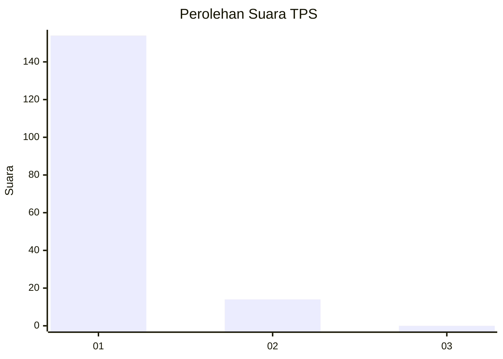
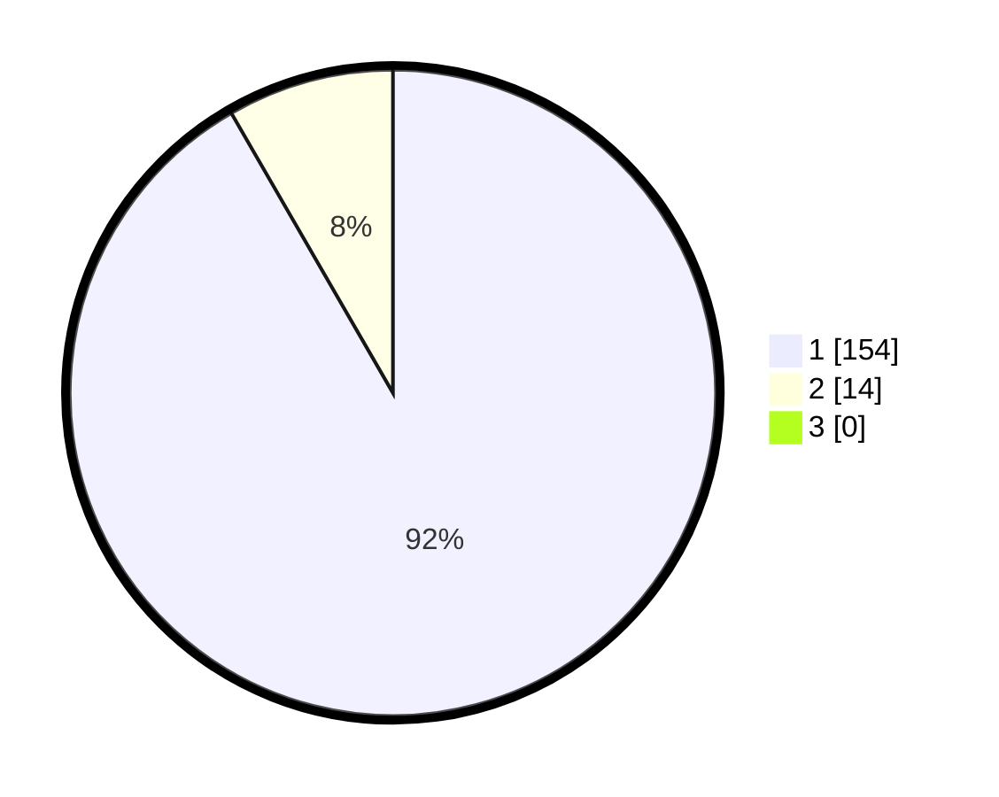

# Hasil

## Grafik

## Tabel

| No. | Nama Paslon    | Suara | Suara (raw) | Persentase |
|:--- |:-------------- | -----:| -----------:| ----------:|
| 1   | ANIES MUHAIMIN | 154   | [154][p-1]  | 91,67      |
| 2   | PRABOWO GIBRAN | 14    | [14][p-2]   | 8,33       |
| 3   | GANJAR MAHFUD  | 0     | [0][p-3]    | 0,00       |

[p-1]: https://github.com/gigit-pemilu/pemilu-2024-11-aceh/blob/main/pilpres/hitung-suara/sub/11-aceh/sub/06-aceh-besar/sub/12-darussalam/sub/2005-lambaro-sukon/sub/001-tps/sub/paslon-1.txt
[p-2]: https://github.com/gigit-pemilu/pemilu-2024-11-aceh/blob/main/pilpres/hitung-suara/sub/11-aceh/sub/06-aceh-besar/sub/12-darussalam/sub/2005-lambaro-sukon/sub/001-tps/sub/paslon-2.txt
[p-3]: https://github.com/gigit-pemilu/pemilu-2024-11-aceh/blob/main/pilpres/hitung-suara/sub/11-aceh/sub/06-aceh-besar/sub/12-darussalam/sub/2005-lambaro-sukon/sub/001-tps/sub/paslon-3.txt

## Foto C Plano

https://sirekap-obj-formc.kpu.go.id/b6ee/pemilu/ppwp/11/06/12/20/05/1106122005001-20240214-220039--ce83fb76-b563-4bad-beeb-916443413beb.jpg

https://sirekap-obj-formc.kpu.go.id/b6ee/pemilu/ppwp/11/06/12/20/05/1106122005001-20240214-160057--071e41b6-848f-4443-a6d5-3475bf5eb901.jpg

https://sirekap-obj-formc.kpu.go.id/b6ee/pemilu/ppwp/11/06/12/20/05/1106122005001-20240214-220150--842f4f66-10df-4177-9d95-ec45fd663d31.jpg

## Metadata

| Key        | Value               |
| ---------- | ------------------- |
| Time Stamp | 2024-02-15 00:41:44 |

