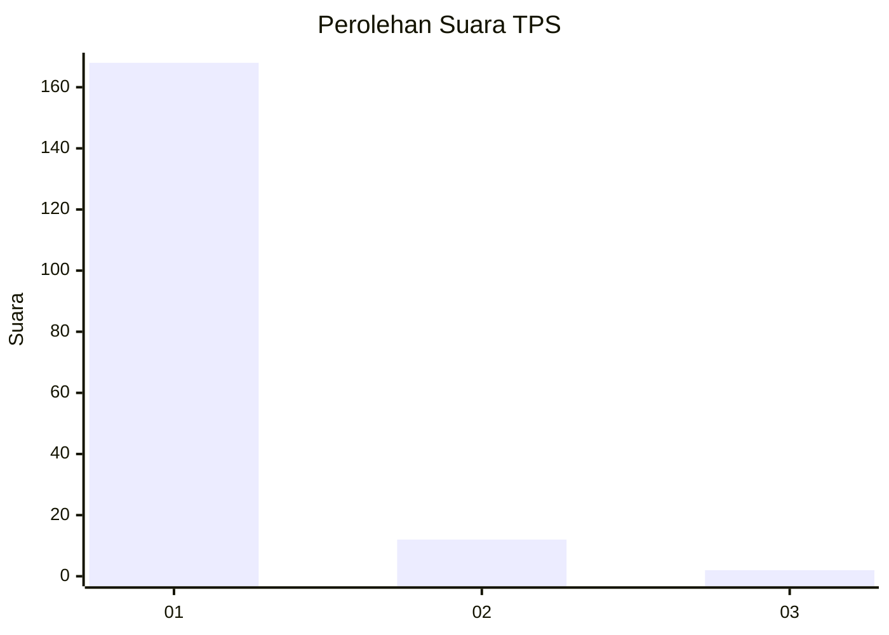
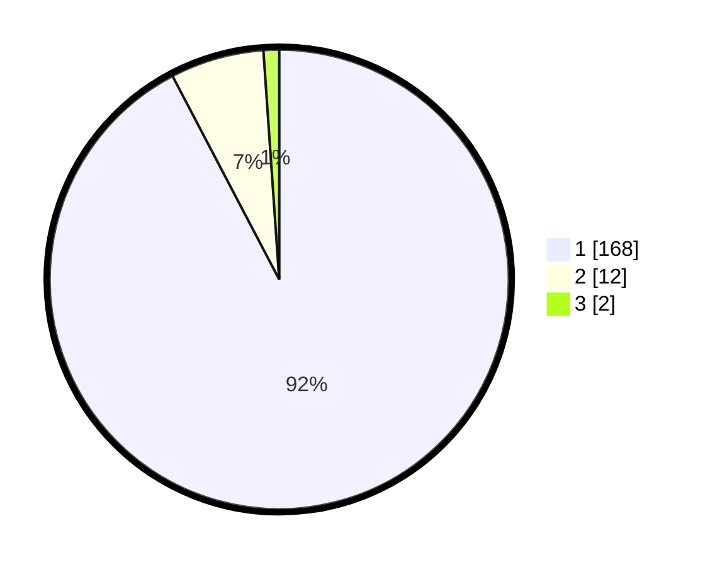

# Hasil

## Grafik

## Tabel

| No. | Nama Paslon    | Suara | Suara (raw) | Persentase |
|:--- |:-------------- | -----:| -----------:| ----------:|
| 1   | ANIES MUHAIMIN | 168   | [168][p-1]  | 92,31      |
| 2   | PRABOWO GIBRAN | 12    | [12][p-2]   | 6,59       |
| 3   | GANJAR MAHFUD  | 2     | [2][p-3]    | 1,10       |

[p-1]: https://github.com/gigit-pemilu/pemilu-2024-11-aceh/blob/main/pilpres/hitung-suara/sub/11-aceh/sub/06-aceh-besar/sub/12-darussalam/sub/2005-lambaro-sukon/sub/003-tps/sub/paslon-1.txt
[p-2]: https://github.com/gigit-pemilu/pemilu-2024-11-aceh/blob/main/pilpres/hitung-suara/sub/11-aceh/sub/06-aceh-besar/sub/12-darussalam/sub/2005-lambaro-sukon/sub/003-tps/sub/paslon-2.txt
[p-3]: https://github.com/gigit-pemilu/pemilu-2024-11-aceh/blob/main/pilpres/hitung-suara/sub/11-aceh/sub/06-aceh-besar/sub/12-darussalam/sub/2005-lambaro-sukon/sub/003-tps/sub/paslon-3.txt

## Foto C Plano

https://sirekap-obj-formc.kpu.go.id/d3b4/pemilu/ppwp/11/06/12/20/05/1106122005003-20240214-205846--b95e652c-45ff-4135-8706-796f4c614a59.jpg

https://sirekap-obj-formc.kpu.go.id/d3b4/pemilu/ppwp/11/06/12/20/05/1106122005003-20240214-205943--c965d73f-9259-4a1f-82d8-1b6fc6df15ea.jpg

https://sirekap-obj-formc.kpu.go.id/d3b4/pemilu/ppwp/11/06/12/20/05/1106122005003-20240214-210025--1329cf34-b5e2-4c08-8f0f-b93a1b9ad71e.jpg

## Metadata

| Key        | Value               |
| ---------- | ------------------- |
| Time Stamp | 2024-02-16 00:00:26 |

