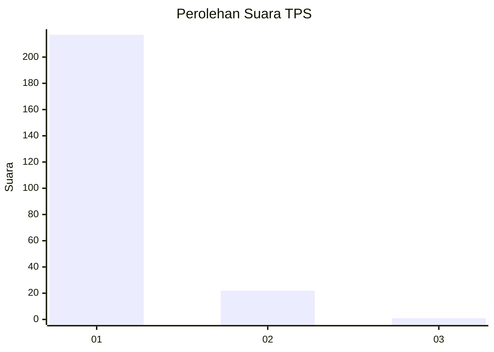
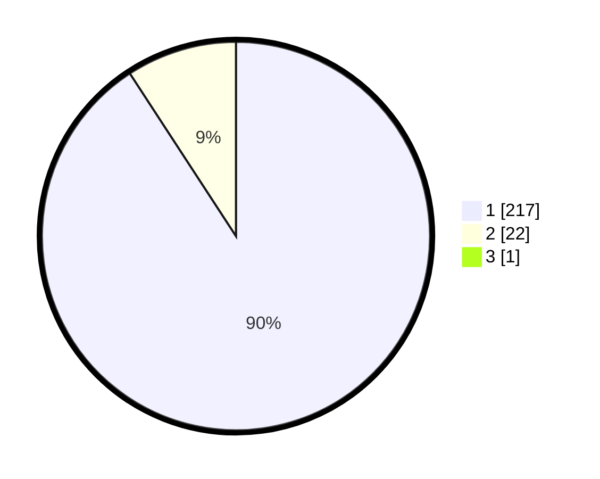

# Hasil

## Grafik

## Tabel

| No. | Nama Paslon    | Suara | Suara (raw) | Persentase |
|:--- |:-------------- | -----:| -----------:| ----------:|
| 1   | ANIES MUHAIMIN | 217   | [217][p-1]  | 90,42      |
| 2   | PRABOWO GIBRAN | 22    | [22][p-2]   | 9,17       |
| 3   | GANJAR MAHFUD  | 1     | [1][p-3]    | 0,42       |

[p-1]: https://github.com/gigit-pemilu/pemilu-2024-11-aceh/blob/main/pilpres/hitung-suara/sub/11-aceh/sub/06-aceh-besar/sub/12-darussalam/sub/2006-miruek-taman/sub/001-tps/sub/paslon-1.txt
[p-2]: https://github.com/gigit-pemilu/pemilu-2024-11-aceh/blob/main/pilpres/hitung-suara/sub/11-aceh/sub/06-aceh-besar/sub/12-darussalam/sub/2006-miruek-taman/sub/001-tps/sub/paslon-2.txt
[p-3]: https://github.com/gigit-pemilu/pemilu-2024-11-aceh/blob/main/pilpres/hitung-suara/sub/11-aceh/sub/06-aceh-besar/sub/12-darussalam/sub/2006-miruek-taman/sub/001-tps/sub/paslon-3.txt

## Foto C Plano

https://sirekap-obj-formc.kpu.go.id/16f6/pemilu/ppwp/11/06/12/20/06/1106122006001-20240215-093054--c676ad37-0c20-43d7-ac7c-5e38604b675a.jpg

https://sirekap-obj-formc.kpu.go.id/16f6/pemilu/ppwp/11/06/12/20/06/1106122006001-20240215-093125--fe05eedb-5b82-4836-ac2a-ba13d6dd1f68.jpg

https://sirekap-obj-formc.kpu.go.id/16f6/pemilu/ppwp/11/06/12/20/06/1106122006001-20240215-093130--7707449f-73b1-456c-bfbf-3c1a8be6813d.jpg

## Metadata

| Key        | Value               |
| ---------- | ------------------- |
| Time Stamp | 2024-02-15 17:30:25 |

