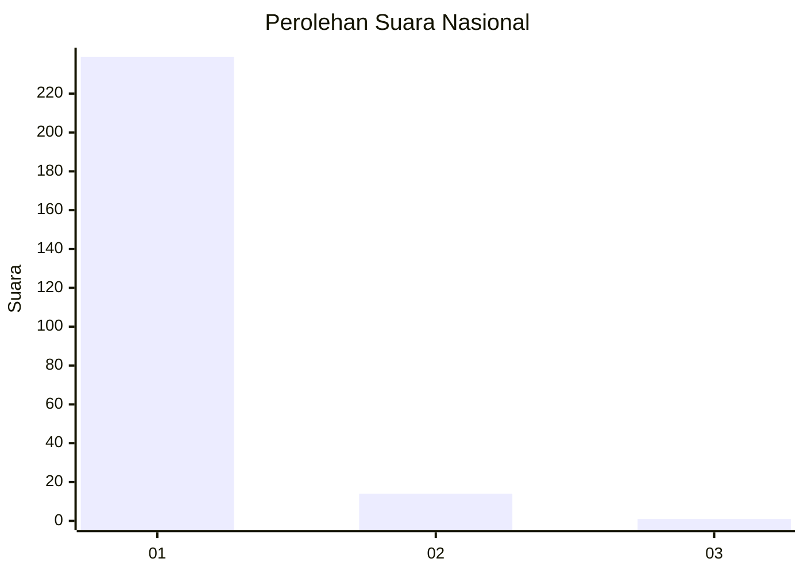
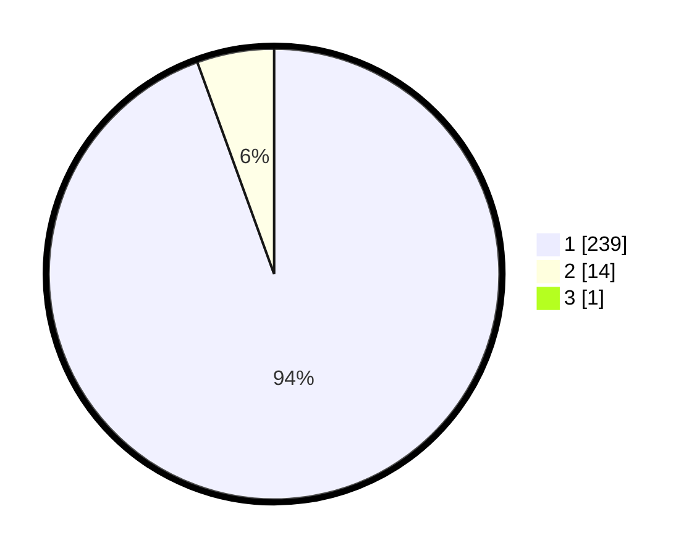

# Hasil

## Grafik

## Tabel

| No. | Nama Paslon    | Suara | Suara (raw) | Persentase |
|:--- |:-------------- | -----:| -----------:| ----------:|
| 1   | ANIES MUHAIMIN | 239   | [239][p-1]  | 94,09      |
| 2   | PRABOWO GIBRAN | 14    | [14][p-2]   | 5,51       |
| 3   | GANJAR MAHFUD  | 1     | [1][p-3]    | 0,39       |

[p-1]: https://github.com/gigit-pemilu/pemilu-2024/blob/main/pilpres/hitung-suara/sub/11-aceh/sub/06-aceh-besar/sub/12-darussalam/sub/2006-miruek-taman/sub/002-tps/sub/paslon-1.txt
[p-2]: https://github.com/gigit-pemilu/pemilu-2024/blob/main/pilpres/hitung-suara/sub/11-aceh/sub/06-aceh-besar/sub/12-darussalam/sub/2006-miruek-taman/sub/002-tps/sub/paslon-2.txt
[p-3]: https://github.com/gigit-pemilu/pemilu-2024/blob/main/pilpres/hitung-suara/sub/11-aceh/sub/06-aceh-besar/sub/12-darussalam/sub/2006-miruek-taman/sub/002-tps/sub/paslon-3.txt

## Foto C Plano

https://sirekap-obj-formc.kpu.go.id/2831/pemilu/ppwp/11/06/12/20/06/1106122006002-20240215-094205--d92725a1-ee71-4f9a-a69d-7b12f2e98ce5.jpg

https://sirekap-obj-formc.kpu.go.id/2831/pemilu/ppwp/11/06/12/20/06/1106122006002-20240215-094301--7dae0ecb-b5ba-4cf5-8cae-ffbcf9cd35ad.jpg

https://sirekap-obj-formc.kpu.go.id/2831/pemilu/ppwp/11/06/12/20/06/1106122006002-20240215-094336--4bb3c868-2012-473b-878a-c14b18d7110b.jpg

## Metadata

| Key        | Value               |
| ---------- | ------------------- |
| Time Stamp | 2024-02-16 00:00:26 |

