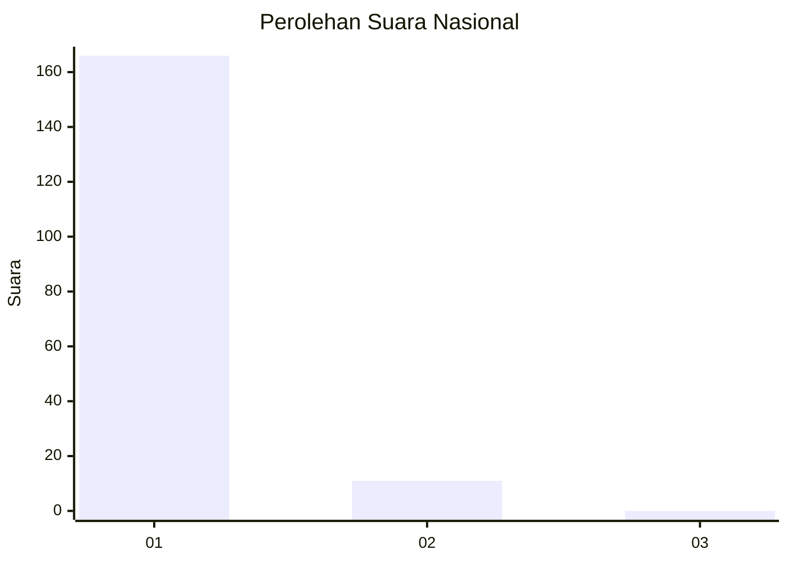
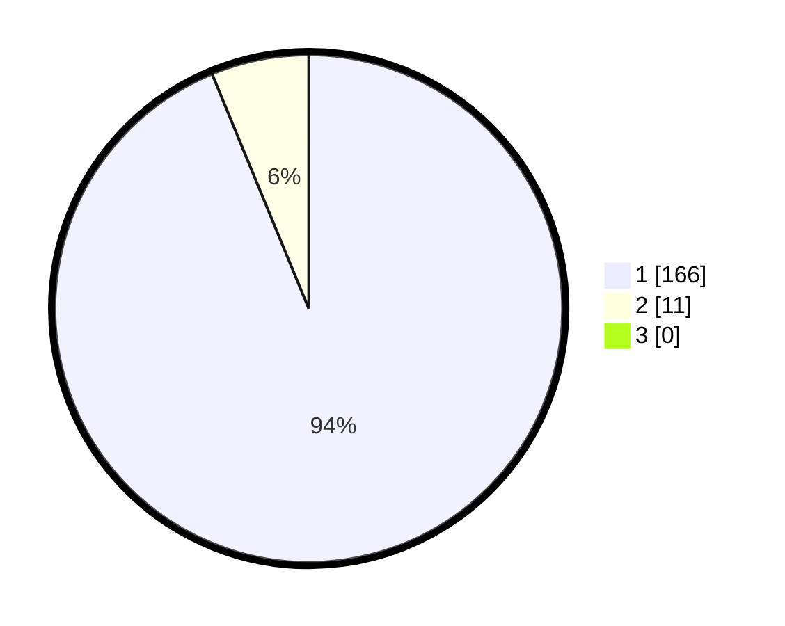

# Hasil

## Grafik

## Tabel

| No. | Nama Paslon    | Suara | Suara (raw) | Persentase |
|:--- |:-------------- | -----:| -----------:| ----------:|
| 1   | ANIES MUHAIMIN | 166   | [166][p-1]  | 93,79      |
| 2   | PRABOWO GIBRAN | 11    | [11][p-2]   | 6,21       |
| 3   | GANJAR MAHFUD  | 0     | [0][p-3]    | 0,00       |

[p-1]: https://github.com/gigit-pemilu/pemilu-2024/blob/main/pilpres/hitung-suara/sub/11-aceh/sub/06-aceh-besar/sub/12-darussalam/sub/2008-gampong-cot/sub/003-tps/sub/paslon-1.txt
[p-2]: https://github.com/gigit-pemilu/pemilu-2024/blob/main/pilpres/hitung-suara/sub/11-aceh/sub/06-aceh-besar/sub/12-darussalam/sub/2008-gampong-cot/sub/003-tps/sub/paslon-2.txt
[p-3]: https://github.com/gigit-pemilu/pemilu-2024/blob/main/pilpres/hitung-suara/sub/11-aceh/sub/06-aceh-besar/sub/12-darussalam/sub/2008-gampong-cot/sub/003-tps/sub/paslon-3.txt

## Foto C Plano

https://sirekap-obj-formc.kpu.go.id/6f9e/pemilu/ppwp/11/06/12/20/08/1106122008003-20240214-155317--74e3a6a9-5313-41a7-8629-1fc7f3385364.jpg

https://sirekap-obj-formc.kpu.go.id/6f9e/pemilu/ppwp/11/06/12/20/08/1106122008003-20240214-155721--a2ee5ce9-c1ff-4000-b7cc-3399d4bad335.jpg

https://sirekap-obj-formc.kpu.go.id/6f9e/pemilu/ppwp/11/06/12/20/08/1106122008003-20240214-155810--297e8eba-1752-4d24-a87d-695463d6c16a.jpg

## Metadata

| Key        | Value               |
| ---------- | ------------------- |
| Time Stamp | 2024-02-15 17:30:25 |

