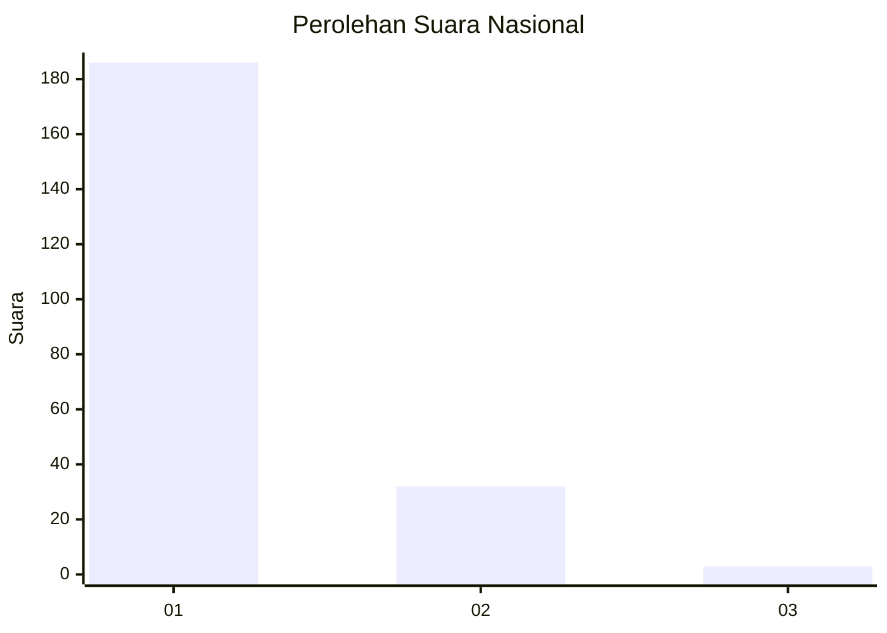
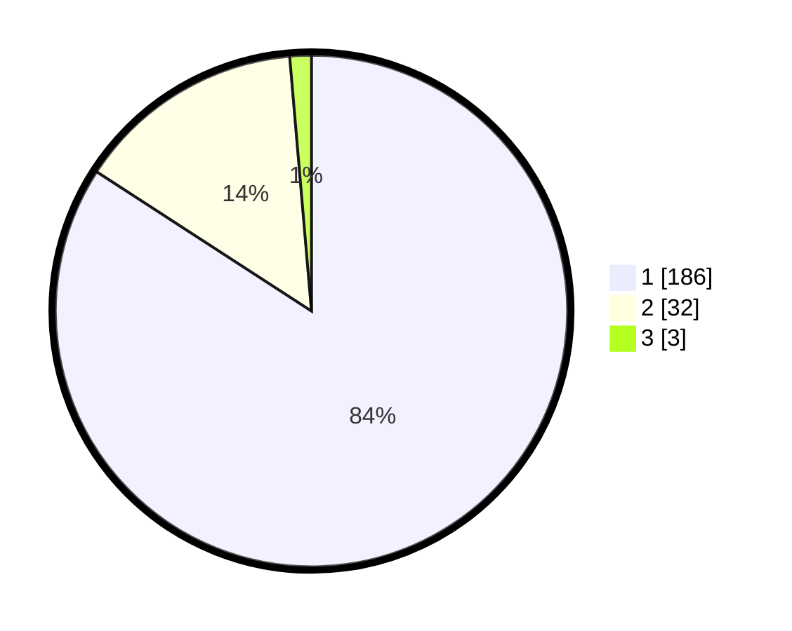

# Hasil

## Grafik

## Tabel

| No. | Nama Paslon    | Suara | Suara (raw) | Persentase |
|:--- |:-------------- | -----:| -----------:| ----------:|
| 1   | ANIES MUHAIMIN | 186   | [186][p-1]  | 84,16      |
| 2   | PRABOWO GIBRAN | 32    | [32][p-2]   | 14,48      |
| 3   | GANJAR MAHFUD  | 3     | [3][p-3]    | 1,36       |

[p-1]: https://github.com/gigit-pemilu/pemilu-2024/blob/main/pilpres/hitung-suara/sub/11-aceh/sub/06-aceh-besar/sub/12-darussalam/sub/2009-gampong-blang/sub/002-tps/sub/paslon-1.txt
[p-2]: https://github.com/gigit-pemilu/pemilu-2024/blob/main/pilpres/hitung-suara/sub/11-aceh/sub/06-aceh-besar/sub/12-darussalam/sub/2009-gampong-blang/sub/002-tps/sub/paslon-2.txt
[p-3]: https://github.com/gigit-pemilu/pemilu-2024/blob/main/pilpres/hitung-suara/sub/11-aceh/sub/06-aceh-besar/sub/12-darussalam/sub/2009-gampong-blang/sub/002-tps/sub/paslon-3.txt

## Foto C Plano

https://sirekap-obj-formc.kpu.go.id/dd6e/pemilu/ppwp/11/06/12/20/09/1106122009002-20240215-084755--0902a033-c21d-4a2b-8fd6-ee519fdc8a05.jpg

https://sirekap-obj-formc.kpu.go.id/dd6e/pemilu/ppwp/11/06/12/20/09/1106122009002-20240214-194321--ac8ceeb1-adac-4f41-a0ba-7069107562aa.jpg

https://sirekap-obj-formc.kpu.go.id/dd6e/pemilu/ppwp/11/06/12/20/09/1106122009002-20240214-194612--c2f404df-8d62-4ef1-b3bf-12cc606cd0d2.jpg

## Metadata

| Key        | Value               |
| ---------- | ------------------- |
| Time Stamp | 2024-02-15 15:00:29 |

