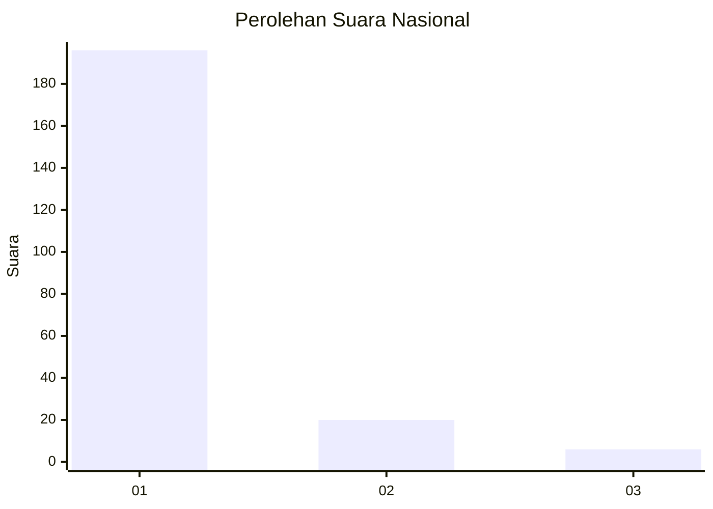
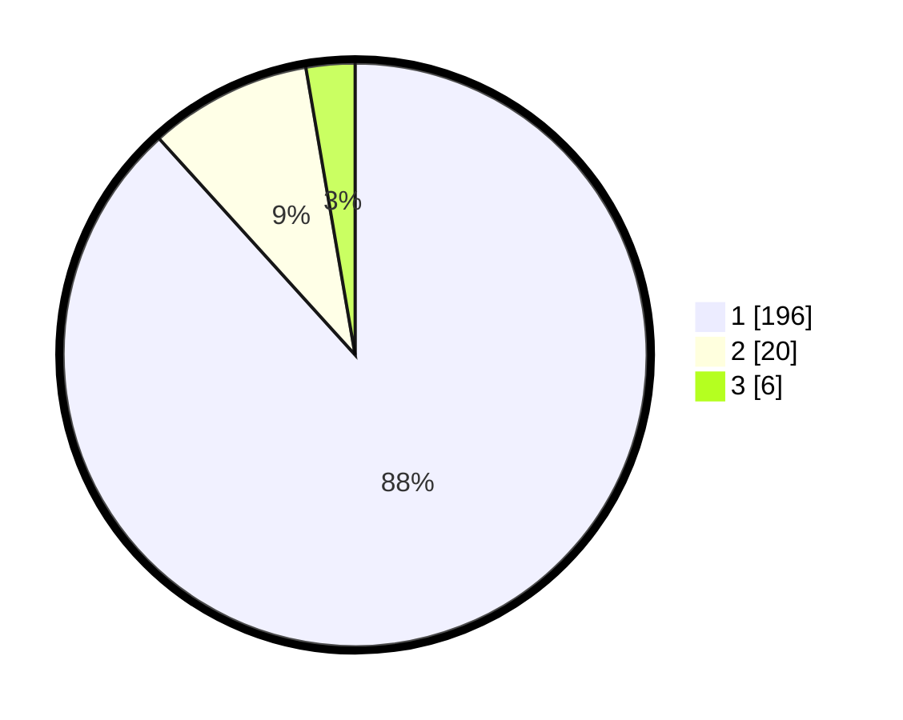

# Hasil

## Grafik

## Tabel

| No. | Nama Paslon    | Suara | Suara (raw) | Persentase |
|:--- |:-------------- | -----:| -----------:| ----------:|
| 1   | ANIES MUHAIMIN | 196   | [196][p-1]  | 88,29      |
| 2   | PRABOWO GIBRAN | 20    | [20][p-2]   | 9,01       |
| 3   | GANJAR MAHFUD  | 6     | [6][p-3]    | 2,70       |

[p-1]: https://github.com/gigit-pemilu/pemilu-2024/blob/main/pilpres/hitung-suara/sub/11-aceh/sub/06-aceh-besar/sub/12-darussalam/sub/2011-tanjung-deah/sub/001-tps/sub/paslon-1.txt
[p-2]: https://github.com/gigit-pemilu/pemilu-2024/blob/main/pilpres/hitung-suara/sub/11-aceh/sub/06-aceh-besar/sub/12-darussalam/sub/2011-tanjung-deah/sub/001-tps/sub/paslon-2.txt
[p-3]: https://github.com/gigit-pemilu/pemilu-2024/blob/main/pilpres/hitung-suara/sub/11-aceh/sub/06-aceh-besar/sub/12-darussalam/sub/2011-tanjung-deah/sub/001-tps/sub/paslon-3.txt

## Foto C Plano

https://sirekap-obj-formc.kpu.go.id/c92c/pemilu/ppwp/11/06/12/20/11/1106122011001-20240215-010922--a50b38a7-ce84-4a2a-aea3-4fe353685aa0.jpg

https://sirekap-obj-formc.kpu.go.id/c92c/pemilu/ppwp/11/06/12/20/11/1106122011001-20240215-011405--7888744b-e472-4298-8467-37c7e5522fb7.jpg

https://sirekap-obj-formc.kpu.go.id/c92c/pemilu/ppwp/11/06/12/20/11/1106122011001-20240215-011831--58fe1b84-13b5-46f9-9cff-5157c14a17f7.jpg

## Metadata

| Key        | Value               |
| ---------- | ------------------- |
| Time Stamp | 2024-02-15 12:00:28 |

