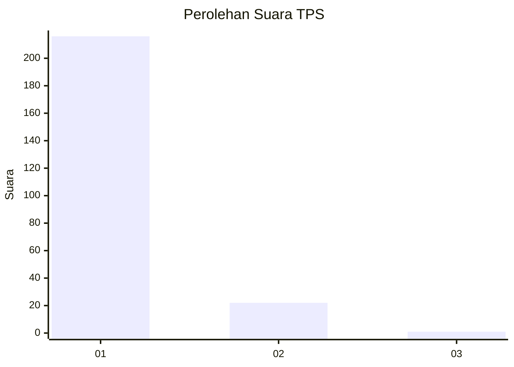
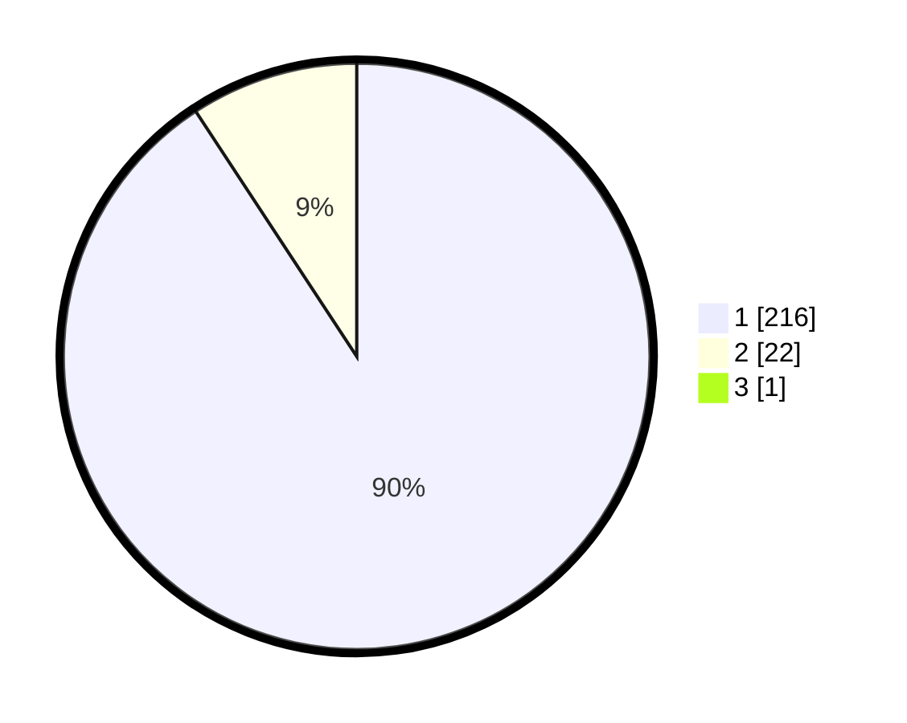

# Hasil

## Grafik

## Tabel

| No. | Nama Paslon    | Suara | Suara (raw) | Persentase |
|:--- |:-------------- | -----:| -----------:| ----------:|
| 1   | ANIES MUHAIMIN | 216   | [216][p-1]  | 90,38      |
| 2   | PRABOWO GIBRAN | 22    | [22][p-2]   | 9,21       |
| 3   | GANJAR MAHFUD  | 1     | [1][p-3]    | 0,42       |

[p-1]: https://github.com/gigit-pemilu/pemilu-2024-11-aceh/blob/main/pilpres/hitung-suara/sub/11-aceh/sub/06-aceh-besar/sub/12-darussalam/sub/2011-tanjung-deah/sub/002-tps/sub/paslon-1.txt
[p-2]: https://github.com/gigit-pemilu/pemilu-2024-11-aceh/blob/main/pilpres/hitung-suara/sub/11-aceh/sub/06-aceh-besar/sub/12-darussalam/sub/2011-tanjung-deah/sub/002-tps/sub/paslon-2.txt
[p-3]: https://github.com/gigit-pemilu/pemilu-2024-11-aceh/blob/main/pilpres/hitung-suara/sub/11-aceh/sub/06-aceh-besar/sub/12-darussalam/sub/2011-tanjung-deah/sub/002-tps/sub/paslon-3.txt

## Foto C Plano

https://sirekap-obj-formc.kpu.go.id/cb2a/pemilu/ppwp/11/06/12/20/11/1106122011002-20240215-081308--dda65ec0-d014-45a9-9d01-7cf724c29210.jpg

https://sirekap-obj-formc.kpu.go.id/cb2a/pemilu/ppwp/11/06/12/20/11/1106122011002-20240215-081521--7467bd22-0959-4998-bd63-827ecd980f33.jpg

https://sirekap-obj-formc.kpu.go.id/cb2a/pemilu/ppwp/11/06/12/20/11/1106122011002-20240215-090516--c7c27b9a-00fa-4e77-85d9-e997c880a522.jpg

## Metadata

| Key        | Value               |
| ---------- | ------------------- |
| Time Stamp | 2024-02-16 00:00:26 |

