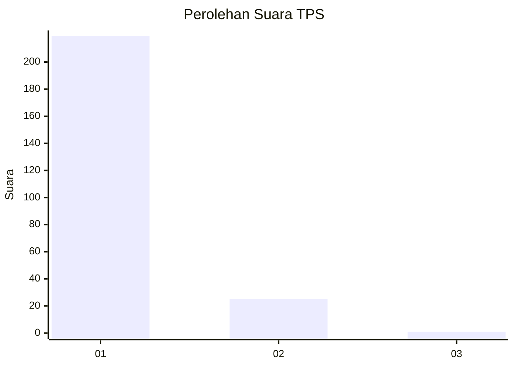
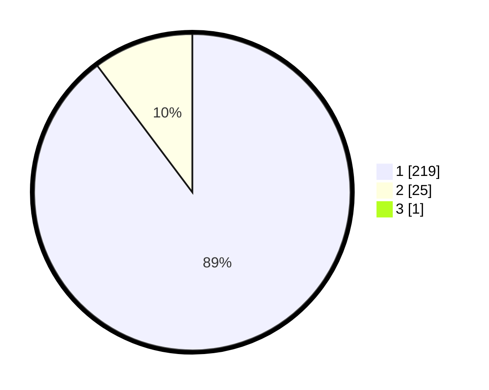

# Hasil

## Grafik

## Tabel

| No. | Nama Paslon    | Suara | Suara (raw) | Persentase |
|:--- |:-------------- | -----:| -----------:| ----------:|
| 1   | ANIES MUHAIMIN | 219   | [219][p-1]  | 89,39      |
| 2   | PRABOWO GIBRAN | 25    | [25][p-2]   | 10,20      |
| 3   | GANJAR MAHFUD  | 1     | [1][p-3]    | 0,41       |

[p-1]: https://github.com/gigit-pemilu/pemilu-2024-11-aceh/blob/main/pilpres/hitung-suara/sub/11-aceh/sub/06-aceh-besar/sub/12-darussalam/sub/2011-tanjung-deah/sub/003-tps/sub/paslon-1.txt
[p-2]: https://github.com/gigit-pemilu/pemilu-2024-11-aceh/blob/main/pilpres/hitung-suara/sub/11-aceh/sub/06-aceh-besar/sub/12-darussalam/sub/2011-tanjung-deah/sub/003-tps/sub/paslon-2.txt
[p-3]: https://github.com/gigit-pemilu/pemilu-2024-11-aceh/blob/main/pilpres/hitung-suara/sub/11-aceh/sub/06-aceh-besar/sub/12-darussalam/sub/2011-tanjung-deah/sub/003-tps/sub/paslon-3.txt

## Foto C Plano

https://sirekap-obj-formc.kpu.go.id/6a60/pemilu/ppwp/11/06/12/20/11/1106122011003-20240215-105035--fcca16c0-26f6-494c-bb91-9884d093032e.jpg

https://sirekap-obj-formc.kpu.go.id/6a60/pemilu/ppwp/11/06/12/20/11/1106122011003-20240215-105432--4433ad21-9471-475c-8147-d014b0748432.jpg

https://sirekap-obj-formc.kpu.go.id/6a60/pemilu/ppwp/11/06/12/20/11/1106122011003-20240215-105239--84080f25-2ef0-4e3e-be81-386f0949ef40.jpg

## Metadata

| Key        | Value               |
| ---------- | ------------------- |
| Time Stamp | 2024-02-16 00:00:26 |

