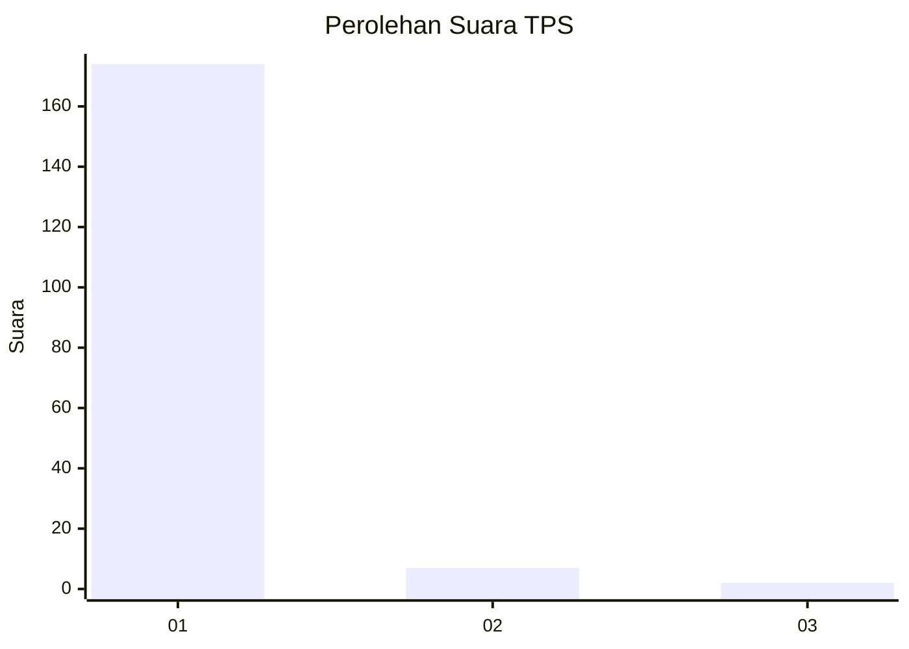
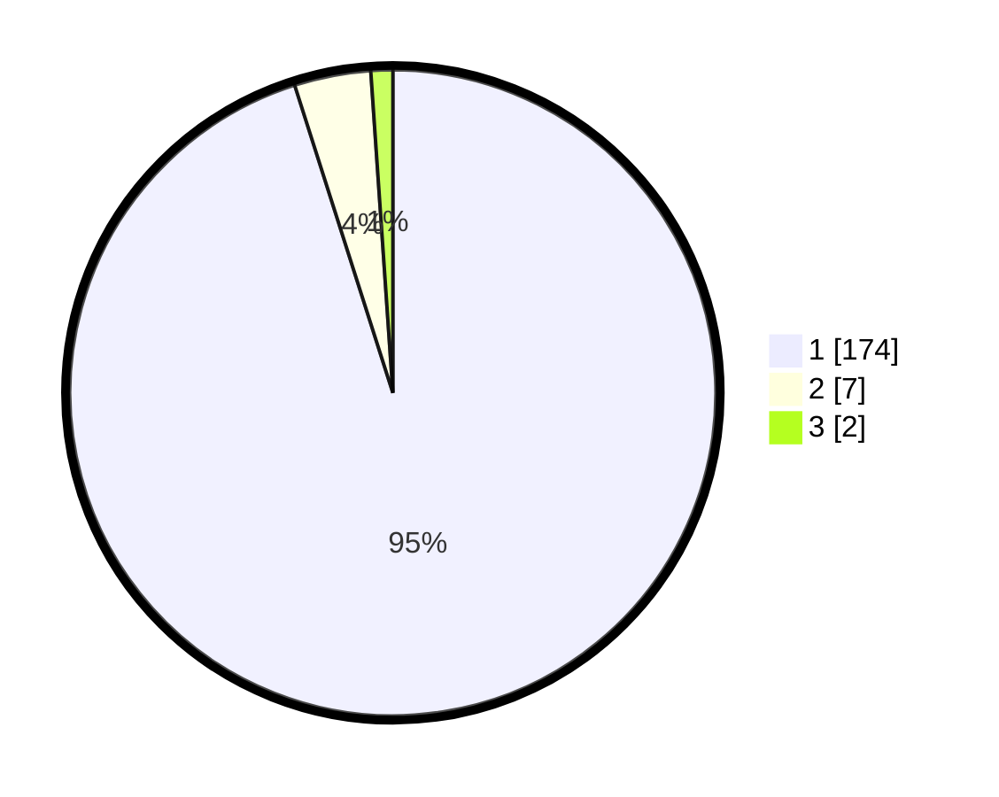

# Hasil

## Grafik

## Tabel

| No. | Nama Paslon    | Suara | Suara (raw) | Persentase |
|:--- |:-------------- | -----:| -----------:| ----------:|
| 1   | ANIES MUHAIMIN | 174   | [174][p-1]  | 95,08      |
| 2   | PRABOWO GIBRAN | 7     | [7][p-2]    | 3,83       |
| 3   | GANJAR MAHFUD  | 2     | [2][p-3]    | 1,09       |

[p-1]: https://github.com/gigit-pemilu/pemilu-2024-11-aceh/blob/main/pilpres/hitung-suara/sub/11-aceh/sub/06-aceh-besar/sub/12-darussalam/sub/2015-lam-gawe/sub/001-tps/sub/paslon-1.txt
[p-2]: https://github.com/gigit-pemilu/pemilu-2024-11-aceh/blob/main/pilpres/hitung-suara/sub/11-aceh/sub/06-aceh-besar/sub/12-darussalam/sub/2015-lam-gawe/sub/001-tps/sub/paslon-2.txt
[p-3]: https://github.com/gigit-pemilu/pemilu-2024-11-aceh/blob/main/pilpres/hitung-suara/sub/11-aceh/sub/06-aceh-besar/sub/12-darussalam/sub/2015-lam-gawe/sub/001-tps/sub/paslon-3.txt

## Foto C Plano

https://sirekap-obj-formc.kpu.go.id/ae7f/pemilu/ppwp/11/06/12/20/15/1106122015001-20240214-214716--5c2e1822-d6cd-4fdf-8a2f-9ee059fda766.jpg

https://sirekap-obj-formc.kpu.go.id/ae7f/pemilu/ppwp/11/06/12/20/15/1106122015001-20240214-214535--9c194e04-75d8-4e39-b709-5f911f9d39b7.jpg

https://sirekap-obj-formc.kpu.go.id/ae7f/pemilu/ppwp/11/06/12/20/15/1106122015001-20240214-214831--78b54a76-fbbc-400f-872e-cb174d48e764.jpg

## Metadata

| Key        | Value               |
| ---------- | ------------------- |
| Time Stamp | 2024-02-15 17:30:25 |

