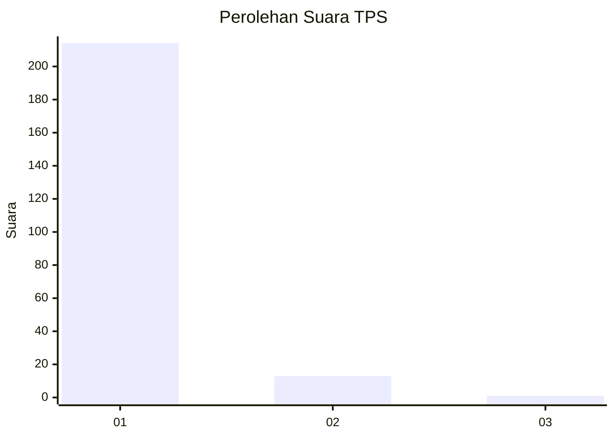
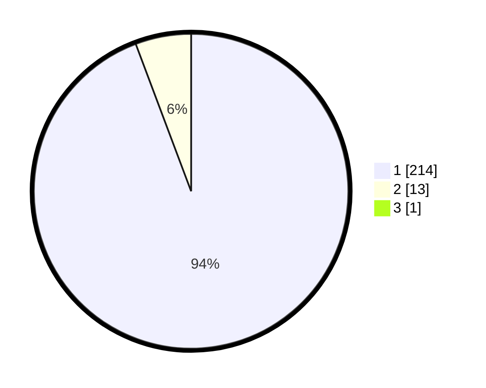

# Hasil

## Grafik

## Tabel

| No. | Nama Paslon    | Suara | Suara (raw) | Persentase |
|:--- |:-------------- | -----:| -----------:| ----------:|
| 1   | ANIES MUHAIMIN | 214   | [214][p-1]  | 93,86      |
| 2   | PRABOWO GIBRAN | 13    | [13][p-2]   | 5,70       |
| 3   | GANJAR MAHFUD  | 1     | [1][p-3]    | 0,44       |

[p-1]: https://github.com/gigit-pemilu/pemilu-2024-11-aceh/blob/main/pilpres/hitung-suara/sub/11-aceh/sub/06-aceh-besar/sub/12-darussalam/sub/2019-tanjong-seulamat/sub/001-tps/sub/paslon-1.txt
[p-2]: https://github.com/gigit-pemilu/pemilu-2024-11-aceh/blob/main/pilpres/hitung-suara/sub/11-aceh/sub/06-aceh-besar/sub/12-darussalam/sub/2019-tanjong-seulamat/sub/001-tps/sub/paslon-2.txt
[p-3]: https://github.com/gigit-pemilu/pemilu-2024-11-aceh/blob/main/pilpres/hitung-suara/sub/11-aceh/sub/06-aceh-besar/sub/12-darussalam/sub/2019-tanjong-seulamat/sub/001-tps/sub/paslon-3.txt

## Foto C Plano

https://sirekap-obj-formc.kpu.go.id/7141/pemilu/ppwp/11/06/12/20/19/1106122019001-20240214-185351--8587588d-4f18-4ed9-aa73-0acd677a994f.jpg

https://sirekap-obj-formc.kpu.go.id/7141/pemilu/ppwp/11/06/12/20/19/1106122019001-20240214-185609--a0064c95-2676-4d31-abbe-8b9365182bd4.jpg

https://sirekap-obj-formc.kpu.go.id/7141/pemilu/ppwp/11/06/12/20/19/1106122019001-20240214-185800--86301737-eac1-4196-a9a6-e3da4c5acbb8.jpg

## Metadata

| Key        | Value               |
| ---------- | ------------------- |
| Time Stamp | 2024-02-16 00:00:26 |

