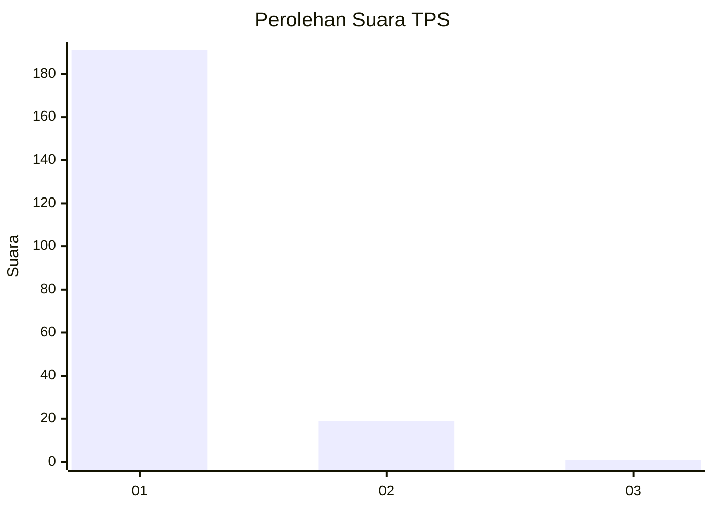
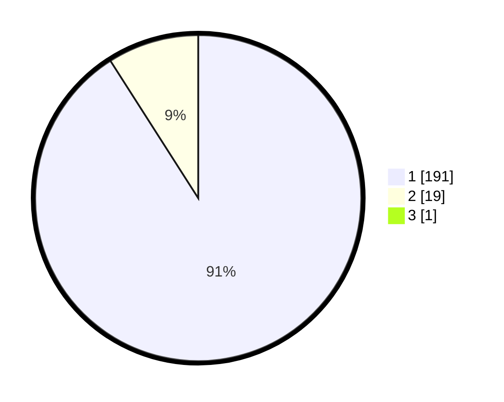

# Hasil

## Grafik

## Tabel

| No. | Nama Paslon    | Suara | Suara (raw) | Persentase |
|:--- |:-------------- | -----:| -----------:| ----------:|
| 1   | ANIES MUHAIMIN | 191   | [191][p-1]  | 90,52      |
| 2   | PRABOWO GIBRAN | 19    | [19][p-2]   | 9,00       |
| 3   | GANJAR MAHFUD  | 1     | [1][p-3]    | 0,47       |

[p-1]: https://github.com/gigit-pemilu/pemilu-2024-11-aceh/blob/main/pilpres/hitung-suara/sub/11-aceh/sub/06-aceh-besar/sub/12-darussalam/sub/2019-tanjong-seulamat/sub/003-tps/sub/paslon-1.txt
[p-2]: https://github.com/gigit-pemilu/pemilu-2024-11-aceh/blob/main/pilpres/hitung-suara/sub/11-aceh/sub/06-aceh-besar/sub/12-darussalam/sub/2019-tanjong-seulamat/sub/003-tps/sub/paslon-2.txt
[p-3]: https://github.com/gigit-pemilu/pemilu-2024-11-aceh/blob/main/pilpres/hitung-suara/sub/11-aceh/sub/06-aceh-besar/sub/12-darussalam/sub/2019-tanjong-seulamat/sub/003-tps/sub/paslon-3.txt

## Foto C Plano

https://sirekap-obj-formc.kpu.go.id/35de/pemilu/ppwp/11/06/12/20/19/1106122019003-20240214-201453--4df333f0-e1cc-4406-be05-b1e39303b1ac.jpg

https://sirekap-obj-formc.kpu.go.id/35de/pemilu/ppwp/11/06/12/20/19/1106122019003-20240214-201844--362e8b4f-f97d-4ac8-be7f-afe3b540815a.jpg

https://sirekap-obj-formc.kpu.go.id/35de/pemilu/ppwp/11/06/12/20/19/1106122019003-20240214-202258--32a96659-d5da-4502-844a-d051c9abc3dd.jpg

## Metadata

| Key        | Value               |
| ---------- | ------------------- |
| Time Stamp | 2024-02-16 00:00:26 |

