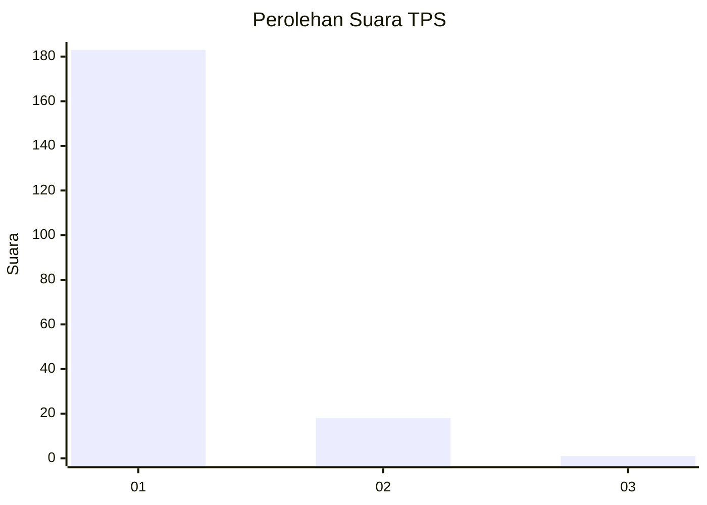
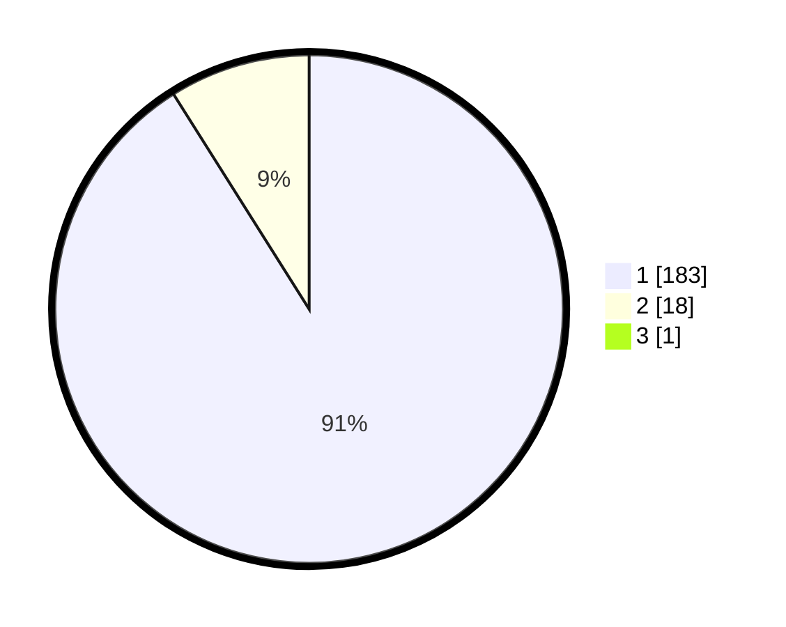

# Hasil

## Grafik

## Tabel

| No. | Nama Paslon    | Suara | Suara (raw) | Persentase |
|:--- |:-------------- | -----:| -----------:| ----------:|
| 1   | ANIES MUHAIMIN | 183   | [183][p-1]  | 90,59      |
| 2   | PRABOWO GIBRAN | 18    | [18][p-2]   | 8,91       |
| 3   | GANJAR MAHFUD  | 1     | [1][p-3]    | 0,50       |

[p-1]: https://github.com/gigit-pemilu/pemilu-2024-11-aceh/blob/main/pilpres/hitung-suara/sub/11-aceh/sub/06-aceh-besar/sub/12-darussalam/sub/2020-lamkeunung/sub/002-tps/sub/paslon-1.txt
[p-2]: https://github.com/gigit-pemilu/pemilu-2024-11-aceh/blob/main/pilpres/hitung-suara/sub/11-aceh/sub/06-aceh-besar/sub/12-darussalam/sub/2020-lamkeunung/sub/002-tps/sub/paslon-2.txt
[p-3]: https://github.com/gigit-pemilu/pemilu-2024-11-aceh/blob/main/pilpres/hitung-suara/sub/11-aceh/sub/06-aceh-besar/sub/12-darussalam/sub/2020-lamkeunung/sub/002-tps/sub/paslon-3.txt

## Foto C Plano

https://sirekap-obj-formc.kpu.go.id/7ecb/pemilu/ppwp/11/06/12/20/20/1106122020002-20240215-092055--8603703d-dc9e-4c7c-b2f8-74713ef82edf.jpg

https://sirekap-obj-formc.kpu.go.id/7ecb/pemilu/ppwp/11/06/12/20/20/1106122020002-20240215-092159--66cb4c6b-8f67-4f8d-99f4-d94e322c8d1b.jpg

https://sirekap-obj-formc.kpu.go.id/7ecb/pemilu/ppwp/11/06/12/20/20/1106122020002-20240215-092411--755b4517-40f2-4bff-a1c7-e13552a40247.jpg

## Metadata

| Key        | Value               |
| ---------- | ------------------- |
| Time Stamp | 2024-02-15 17:30:25 |

