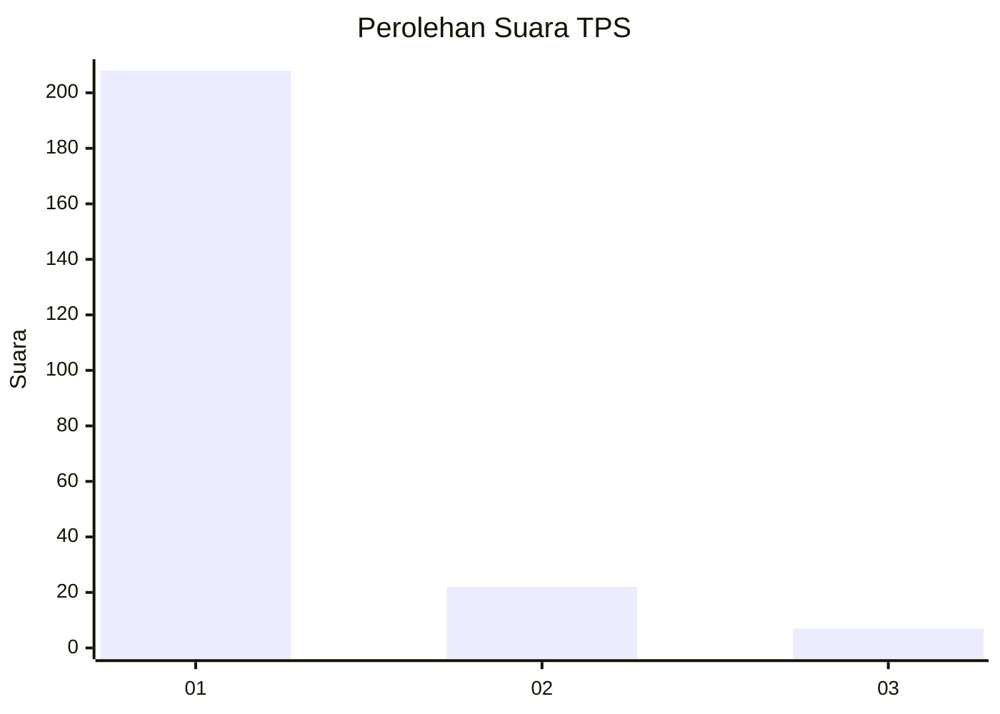
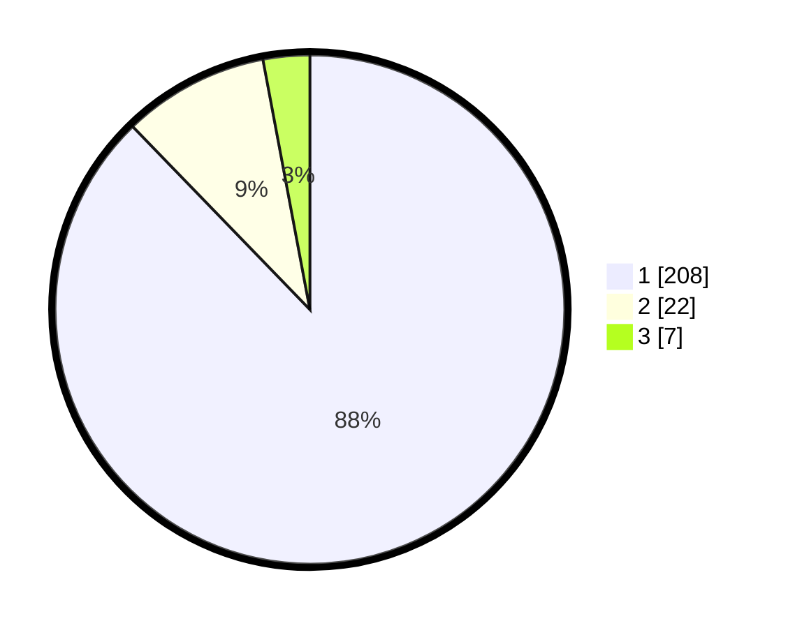

# Hasil

## Grafik

## Tabel

| No. | Nama Paslon    | Suara | Suara (raw) | Persentase |
|:--- |:-------------- | -----:| -----------:| ----------:|
| 1   | ANIES MUHAIMIN | 208   | [208][p-1]  | 87,76      |
| 2   | PRABOWO GIBRAN | 22    | [22][p-2]   | 9,28       |
| 3   | GANJAR MAHFUD  | 7     | [7][p-3]    | 2,95       |

[p-1]: https://github.com/gigit-pemilu/pemilu-2024-11-aceh/blob/main/pilpres/hitung-suara/sub/11-aceh/sub/06-aceh-besar/sub/12-darussalam/sub/2023-lambiheu-siem/sub/002-tps/sub/paslon-1.txt
[p-2]: https://github.com/gigit-pemilu/pemilu-2024-11-aceh/blob/main/pilpres/hitung-suara/sub/11-aceh/sub/06-aceh-besar/sub/12-darussalam/sub/2023-lambiheu-siem/sub/002-tps/sub/paslon-2.txt
[p-3]: https://github.com/gigit-pemilu/pemilu-2024-11-aceh/blob/main/pilpres/hitung-suara/sub/11-aceh/sub/06-aceh-besar/sub/12-darussalam/sub/2023-lambiheu-siem/sub/002-tps/sub/paslon-3.txt

## Foto C Plano

https://sirekap-obj-formc.kpu.go.id/6e8a/pemilu/ppwp/11/06/12/20/23/1106122023002-20240219-203629--8e83866b-d853-4439-beb2-71d8fddba144.jpg

https://sirekap-obj-formc.kpu.go.id/6e8a/pemilu/ppwp/11/06/12/20/23/1106122023002-20240214-231503--476175e5-a697-411f-bdf5-7cc048ba5558.jpg

https://sirekap-obj-formc.kpu.go.id/6e8a/pemilu/ppwp/11/06/12/20/23/1106122023002-20240214-231635--049ed266-91ac-405c-8971-36f500ef33ef.jpg

## Metadata

| Key        | Value               |
| ---------- | ------------------- |
| Time Stamp | 2024-02-19 21:00:00 |

