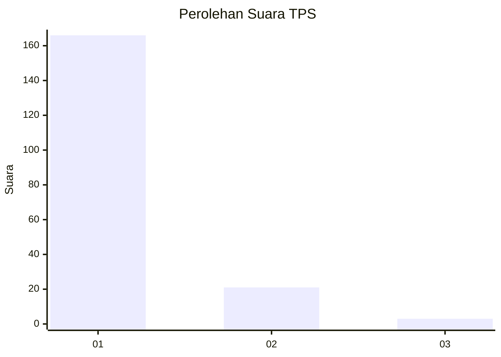
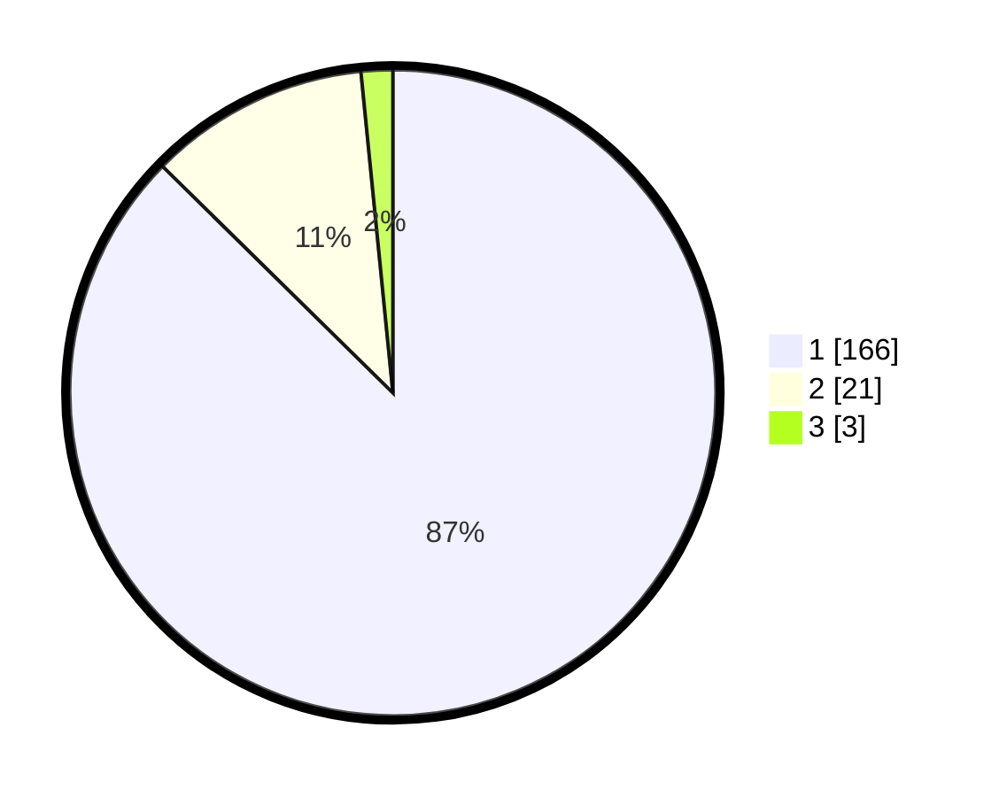

# Hasil

## Grafik

## Tabel

| No. | Nama Paslon    | Suara | Suara (raw) | Persentase |
|:--- |:-------------- | -----:| -----------:| ----------:|
| 1   | ANIES MUHAIMIN | 166   | [166][p-1]  | 87,37      |
| 2   | PRABOWO GIBRAN | 21    | [21][p-2]   | 11,05      |
| 3   | GANJAR MAHFUD  | 3     | [3][p-3]    | 1,58       |

[p-1]: https://github.com/gigit-pemilu/pemilu-2024-11-aceh/blob/main/pilpres/hitung-suara/sub/11-aceh/sub/06-aceh-besar/sub/12-darussalam/sub/2024-lambitra/sub/001-tps/sub/paslon-1.txt
[p-2]: https://github.com/gigit-pemilu/pemilu-2024-11-aceh/blob/main/pilpres/hitung-suara/sub/11-aceh/sub/06-aceh-besar/sub/12-darussalam/sub/2024-lambitra/sub/001-tps/sub/paslon-2.txt
[p-3]: https://github.com/gigit-pemilu/pemilu-2024-11-aceh/blob/main/pilpres/hitung-suara/sub/11-aceh/sub/06-aceh-besar/sub/12-darussalam/sub/2024-lambitra/sub/001-tps/sub/paslon-3.txt

## Foto C Plano

https://sirekap-obj-formc.kpu.go.id/32f9/pemilu/ppwp/11/06/12/20/24/1106122024001-20240215-024858--5c0354db-1304-4051-b70f-f3c756b36584.jpg

https://sirekap-obj-formc.kpu.go.id/32f9/pemilu/ppwp/11/06/12/20/24/1106122024001-20240215-025029--c8e1b4c1-e9a5-4f53-8240-709700105cbf.jpg

https://sirekap-obj-formc.kpu.go.id/32f9/pemilu/ppwp/11/06/12/20/24/1106122024001-20240215-025154--faaeacc4-55c5-4ba4-ac29-b91b46e4a479.jpg

## Metadata

| Key        | Value               |
| ---------- | ------------------- |
| Time Stamp | 2024-02-16 00:00:26 |

