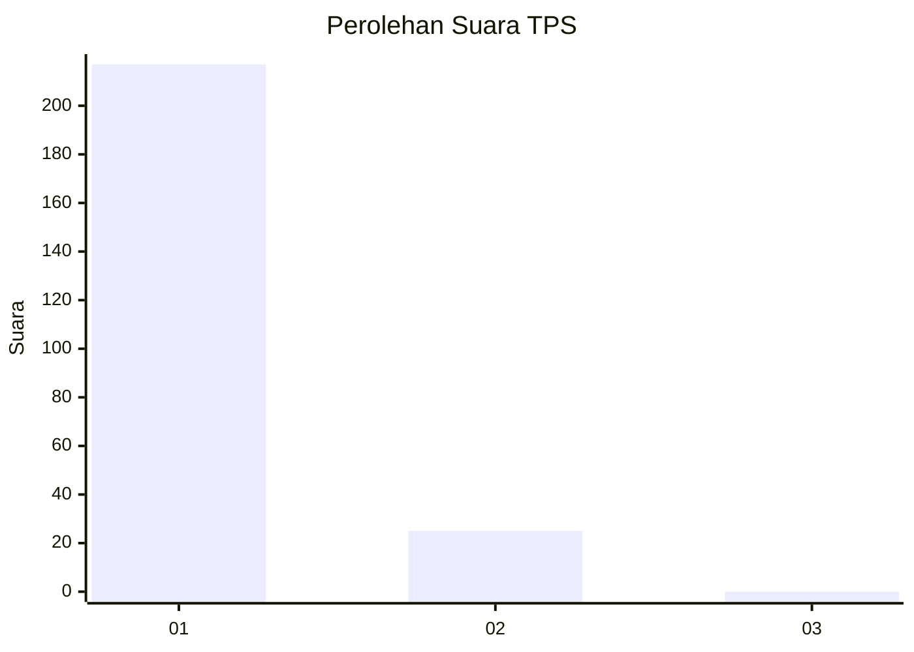
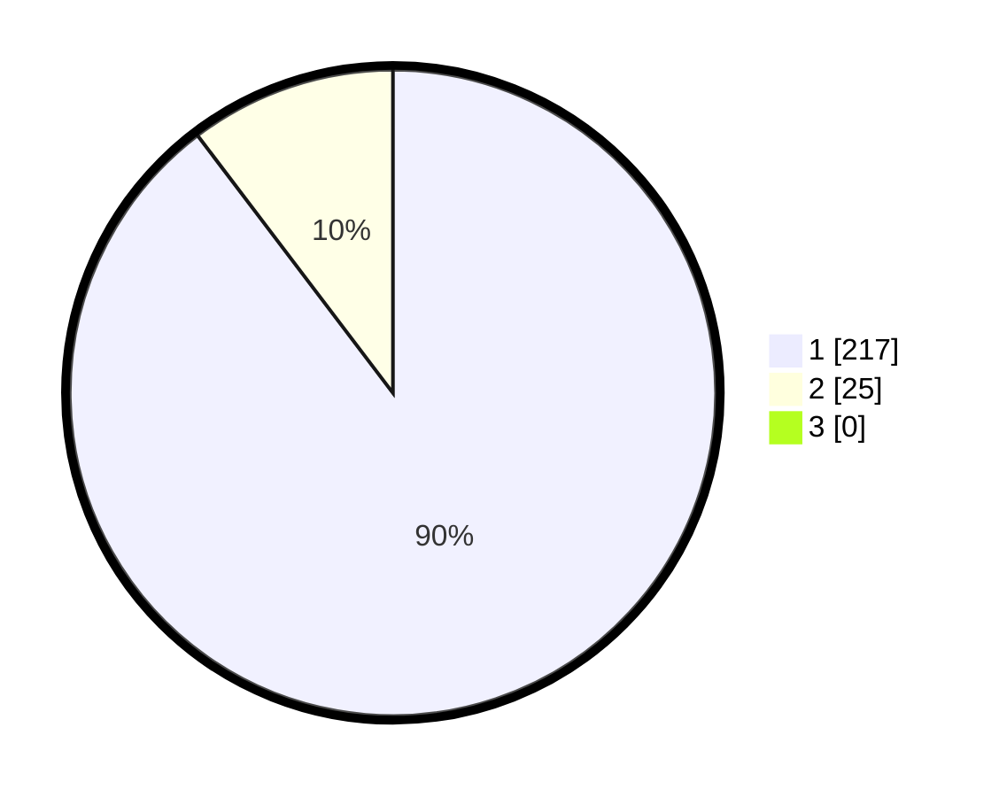

# Hasil

## Grafik

## Tabel

| No. | Nama Paslon    | Suara | Suara (raw) | Persentase |
|:--- |:-------------- | -----:| -----------:| ----------:|
| 1   | ANIES MUHAIMIN | 217   | [217][p-1]  | 89,67      |
| 2   | PRABOWO GIBRAN | 25    | [25][p-2]   | 10,33      |
| 3   | GANJAR MAHFUD  | 0     | [0][p-3]    | 0,00       |

[p-1]: https://github.com/gigit-pemilu/pemilu-2024-11-aceh/blob/main/pilpres/hitung-suara/sub/11-aceh/sub/06-aceh-besar/sub/12-darussalam/sub/2025-lie-eue/sub/002-tps/sub/paslon-1.txt
[p-2]: https://github.com/gigit-pemilu/pemilu-2024-11-aceh/blob/main/pilpres/hitung-suara/sub/11-aceh/sub/06-aceh-besar/sub/12-darussalam/sub/2025-lie-eue/sub/002-tps/sub/paslon-2.txt
[p-3]: https://github.com/gigit-pemilu/pemilu-2024-11-aceh/blob/main/pilpres/hitung-suara/sub/11-aceh/sub/06-aceh-besar/sub/12-darussalam/sub/2025-lie-eue/sub/002-tps/sub/paslon-3.txt

## Foto C Plano

https://sirekap-obj-formc.kpu.go.id/8359/pemilu/ppwp/11/06/12/20/25/1106122025002-20240215-063425--2e4df008-ab37-4632-b3b8-a91d13ab3082.jpg

https://sirekap-obj-formc.kpu.go.id/8359/pemilu/ppwp/11/06/12/20/25/1106122025002-20240215-001721--15571ed6-4434-4c66-ad74-ebe91920314b.jpg

https://sirekap-obj-formc.kpu.go.id/8359/pemilu/ppwp/11/06/12/20/25/1106122025002-20240215-014146--9e5b4170-0c41-47fe-aad8-54742c3b766f.jpg

## Metadata

| Key        | Value               |
| ---------- | ------------------- |
| Time Stamp | 2024-02-16 00:00:26 |

